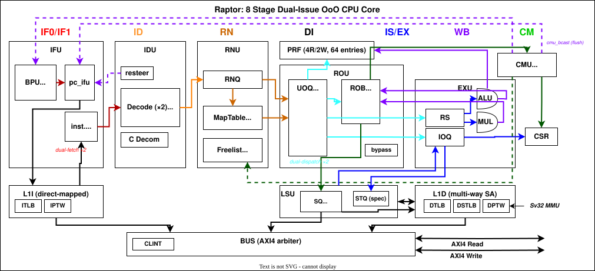

# Raptor Project

[](https://github.com/Kingfish404/raptor-chip/actions/workflows/riscv-arch-test.yaml)
[](https://github.com/Kingfish404/raptor-chip/actions/workflows/am-benchmark.yaml)
[](https://github.com/Kingfish404/raptor-chip/actions/workflows/app-pk.yaml)
[](https://github.com/Kingfish404/raptor-chip/actions/workflows/linux-boot.yaml)
[](https://en.wikipedia.org/wiki/Ubuntu)
[](https://en.wikipedia.org/wiki/MacOS)
[](https://github.dev/Kingfish404/raptor-chip)

[](./docs/uarch.md)
[](https://github.com/riscv/riscv-isa-manual)
[](./docs/uarch.md)
[](./docs/uarch.md)
[](./fpga/)
[](./LICENSE)

> It is possible to invent a single machine which can be used to compute any computable sequence. — Alan Turing, 1936

Welcome to the Raptor Project! Here is an all-in-one repository for exploring, developing, optimizing, and verifying a RISC-V core. Aiming at high quality, full Linux support, FPGA implementation, and ASIC readiness.

Core description: **Super-scalar, Out-of-order RISC-V core** with register renaming, ROB, and reservation stations. The RTL is described by `SystemVerilog` with `Chisel` (`Scala`) used only for decoder generation. Features Sv32 (RV32) / Sv39 (RV64) virtual memory (MMU/TLB/PTW), 16-entry PMP (TOR/NA4/NAPOT), LR/SC + AMO atomics, compressed instructions (RVC), CLINT/PLIC interrupts, and boots Linux v6.18.x via OpenSBI. Supports configurable **RV32** and **RV64** modes via compile-time switch.

```
Core name:  raptor-falcon (M/S/U + Sv32/Sv39 + PMP, Linux-capable)
ISA:        rv32/rv64 imac_zicbop_zicntr_zicond_zicsr_zifencei_zihintntl_zihintpause_zimop_zcb_zcmop_zba_zbb_zbc_zbs
Modes:      Machine, Supervisor, User
MMU:        riscv,sv32 (RV32) / riscv,sv39 (RV64) / riscv,none (Bare)
PMP:        16 entries, TOR / NA4 / NAPOT, L-bit lockable
Interrupts: CLINT (mtime, mtimecmp, msip) + PLIC (31 sources, M/S contexts)
Profile:    n/a (closest peer: RVM23U32 / RVA20S64)

Bus Interface:  AXI4, XLEN-bit data/addr, 4-bit ID, burst

Verifying:  RISCOF (riscv-arch-test), RVFI, SVA
```

### [Documentation](./docs/README.md)

## Microarchitecture



## Setup & Quick Start

Suggest install `tmux` for better terminal management. [`surfer`][^surfer] for wave viewer. [`colima`][^colima] for Linux container.

[^surfer]: https://surfer-project.org/
[^colima]: https://github.com/abiosoft/colima

```shell
# One-line setup (installs all dependencies)
make setup
# or if just want to setup RTL workspace
make setup-rtl

# Show all available targets
make help
# or pack all SV files into one
make verilog pack

# Setup for IDE/LSP support
make ide-setup
```

### 1. NEMU (Software Emulator)

```shell
# Configure, build and run NEMU (riscv32)
make run-nemu32

# Or step by step
make config-nemu32          # configure (riscv32_defconfig)
make build-nemu32           # build
make run-nemu32             # run

# Interactive menuconfig
make menuconfig-nemu32
```

### 2. NPC Simulation (Verilator)

```shell
# Full pipeline: generate RTL -> configure -> build -> run
make sim-npc32

# Or step by step
make verilog              # Chisel -> SystemVerilog
make config-npc32         # configure (o2_defconfig)
make build-npc32          # build Verilator simulator
make run-npc32            # run simulation

# Run with args
make run-npc32 ARGS="-b -n"    # -b: batch mode [default], -n: no wave trace
make run-npc32 IMG=path/to.bin  # load custom image
# Interactive menuconfig
make menuconfig-npc32
```

#### RV64 Mode

The processor supports RV64 via a compile-time switch (`-DRAPT_RV64`). Switching between RV32 and RV64 automatically invalidates the build cache, no manual `make clean` needed.

```shell
# Build and run in RV64 mode (convenience targets)
make build-npc64
make run-npc64 ARGS="-b -n"
# Or explicitly pass VFLAGS
make run-npc32 VFLAGS="-DRAPT_RV64" ARGS="-b -n"
```

### 3. Benchmarks

```shell
# Run on NPC (riscv32-npc)
make coremark-npc32 ARGS="-b -n"
make microbench-npc32 ARGS="-b -n"
# Run on NPC with difftest (vs NEMU reference)
make coremark-npc32-difftest ARGS="-b -n"
make microbench-npc32-difftest ARGS="-b -n"
# Run on ysyxSoC
make coremark-ysyxsoc ARGS="-b -n"
make microbench-ysyxsoc ARGS="-b -n"
# Run on NEMU (riscv32-nemu)
make coremark-nemu32 ARGS="-b -n"
make microbench-nemu32 ARGS="-b -n"
```

### 4. Applications running on riscv-pk

```shell
# Build and run hello world on NPC
make app-hello-npc32
# Build and run CoreMark on NPC
make app-coremark-npc32 ARGS="-b -n"
# Build and run Embench-IoT on NPC
make app-embench-npc32 ARGS="-b -n"
# Build riscv-pk (opensbi + pk)
make app-pk-build
# Clean app build artifacts
make app-clean
```

### 5. Linux Kernel Boot

```shell
# Boot Linux on NEMU (requires OpenSBI payload built first)
make linux-boot-nemu32
# Boot Linux on NPC
make linux-boot-npc32
# Boot Linux on NPC with difftest (vs NEMU reference)
make linux-boot-npc32-difftest
# See detailed instructions
# docs/linux_kernel.md, linux/README.md
```

### 6. Verification

```shell
# Random instruction fuzzing with difftest (NPC vs NEMU)
make verify-fuzz
make verify-fuzz-inf      # continuous until Ctrl-C / failure
# Signature-based ISA corner-case tests
make verify-sigtest
# RISCOF classic compliance tests (legacy, no difftest)
make verify-riscof-classic
make verify-riscof-classic-nemu
# Official RISCOF compliance (riscv-arch-test, sail reference)
make verify-riscof
# Verilator line/toggle coverage
make verify-coverage
# Run everything
make verify-all
# See verify/README.md for SVA, formal (RVFI), and ACT4 details
```

### 7. FPGA

```shell
# --- LiteX SoC ---
cd fpga/litex
make setup                          # one-time: install LiteX + register Raptor CPU
make pack                           # pack RTL into single .sv
make sim                            # Verilator sim with LiteX BIOS
make coremark                       # build + run CoreMark in sim
make embench                        # build + run all Embench-IoT benches
make linux                          # build + run Linux payload in sim

# Tang Mega 138K Pro hardware flow
make fpga-build                     # synth + P&R bitstream
make fpga-load                      # load to SRAM (volatile)
make fpga-flash                     # write to external SPI flash
make fpga-console                   # open UART console
# See fpga/litex/README.md for full target/variant matrix
```

## Build and Run (Manual)

> The following commands are equivalent to the `make` targets above,
> useful if you need finer-grained control.

```shell

# 0. environment variables for direct subdirectory workflows
source ./env.sh

# 1. build and run NEMU
cd $NEMU_HOME && make riscv32_defconfig && make && make run
cd $NEMU_HOME && make riscv32_linux_defconfig && make && make run

# 2. build and run NPC
cd $RAPTOR_HOME/rtl_scala && make verilog
cd $NSIM_HOME && make o2_defconfig && make && make run
cd $NSIM_HOME && make o2linux_defconfig && make && make run
cd $NSIM_HOME && make menuconfig && make ARCH=riscv32-npc run

# 3. build and run the program you want

## n. running nanos-lite on nemu
cd $NAVY_HOME && make ISA=$ISA fsimg
cd $NAVY_HOME/apps/menu && make ISA=$ISA install
cd $RAPTOR_HOME/abstract-machine/app/nanos-lite && make ARCH=$ISA-nemu update run
cd $RAPTOR_HOME/abstract-machine/app/nanos-lite && make ARCH=$ISA-nemu run
## n.vme running nanos-lite on nemu with VME
cd $RAPTOR_HOME/abstract-machine/app/nanos-lite && make ARCH=$ISA-nemu update run ARGS="-b" VME=1

## n+1. running busybox on nemu (Linux required)
cd $NAVY_HOME/apps/busybox && colima ssh # login to Linux container
make ARCH=riscv32-nemu install

## 2n. running microbench/coremark on npc
cd $RAPTOR_HOME/abstract-machine/app/am-kernels/benchmarks/coremark_eembc && \
    make ARCH=riscv32-npc run ARGS="-b -n"
cd $RAPTOR_HOME/abstract-machine/app/am-kernels/benchmarks/microbench && \
    make ARCH=riscv32-npc run ARGS="-b -n"
# ARGS="-b -n" is optional, -b is for batch mode [default], -n is for no wave trace

## package all sv files into one
cd nsim && make pack
```

## Run OpenSBI & Linux Kernel

See [Linux Kernel](./docs/linux_kernel.md)

## Reference

- [Specifications – RISC-V International](https://riscv.org/technical/specifications/)
- [riscv/riscv-isa-manual: RISC-V Instruction Set Manual](https://github.com/riscv/riscv-isa-manual)
- [riscv-software-src/riscv-unified-db: Machine-readable database of the RISC-V specification, and tools to generate various views](https://github.com/riscv-software-src/riscv-unified-db)
- ["一生一芯"](https://rapt.oscc.cc/)
