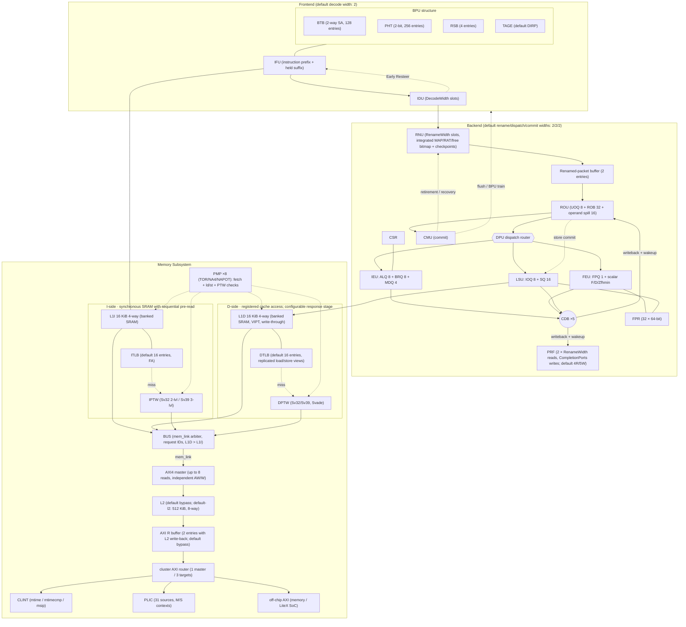

# Raptor Project

[](https://github.com/Kingfish404/raptor-chip/actions/workflows/benchmark.yaml) [](https://github.com/Kingfish404/raptor-chip/actions/workflows/app.yaml) [](https://github.com/Kingfish404/raptor-chip/actions/workflows/sta.yaml)

[](./docs/uarch.md) [](https://github.com/riscv/riscv-isa-manual) [](./docs/uarch.md) [](./fpga/) [](./LICENSE)

> It is possible to invent a single machine which can be used to compute any computable sequence. — Alan Turing, 1936

Welcome to the Raptor Project! Here is an all-in-one repository for exploring, developing, optimizing, and verifying a RISC-V core. Aiming at high quality, full Linux support, FPGA implementation, and ASIC readiness.

Core description: **Super-scalar, out-of-order RISC-V core** with register renaming, a 32-entry ROB, six execution paths fed by five scheduler classes over five unified writeback CDB ports, TAGE branch prediction, and a unified speculative/committed store queue. The scalar F/D unit has a dedicated FPQ and architectural 32 x 64-bit FPR bank, and shares CDB0 with the ALU-CSR pipe. The RTL is described by `SystemVerilog` with `Chisel` (`Scala`) used only for decoder generation. Features Sv32 (RV32) / Sv39 (RV64) virtual memory (MMU/TLB/PTW), 8 usable PMP entries (TOR/NA4/NAPOT; 16 CSR slots, upper eight read-only zero), LR/SC + AMO atomics, compressed instructions (RVC), CLINT/PLIC interrupts, a RISC-V Debug Module / JTAG DTM bring-up path, and Linux v6.18.x flows via OpenSBI. Supports configurable **RV32** and **RV64** modes via compile-time switch.

```
RV64 (default config, -DRAPT_RV64)
ISA summary: rv64imafdc_zba_zbb_zbs_zfhmin_zicbom_zicbop_zicboz_zicntr_zicond_zicsr_zifencei_zihintntl_zihintpause_zihpm_zimop_zkt_zca_zcb_zcmop_svinval_svpbmt
Profile:     RVA22S64 implementation target; full-profile validation remains open
Modes:       Machine, Supervisor, User
MMU:         Sv39 / Bare; Svade; Svpbmt page attributes

RV32 (default config, without -DRAPT_RV64)
ISA summary: rv32imafdc_zba_zbb_zbs_zfhmin_zicbom_zicbop_zicboz_zicntr_zicond_zicsr_zifencei_zihintntl_zihintpause_zihpm_zimop_zca_zcb_zcmop_svinval
Profile:     RVI20U32; additional ISA and supervisor features listed above
Modes:       Machine, Supervisor, User
MMU:         Sv32 / Bare; Svade

Core name:  raptor-falcon (Linux-capable)
PMP:        8 usable entries, TOR / NA4 / NAPOT, L-bit lockable
Interrupts: CLINT (mtime, mtimecmp, msip) + PLIC (31 sources, M/S contexts)

Bus Interface:  AXI4, XLEN-bit data/addr, 4-bit ID; burst-capable reads (up to 8 outstanding), one outstanding write with independent AW/W handshakes (single-beat ordinary stores, multi-beat Zicboz `CBO.ZERO`)
Default uarch: dual issue / dual commit, ROB=32, ALQ=8 (2 issue ports), BRQ=8, MDQ=4, FPQ=1, IOQ=8, SQ=16, integer PRF=64, FPR=32 x 64-bit, L1I=16 KiB, L1D=16 KiB (both 4-way), 64 B cache lines, optional L2 passthrough/cache stage

Verifying:  RISCOF (riscv-arch-test), full-core F/D directed/differential tests, RVFI, SVA
```

The ISA summaries list implemented extensions, not complete profile requirement inventories. For RV64/default, Zkt provides data-independent execution latency for the instructions covered by its specification; it does not imply AES/SHA instruction support. Svinval implements translation invalidation using a conservative full SFENCE.VMA operation in both XLEN modes. Svpbmt carries page-based memory types through the RV64 Sv39 translation, cache, and bus paths; Sv32 has no PBMT field. The [RV64 supervisor verification configuration](verify/riscof/raptor-rv64s/raptor-rv64s.yaml) declares these extensions, while the [RVA22S64 requirement ledger](verify/riscof/raptor-rv64s/requirements.json) records acceptance separately: Zkt and Svinval are accepted for recorded frozen configurations; Svpbmt remains partially covered with open acceptance gates. Validation results do not automatically transfer to later RTL changes or other configs, and the RV64 Zkt acceptance does not establish an RV32 Zkt claim.

The F/D/Zfhmin implementation covers scalar floating-point load/store, arithmetic, FMA, divide/square-root, conversion, comparison/classification, rounding modes, accrued exception flags, and binary16 load/store, transfer, and conversion. The compressed subset includes the C-extension floating-point memory forms required with F/D (C.FLW/C.FSW on RV32 and C.FLD/C.FSD plus their stack-pointer forms on RV32/RV64).

See [documentation](./docs/README.md) for more details.

## Microarchitecture


```mermaid
flowchart TD
  subgraph BPU["BPU structure"]
    direction TD
    BTB["BTB (2-way SA, 128 entries)"]
    PHT["PHT (2-bit, 256 entries)"]
    RSB["RSB (4 entries)"]
    TAGE["TAGE (default DIRP)"]
  end
  subgraph FE["Frontend (default decode width: 2)"]
    BPU["BPU (TAGE/BTB/RSB)"]
    IFU["IFU (instruction prefix + held suffix)"]
    IDU["IDU (DecodeWidth slots)"]
  end
  subgraph BE["Backend (default rename/dispatch/commit widths: 2/2/2)"]
    RNU["RNU (RenameWidth slots, integrated MAP/RAT/free bitmap + checkpoints)"]
    RBUF["Renamed-packet buffer (2 entries)"]
    ROU["ROU (UOQ 8 + ROB 32 + operand spill 16)"]
    DPU{{"DPU dispatch router"}}
    IEU["IEU: ALQ 8 + BRQ 8 + MDQ 4"]
    FEU["FEU: FPQ 1 + scalar F/D/Zfhmin"]
    LSU["LSU: IOQ 8 + SQ 16"]
    CDB(("CDB ×5"))
    PRF["PRF (2 × RenameWidth reads, CompletionPorts writes; default 4R/5W)"]
    FPR["FPR (32 × 64-bit)"]
    CMU["CMU (commit)"]
    CSR
  end
  subgraph MEM["Memory Subsystem"]
    direction TD
    subgraph IMEM["I-side · synchronous SRAM with sequential pre-read"]
      L1I["L1I 16 KiB 4-way (banked SRAM)"]
      ITLB["ITLB (default 16 entries, FA)"]
      IPTW["IPTW (Sv32 2-lvl / Sv39 3-lvl)"]
    end
    subgraph DMEM["D-side · registered cache access; configurable response stage"]
      L1D["L1D 16 KiB 4-way (banked SRAM, VIPT, write-through)"]
      DTLB["DTLB (default 16 entries, replicated load/store views)"]
      DPTW["DPTW (Sv32/Sv39, Svade)"]
    end
    PMPC["PMP ×8 (TOR/NA4/NAPOT): fetch + ld/st + PTW checks"]
    BUS["BUS (mem_link arbiter, request IDs, L1D > L1I)"]
    AXIM["AXI4 master (up to 8 reads, independent AW/W)"]
    L2["L2 (default bypass; default-l2: 512 KiB, 8-way)"]
    RBUF_AXI["AXI R buffer (2 entries with L2 write-back; default bypass)"]
    RTR["cluster AXI router (1 master / 3 targets)"]
    CLINT["CLINT (mtime / mtimecmp / msip)"]
    PLIC["PLIC (31 sources, M/S contexts)"]
    EXT["off-chip AXI (memory / LiteX SoC)"]
  end
  BPU --- IFU
  IFU --> IDU --> RNU
  IDU -."Early Resteer".-> IFU
  RNU --> RBUF --> ROU --> DPU
  DPU --> IEU & FEU & LSU
  IEU & FEU & LSU --> CDB
  CDB -->|"writeback + wakeup"| ROU & PRF
  FEU --- FPR
  LSU --- FPR
  ROU --> CMU
  ROU -."store commit".-> LSU
  CMU -."flush / BPU train".-> FE
  CMU -."retirement / recovery".-> RNU
  CSR --- IEU
  IFU --- L1I
  L1I --- ITLB
  ITLB -."miss".-> IPTW
  LSU --> L1D
  L1D --- DTLB
  DTLB -."miss".-> DPTW
  PMPC -.-> L1I & L1D & IPTW & DPTW
  L1I & L1D & IPTW & DPTW --> BUS
  BUS -->|mem_link| AXIM --> L2 --> RBUF_AXI --> RTR
  RTR --> CLINT & PLIC & EXT
```

## Setup & Quick Start

```shell
# Install the common development toolchain (FPGA/PDK setup is separate)
make setup
# or if just want to setup RTL workspace
make setup-rtl

# Show all available targets
make help
# or pack all SV files into one
make verilog pack

# Setup for IDE/LSP support
make compile-commands
```

### 1. NEMU (Software Emulator)

```shell
# Configure, build and run NEMU (riscv32)
make run-nemu32

# Or step by step
make build-nemu32           # configure and build
make run-nemu32             # run

# Interactive menuconfig
make menuconfig-nemu32
```

### 2. Simulation (Verilator)

```shell
# Full pipeline: generate RTL -> configure -> build -> run
make run-rv32

# Or step by step
make verilog              # Chisel -> SystemVerilog
make configure-rv32      # apply simulator configuration only
make build-rv32          # build Verilator simulator
make run-rv32            # run simulation

# Run with args
make run-rv32 ARGS="-b -n"    # -b: batch mode [default], -n: no wave trace
make run-rv32 IMG=path/to.bin  # load custom image
# Add reproducible 0..8-cycle delays to each AXI memory beat/response
make run-rv32 ARGS="-b -n --mem-random-delay=8 --mem-random-seed=1"
# Interactive menuconfig
make menuconfig-rv32
```

#### RV64 Mode

The processor supports RV64 via a compile-time switch (`-DRAPT_RV64`). RV32 and RV64 use separate configuration and model caches; no manual `make clean` is needed. See [simulator builds](sim/README.md).

```shell
# Build and run in RV64 mode (convenience targets)
make build-rv64
make run-rv64 ARGS="-b -n"
# Or explicitly pass VFLAGS
make run-rv32 VFLAGS="-DRAPT_RV64" ARGS="-b -n"
```

### 3. Benchmarks

```shell
# Run riscv32
make coremark-rv32 ARGS="-b -n"
make microbench-rv32 ARGS="-b -n"
# Run sim with reproducible random AXI memory delays (also supports -rv64)
make coremark-rv32 SIM_RANDOM_DELAY=31 SIM_RANDOM_SEED=1
make microbench-rv32 SIM_RANDOM_DELAY=31 SIM_RANDOM_SEED=42
# Run on ysyxSoC
make coremark-ysyxsoc ARGS="-b -n"
make microbench-ysyxsoc ARGS="-b -n"
# Run on NEMU (riscv32-nemu)
make coremark-nemu32 ARGS="-b -n"
make microbench-nemu32 ARGS="-b -n"
```

### 4. Applications running on riscv-pk

```shell
# Build and run hello world on NPC
make app-hello-rv32
# Build and run CoreMark on NPC
make app-coremark-rv32 ARGS="-b -n"
# Build and run Embench-IoT on NPC
make app-embench-rv32 ARGS="-b -n"
# Build riscv-pk (separate from the OpenSBI/Linux flow)
make app-pk-build
```

### 5. Linux Kernel Boot

```shell
# Boot Linux on NEMU (requires OpenSBI payload built first)
make linux-boot-nemu32
# Boot RV32GC Buildroot Linux on NEMU (downloads/re-wraps the image as needed)
make linux-boot-nemu32gc
# RV64GC equivalent
make linux-boot-nemu64gc
# Boot Linux on NPC (NEMU difftest is enabled by default)
make linux-boot-rv32
# See detailed instructions
# docs/linux_kernel.md, linux/README.md
```

### 6. Verification

```shell
# Random instruction fuzzing with difftest (NPC vs NEMU)
make verify-fuzz
make verify-fuzz-inf      # continuous until Ctrl-C / failure
# Signature-based ISA corner-case tests
make verify-sigtest
# RISCOF classic compliance tests (legacy, no difftest)
make verify-riscof-classic
make verify-riscof-classic-nemu
# Official RISCOF compliance (riscv-arch-test, sail reference)
make verify-riscof
# Verilator line/toggle coverage
make verify-coverage
# Run the lightweight fuzz + signature suites
make verify-light
# See verify/README.md for SVA, formal (RVFI), and ACT4 details
```

### 7. FPGA

For **MLK-CU08 RV32/RV64 Linux with Ethernet and BIOS `netboot`**, follow the [paired build/load quick start](fpga/litex/README.md#cu08-rv32rv64-netboot-build-and-load) and then [TFTP bundle preparation](fpga/litex/NETBOOT.md). Ethernet is **disabled by default** (`WITH_ETHERNET=0`), including Linux CPU variants. A plain build therefore does not provide BIOS `netboot`. Build and load must use the same Ethernet settings and output directory; `fpga-load` loads an existing bitstream and does not rebuild it.

For the fixed current CU08 netboot configuration, run from `fpga/litex`: `make fpga-netboot-rv32-build`, then `make fpga-netboot-rv32-load`. Replace `rv32` with `rv64` for RV64. These paired targets preserve the same Ethernet/CPU settings and use isolated output directories; see the linked guide for prerequisites, payload paths and TFTP setup.

```shell
# --- LiteX SoC ---
cd fpga/litex
make setup                          # one-time: install LiteX + register Raptor CPU
make pack                           # pack RTL into single .sv
make sim                            # Verilator sim with LiteX BIOS
make coremark                       # build + run CoreMark in sim
make embench                        # build + run all Embench-IoT benches
make linux32                        # build + run Linux payload in sim (make linux64 for RV64)

# Tang Mega 138K Pro hardware flow
make fpga-build BOARD=tang_mega_138k_pro # synth + P&R bitstream
make fpga-load BOARD=tang_mega_138k_pro  # load to SRAM (volatile)
make fpga-flash BOARD=tang_mega_138k_pro # write to external SPI flash
make fpga-console                   # open UART console

# MLK-CU07-KU15P OpenSBI/Linux over MIG DDR and BIOS serialboot
make opensbi-fpga-rv32-e2e UART_PORT=/dev/ttyUSB0  # build/load, then standalone OpenSBI
make linux-fpga-rv32-e2e UART_PORT=/dev/ttyUSB0    # build/load, then OpenSBI + Linux
make linux-fpga-rv32-run UART_PORT=/dev/ttyUSB0    # reuse an existing bitstream
# Replace rv32 with rv64 for the RV64 profile.
# See fpga/litex/README.md for full target/variant matrix
```

## Build and Run (Manual)

> The following commands are equivalent to the `make` targets above,
> useful if you need finer-grained control.

```shell

# 0. environment variables for direct subdirectory workflows
source ./env.sh

# 1. build and run NEMU
cd $NEMU_HOME && make riscv32_defconfig && make && make run
cd $NEMU_HOME && make riscv32_linux_defconfig && make && make run

# 2. build and run NPC
cd $RAPTOR_HOME/hdl/chisel && make verilog
cd $NSIM_HOME && make o2_difftest_defconfig && make && make run
cd $NSIM_HOME && make o2linux_difftest_defconfig && make && make run
cd $NSIM_HOME && make menuconfig && make ARCH=riscv32-npc run

# 3. build and run the program you want

## n. running nanos-lite on nemu
cd $NAVY_HOME && make ISA=$ISA fsimg
cd $NAVY_HOME/apps/menu && make ISA=$ISA install
cd $RAPTOR_HOME/abstract-machine/app/nanos-lite && make ARCH=$ISA-nemu update run
cd $RAPTOR_HOME/abstract-machine/app/nanos-lite && make ARCH=$ISA-nemu run
## n.vme running nanos-lite on nemu with VME
cd $RAPTOR_HOME/abstract-machine/app/nanos-lite && make ARCH=$ISA-nemu update run ARGS="-b" VME=1

## n+1. running busybox on nemu (Linux required)
cd $NAVY_HOME/apps/busybox && colima ssh # login to Linux container
make ARCH=riscv32-nemu install

## 2n. running microbench/coremark on npc
cd $RAPTOR_HOME/abstract-machine/app/am-kernels/benchmarks/coremark_eembc && \
    make ARCH=riscv32-npc run ARGS="-b -n"
cd $RAPTOR_HOME/abstract-machine/app/am-kernels/benchmarks/microbench && \
    make ARCH=riscv32-npc run ARGS="-b -n"
# ARGS="-b -n" is optional, -b is for batch mode [default], -n is for no wave trace

## package all sv files into one
cd "$NSIM_HOME" && make pack
```

## Run Linux Kernel

See [Linux Kernel](./docs/linux_kernel.md)

## Reference

- [Specifications – RISC-V International](https://riscv.org/technical/specifications/)
- [riscv/riscv-isa-manual: RISC-V Instruction Set Manual](https://github.com/riscv/riscv-isa-manual)
- [riscv-software-src/riscv-unified-db: Machine-readable database of the RISC-V specification, and tools to generate various views](https://github.com/riscv-software-src/riscv-unified-db)
- ["一生一芯"](https://rapt.oscc.cc/)
