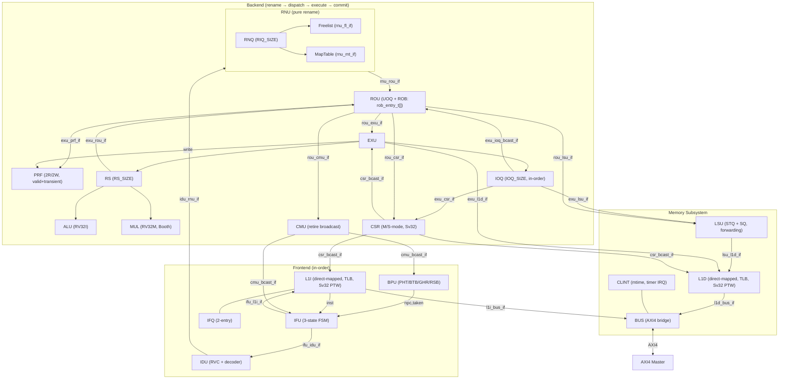

# Microarchitecture (uarch)

## Overview

Raptor is an out-of-order, single-issue RISC-V (RV32IMAC\_Zicsr\_Zifencei\_Sv32) processor core with register renaming, a reorder buffer (ROB), reservation stations, and Sv32 virtual memory support.

**ISA**: RV32I + M (mul/div) + A (atomics: LR/SC, AMO) + C (compressed) + Zicsr + Sv32 MMU

```text
 Pipeline Overview — 3 major partitions

 ┌─ FRONTEND (in-order, speculative) ──────────────────────┐
 │ IFU  — Instruction Fetch Unit (3-state FSM)             │
 │   ├─ L1I  (direct-mapped I-cache, TLB, Sv32 PTW, IFQ)   │
 │   └─ BPU  (bimodal PHT, BTB, GHR, RSB)                  │
 │ IDU  — Instruction Decode Unit                          │
 │   └─ RVC expansion + Chisel-generated decoders          │
 └─────────────────────────────────────────────────────────┘

 ┌─ BACKEND (rename → dispatch → execute → commit) ────────┐
 │ RNU  — Register Naming Unit (pure rename)               │
 │   ├─ RNQ     (rename queue, circular, RIQ_SIZE)         │
 │   ├─ Freelist (rnu_fl_if, circular FIFO, PHY_SIZE)      │
 │   └─ MapTable (rnu_mt_if, spec MAP + committed RAT)     │
 │ PRF  — Physical Register File (top-level, 2R/2W)        │
 │ ROU  — Re-Order Unit (ROB + dispatch)                   │
 │   ├─ UOQ  (dispatch queue, circular, IIQ_SIZE)          │
 │   ├─ ROB  (rob_entry_t[], ROB_SIZE, head/tail)          │
 │   └─ Operand bypass (EXU/IOQ → dispatch)                │
 │ EXU  — Execution Unit (out-of-order)                    │
 │   ├─ RS   (reservation station, RS_SIZE)                │
 │   │   ├─ ALU  (RV32I combinational)                     │
 │   │   └─ MUL  (RV32M, Booth's / iterative div)          │
 │   └─ IOQ  (in-order queue, IOQ_SIZE, for ld/st/amo)     │
 │ CMU  — Commit Unit (broadcast retire info, in-order)    │
 │ CSR  — M/S-mode CSR file + trap/interrupt handling      │
 └─────────────────────────────────────────────────────────┘

 ┌─ MEMORY SUBSYSTEM ──────────────────────────────────────┐
 │ LSU  — Load/Store Unit                                  │
 │   ├─ STQ  (store temp queue, speculative, SQ_SIZE)      │
 │   ├─ SQ   (store queue, committed, SQ_SIZE)             │
 │   └─ Store-to-load forwarding (CAM)                     │
 │ L1D  — Data Cache (direct-mapped, TLB, Sv32 PTW)        │
 │   └─ Reservation register (LR/SC atomics)               │
 │ BUS  — AXI4 master bridge (L1I/L1D arbitration)         │
 │   └─ CLINT (mtime timer, periodic interrupt)            │
 └─────────────────────────────────────────────────────────┘
```

## Pipeline Data Flow

```text
 ┌─ frontend (in-order, speculative) ──────────────────────┐
 │      v─ [BUS <─load─ AXI4]                              │
 │  IFU[l1i,tlb,ifq] ═issue═> IDU                          │
 │      ^─ bpu[btb(COND/DIRE/INDR/RETU),pht,ghr,rsb]       │
 └─────────────────────────────────────────────────────────┘
          ║ ifu_idu_if
 ┌─ backend (rename → dispatch → execute → commit) ────────┐
 │  IDU ═issue═> RNU[rnq,freelist,maptable]                │
 │  RNU ═rename═> ROU[uoq]                                 │
 │  ROU[uoq] ─dispatch─> ROU[rob(rob_entry_t)]             │
 │           ═dispatch═> EXU[rs] / EXU[ioq]                │
 │                                                         │
 │  EXU[rs] ═writeback═> ROU[rob]   (via exu_rou_if)       │
 │      ^─ ALU :alu ops                                    │
 │      ├─ MUL :mult/div (Booth's / iterative)             │
 │  EXU[ioq] ═writeback═> ROU[rob]  (via exu_ioq_bcast_if) │
 │      ^─ CSR :Zicsr read                                 │
 │      ├─ AMO :atomics (LR/SC/AMO*)                       │
 │                                                         │
 │  ROU[rob] ═commit═> CMU & LSU[sq] & CSR                 │
 │  CMU ═broadcast═> frontend: IFU[pc], BPU[update]        │
 └─────────────────────────────────────────────────────────┘
          ║ exu_lsu_if, rou_lsu_if, lsu_l1d_if
 ┌─ memory subsystem ──────────────────────────────────────┐
 │  LSU[stq] (speculative store temp queue)                │
 │  LSU[sq ] (committed store queue ─> L1D/BUS)            │
 │  L1D[tlb,ptw] ─> BUS ─> AXI4 (write-through)            │
 └─────────────────────────────────────────────────────────┘
```

## Module Details

### Frontend

#### IFU — Instruction Fetch Unit (`ysyx_ifu.sv`)

- **FSM**: 3-state (`IDLE` → `VALID` → `STALL`)
- Sends PC to L1I cache and BPU in parallel
- Next-PC mux priority: flush redirect > BPU taken > sequential (PC+2/+4)
- Pre-decodes compressed instruction bit for PC stride (2 vs 4)
- Stalls pipeline on system/atomic/trap instructions until flush completes

#### BPU — Branch Prediction Unit (`ysyx_bpu.sv`)

- **PHT**: 2-bit saturating counters, `PHT_SIZE` entries (default 512), bimodal indexing
- **GHR**: Global History Register, 11 bits
- **BTB**: `BTB_SIZE` entries (default 64), 7-bit tag, XOR-hash index
  - Entry types: `COND` (conditional), `DIRE` (direct jump), `INDR` (indirect), `RETU` (return)
- **RSB**: Return Stack Buffer, `RSB_SIZE` entries (default 8)
- Updates: PHT on committed branches, BTB on flushes
- Reset: PHT/BTB invalidated on `fence_time`

#### L1I — Instruction Cache (`ysyx_l1i.sv`)

- Direct-mapped, `2^L1I_LEN` entries (default 64, 6-bit index)
- Line size: `2^L1I_LINE_LEN` words (default 2 words per line)
- **IFQ**: 2-entry instruction fetch queue for outstanding requests
- **TLB**: Single-entry ITLB (vtag→ptag)
- **Sv32 PTW**: 2-level page table walk (PTW1→PTW0) with trap on page fault
- Supports 16-bit alignment for RVC (cross-word fetch)
- Burst reads for SDRAM region
- `fence.i` invalidation support
- **FSM**: 10-state (`IDLE`, `PTW0`, `PTW1`, `TRAP`, `RD_A`, `RD_0`, `WAIT`, `RD_1`, `FINA`, `NULL`)

#### IDU — Instruction Decode Unit (`ysyx_idu.sv`)

- **FSM**: 2-state (`IDLE`, `VALID`) with valid/ready handshake
- Instantiates `ysyx_idu_decoder_c` (RVC expansion) and `ysyx_idu_decoder` (Chisel-generated)
- `csr_addr_valid()` function validates all M-mode + S-mode CSR addresses
- Aggregates traps from IFU (page faults) and decode-time errors (illegal inst/CSR)
- Outputs full `uop_t` micro-op struct

### Backend

#### RNU — Register Naming Unit (`ysyx_rnu.sv`)

- Pure rename stage: maps architectural registers → physical registers
- **RNQ**: Circular rename queue, `RIQ_SIZE` entries (default 4), buffers uops from IDU
- **Freelist** (`ysyx_rnu_freelist.sv`): Circular FIFO, `PHY_SIZE` entries (default 64)
  - Allocates physical register on rename, deallocates on commit
  - Flush recovery: rewinds head pointer by in-flight count
  - Initial state: first 32 entries identity-mapped, rest free
- **MapTable** (`ysyx_rnu_maptable.sv`): Dual-table design
  - **MAP**: Speculative rename map, 3 read ports (rs1, rs2, rd\_old)
  - **RAT**: Committed architectural map, written on ROB commit
  - Flush recovery: MAP ← RAT (with concurrent commit write forwarding)
- Outputs: `map_snapshot` / `rat_snapshot` for PRF debug view

#### PRF — Physical Register File (`ysyx_prf.sv`)

- `PHY_SIZE` entries (default 64), 2 read ports + 2 write ports
- Instantiated at top level (`ysyx.sv`), shared resource
- **Valid tracking**: `prf_valid[]` bits per physical register
- **Transient tracking**: `prf_transient[]` bits for speculative writes
  - On flush: transient registers invalidated and zeroed
  - On commit: transient bit cleared
  - On dealloc: valid bit cleared
- Write port A: `exu_rou_if` (ALU/RS writeback)
- Write port B: `exu_ioq_bcast_if` (IOQ/LSU/CSR writeback)
- Read port: `exu_prf_if` (operand fetch for ROU dispatch)
- Debug: `rf[]` (committed view via RAT), `rf_map[]` (speculative view via MAP)

#### ROU — Re-Order Unit (`ysyx_rou.sv`)

- **UOQ**: Circular dispatch queue, `IIQ_SIZE` entries (default 4)
- **ROB**: `rob_entry_t` struct array, `ROB_SIZE` entries (default 8), head/tail pointers
  - States: `ROB_EX` (executing) → `ROB_WB` (written back) → `ROB_CM` (committed)
- **Operand bypass**: Forwards from EXU/IOQ broadcasts to dispatch operands
  - Priority: PRF > IOQ broadcast > EXU broadcast
- **Commit**: In-order, waits for ROB head `ROB_WB` + store queue ready
- **Flush triggers**: fence\_i, branch mispredict, trap, system op, atomic
- **Async trap**: Timer interrupt from CLINT (`clint_trap`)
- Interfaces: `rou_exu_if` (dispatch to EXU), `rou_csr_if` (CSR commit), `rou_lsu_if` (store commit)

#### EXU — Execution Unit (`ysyx_exu.sv`)

- **RS** (Reservation Station): `RS_SIZE` entries (default 4)
  - Operand forwarding from both EXU and IOQ broadcasts
  - Priority issue: first ready entry with both operands available
  - Submodules: `ysyx_exu_alu` (combinational), `ysyx_exu_mul` (multi-cycle)
- **IOQ** (In-Order Queue): `IOQ_SIZE` entries (default 4), circular FIFO
  - Handles: load/store, atomics (LR/SC, AMO\*), Zicsr (CSRRW/S/C)
  - In-order issue, also supports operand forwarding
- **ALU** (`ysyx_exu_alu.sv`): Purely combinational RV32I ops (ADD/SUB/SLT/XOR/OR/AND/SLL/SRL/SRA/comparisons)
- **MUL** (`ysyx_exu_mul.sv`): RV32M ops with two modes:
  - Fast mode (`YSYX_M_FAST`): single-cycle (for simulation)
  - Iterative: Booth's multiplication (33/65 cycles), restoring division (32 cycles)
- **Atomics**: Full AMO support — LR/SC with reservation, AMOSWAP/ADD/XOR/AND/OR/MIN/MAX
- **Store MMU**: Address translation via `exu_l1d_if`

#### CMU — Commit Unit (`ysyx_cmu.sv`)

- Lightweight broadcast unit: receives commit info from ROU, broadcasts to pipeline
- Broadcasts: `rpc` (retire PC), `cpc` (correct/redirect PC), branch resolution, `flush_pipe`, `fence_i`, `fence_time`, `time_trap`
- Tracks instruction retire count (`pmu_inst_retire`)
- DPI-C hooks for difftest and ebreak

#### CSR — Control & Status Registers (`ysyx_csr.sv`)

- 32-entry CSR register file, M-mode + S-mode
- Handles trap entry/exit: `ecall`, `ebreak`, `mret`, `sret`
- Privilege mode transitions (M/S/U)
- Trap delegation (`medeleg` / `mideleg`)
- `MSTATUS` ↔ `SSTATUS` mirroring
- `mcycle` / `time` counters
- Broadcasts: `priv`, `satp_ppn`, `satp_asid`, `immu_en`/`dmmu_en`, `tvec`, `interrupt_en`

### Memory Subsystem

#### LSU — Load/Store Unit (`ysyx_lsu.sv`)

- **STQ** (Store Temporary Queue): `SQ_SIZE` entries, speculative stores before commit
- **SQ** (Store Queue): `SQ_SIZE` entries, committed stores pending L1D write
- **Store FSM**: 2-state (`LS_S_V`, `LS_S_R`)
- **Store-to-load forwarding**: CAM search of SQ by address
- Load data alignment/sign-extension (LB/LBU/LH/LHU/LW)
- Loads blocked while SQ/STQ non-empty (memory ordering)
- Address validation via hardcoded memory map ranges

#### L1D — Data Cache (`ysyx_l1d.sv`)

- Direct-mapped, `2^L1D_LEN` entries (default 128, 7-bit index)
- Write-through policy: full-word writes update cache, sub-word writes invalidate
- **Load TLB**: Single-entry (vtag→ptag)
- **Store TLB (STLB)**: Separate single-entry TLB for store address translation
- **Sv32 PTW**: 2-level page table walk for both loads and stores
- **Reservation register**: For LR/SC atomics
- Misalignment detection for loads/stores
- Cacheability determined by address ranges
- `fence_time` invalidates entire cache
- **FSM**: 6-state (`IDLE`, `PTW0`, `PTW1`, `TRAP`, `LD_A`, `LD_D`)

#### BUS — AXI4 Bus Bridge (`ysyx_bus.sv`)

- Arbitrates L1I and L1D requests to single AXI4 master port
- L1D has priority over L1I for reads
- **Read FSM**: 3-state (`LD_A`, `LD_AS`, `LD_D`)
- **Write FSM**: 3-state (`LS_S_A`, `LS_S_W`, `LS_S_B`)
- Load source tracking: `L1I` / `L1D` / `TLBI` / `TLBD`
- SDRAM burst support (AXI INCR mode for I-cache)
- CLINT reads handled locally (not sent over AXI)
- DPI-C difftest skip for MMIO regions

#### CLINT — Core Local Interrupt Controller (`ysyx_clint.sv`)

- 64-bit `mtime` counter
- Periodic timer interrupt every 262144 cycles (`mtime[18:0] == 0x40000`)
- Reads return lower or upper 32 bits of `mtime` based on address
- Instantiated inside BUS module

## Interface Summary

### Inter-module interfaces (`ysyx_if.svh`, `ysyx_*_if.svh`)

| Interface | Direction | Description |
|-----------|-----------|-------------|
| `ifu_bpu_if` | IFU → BPU | PC for prediction, NPC + taken back |
| `ifu_l1i_if` | IFU → L1I | PC fetch request, inst + trap response |
| `ifu_idu_if` | IFU → IDU | Fetched instruction + PC + predicted NPC |
| `idu_rnu_if` | IDU → RNU | Decoded uop + operands + arch reg IDs |
| `rnu_rou_if` | RNU → ROU | Renamed uop + physical reg mappings |
| `rou_exu_if` | ROU → EXU | Dispatched uop + operands + ROB dest |
| `rou_lsu_if` | ROU → LSU | Store commit (addr/data/alu) |
| `rou_csr_if` | ROU → CSR | CSR write + trap/system on commit |
| `rou_cmu_if` | ROU → CMU | Commit info (PC, branch, fence, flush) |
| `exu_rou_if` | EXU → ROU | RS writeback (result, branch, CSR, trap) |
| `exu_ioq_bcast_if` | EXU → ROU/PRF/LSU | IOQ broadcast (ld/st/CSR result) |
| `exu_prf_if` | ROU → PRF | Operand read (2 ports, valid check) |
| `exu_lsu_if` | EXU(IOQ) → LSU | Load request (addr/alu/atomic) |
| `exu_csr_if` | EXU → CSR | CSR read port |
| `exu_l1d_if` | EXU → L1D | Store MMU + SC reservation check |
| `cmu_bcast_if` | CMU → all | Retire broadcast (flush, fence, branch) |
| `csr_bcast_if` | CSR → all | Priv mode, SATP, MMU enable, tvec |
| `lsu_l1d_if` | LSU → L1D | Load/store data path |
| `l1i_bus_if` | L1I → BUS | I-cache miss read |
| `l1d_bus_if` | L1D → BUS | D-cache miss read + write-through |

### RNU internal interfaces (`ysyx_rnu_internal_if.svh`)

| Interface | Description |
|-----------|-------------|
| `rnu_fl_if` | Freelist: alloc\_req/alloc\_pr (rename), dealloc (commit), flush recovery |
| `rnu_mt_if` | MapTable: 3 read ports (rs1, rs2, rd\_old), spec write (MAP), commit write (RAT) |

## Configuration Parameters (`ysyx_config.svh`)

| Parameter | Default | Description |
|-----------|---------|-------------|
| `YSYX_XLEN` | 32 | Register width |
| `YSYX_I_EXTENSION` | 1 | RV32I base |
| `YSYX_M_EXTENSION` | 1 | M extension (mul/div) |
| `YSYX_M_FAST` | 1 | Single-cycle mul/div (sim mode) |
| `YSYX_L1I_LINE_LEN` | 1 | L1I line: 2^1 = 2 words |
| `YSYX_L1I_LEN` | 6 | L1I entries: 2^6 = 64 |
| `YSYX_PHT_SIZE` | 512 | PHT entries |
| `YSYX_BTB_SIZE` | 64 | BTB entries |
| `YSYX_RSB_SIZE` | 8 | Return stack entries |
| `YSYX_RIQ_SIZE` | 4 | Rename queue (RNQ) entries |
| `YSYX_IIQ_SIZE` | 4 | Dispatch queue (UOQ) entries |
| `YSYX_ROB_SIZE` | 8 | Reorder buffer entries |
| `YSYX_RS_SIZE` | 4 | Reservation station entries |
| `YSYX_IOQ_SIZE` | 4 | In-order queue entries |
| `YSYX_SQ_SIZE` | 8 | Store queue entries |
| `YSYX_L1D_LEN` | 7 | L1D entries: 2^7 = 128 |
| `YSYX_ISSUE_WIDTH` | 1 | Instructions dispatched per cycle |
| `YSYX_REG_SIZE` | 32 | Architectural registers |
| `YSYX_PHY_SIZE` | 64 | Physical registers |

## Key Types (`ysyx_pkg.sv`)

| Type | Description |
|------|-------------|
| `uop_t` | Micro-op: decoded instruction fields (alu, branch, mem, CSR, trap, pc, inst, imm) |
| `prd_t` | Physical register descriptor: op1/op2 values + pr1/pr2/prd/prs mappings |
| `rob_state_t` | ROB entry state enum: `ROB_CM` (committed), `ROB_WB` (written-back), `ROB_EX` (executing) |
| `rob_entry_t` | Full ROB entry: phys regs, arch rd, state, branch/jump, memory, atomics, CSR, trap, fence, inst/PC |

## Mermaid Diagram

mermaid [^1] diagram [^2] of the uarch:



[^1]: https://mermaid.js.org/
[^2]: https://www.mermaidchart.com/play
