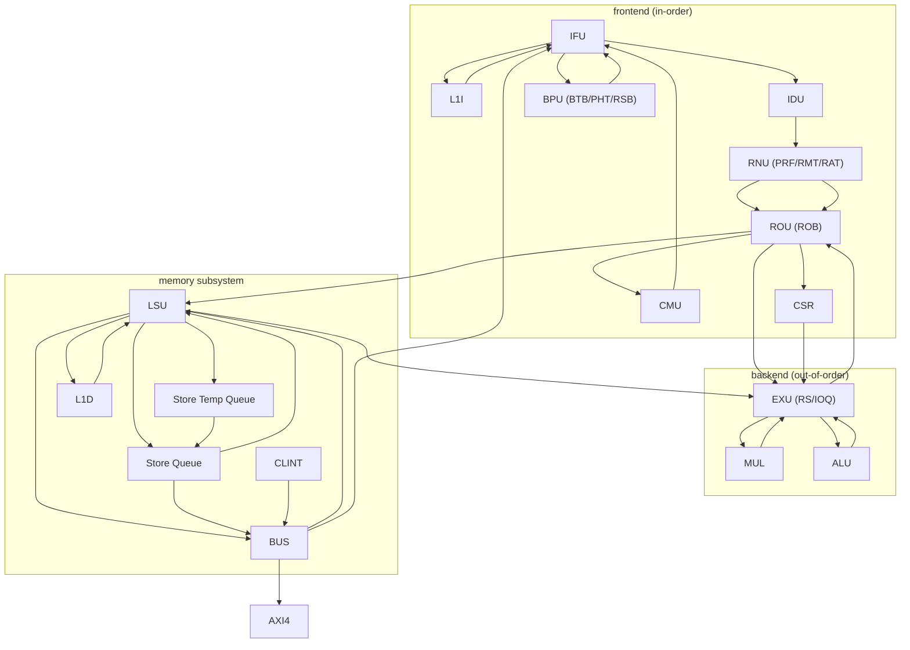

# Microarchitecture (uarch)

```text
 ------------------------------------------------------------
 RISC-V processor pipeline
 has the following (conceptual) stages:
 ------------------------------------------------------------
 in-order      | IFU - Instruction Fetch Unit
 issue         | IDU - Instruction Decode Unit
               | RNU - Register Naming Unit (rename, PRF)
 --------------+ ROU - Re-Order Unit (ROB, uop queue)
 out-of-order  :
 execution     : EXU - Execution Unit (RS, IOQ)
 --------------+
 in-order      | LSU - Load Store Unit (STQ, SQ)
 --------------+
 in-order      | ROU - Re-Order Unit
 commit        | CMU - Commit Unit
 ------------------------------------------------------------
 Stages (`=>' split each stage):
 [
  frontend (in-order and speculative issue):
        v- [BUS <-load- AXI4]
    IFU[l1i,tlb] =issue=> IDU =issue=> RNU[prf,rmt,rat]
        ^- bpu[btb(COND/DIRE/INDR/RETU),pht,rsb]
    RNU =rename=> ROU[uop]
    ROU[uop] -dispatch-> ROU[rob]
             =dispatch=> EXU[rs ]
  backend  (out-of-order execution):
    EXU[rs]  =write-back=> ROU[rob]
        ^- LSU[l1d,tlb] <-load/store-> [BUS <-load/store-> AXI4]
        |- MUL :mult/div
    LSU[stq] (speculative store temp queue)
    LSU[sq ] (committed store queue -> L1D/BUS)
  frontend (in-order commit):
    ROU[rob] =commit=> CMU & LSU[sq]
    CMU =resolve-branch=> frontend: IFU[pc,bpu]
 ]
 ------------------------------------------------------------
 See /rtl_sv/include/ysyx.svh for more details.
```

mermaid [^1] diagram [^2] of the uarch:



[^1]: https://mermaid.js.org/
[^2]: https://www.mermaidchart.com/play
