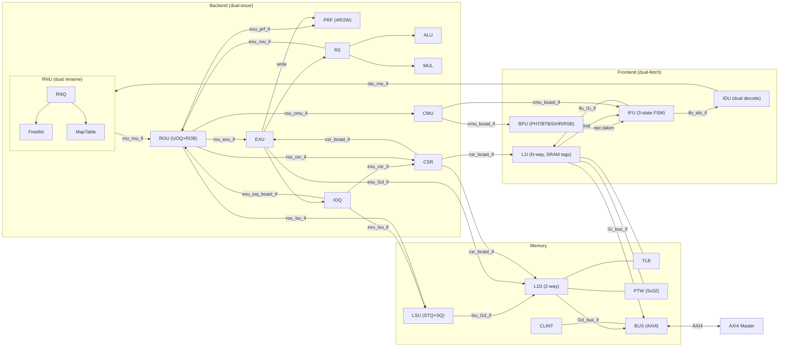

# Microarchitecture (uarch)

## Overview

Raptor is an out-of-order, dual-issue RISC-V processor core with register renaming, a reorder buffer (ROB), reservation stations, and virtual memory support. The pipeline fetches, decodes, renames, and dispatches up to **2 instructions per cycle** (`YSYX_DUAL_ISSUE`). The commit stage supports **dual commit** -- up to 2 instructions can retire from the ROB per cycle when consecutive entries are both ready.

**ISA**: RV32/RV64 I + M (mul/div) + A (atomics: LR/SC, AMO) + C (compressed) + Zba (address generation, incl. RV64 `.UW` variants) + Zbb (basic bit-manipulation) + Zbc (carry-less multiply) + Zbs (single-bit) + Zcb (additional compressed ops) + Zicntr (base counters) + Zicond (conditional zero) + Zicsr + Zifencei + Zimop / Zcmop (may-be-ops / compressed may-be-ops, decoded as NOPs) + Zihintpause / Zihintntl / Zicbop (hint NOPs) + Sv32 MMU

The core supports configurable **RV32** and **RV64** modes via a compile-time switch (`YSYX_RV64`). When `YSYX_RV64` is defined, XLEN=64 and all datapath, register file, AXI bus, and DPI-C interfaces widen to 64 bits. RV64 adds W-variant instructions (ADDIW, SLLIW, etc.) with 32-bit result sign-extension.

## Pipeline

8 logical stages, dual-issue width through IF->DI. Valid/ready handshaking at all boundaries; queues (RNQ, UOQ, RS, IOQ, ROB) decouple stages.

```text
 IF0     IF1      ID      RN       DI       IS/EX    WB      CM
+-----++------++------++-------++--------++-------++-----++------+
|L1I  ||IFU   ||IDU   ||RNU    ||ROU     ||EXU    ||ROB  ||CMU   |
|SRAM ||FSM   ||decode||RNQ->   ||UOQ->    ||RS->ALU ||->WB  ||bcast |
|read ||latch ||x2    ||rename ||dispatch||issue  ||state||retire|
|(spec)|      | latch | pipe x2| +ROB x2 |        |      | x2   |
+--+--++--+---++--+---++--+----++---+----++--+----++--+--++--+---+
 1 cyc  1 cyc   1 cyc   1 cyc    1 cyc    1 cyc   0 cyc  1 cyc
```

| Stage     | Module | Register boundary                          |
| --------- | ------ | ------------------------------------------ |
| **IF0**   | L1I    | SRAM address latched                       |
| **IF1**   | IFU    | `inst`, `pc`, `pc_ifu` registered          |
| **ID**    | IDU    | `uop_t`, operands registered               |
| **RN**    | RNU    | `rn_pipe_{pr1,pr2,prd,prs,uop}` registered |
| **DI**    | ROU    | UOQ consumed, ROB entry allocated          |
| **IS/EX** | EXU    | RS/IOQ entries updated                     |
| **WB**    | ROB    | ROB state -> `ROB_WB`                      |
| **CM**    | CMU    | Architectural state committed              |

- **First-instruction latency**: ~9 cycles (empty pipeline, L1I hit, ALU)
- **Peak throughput**: 2 IPC (dual-issue, all queues flowing)
- **Load-use latency**: 3 cycles (IOQ issue -> L1D hit -> result broadcast)
- **Branch misprediction penalty**: ~8 cycles (full pipeline drain, flush at commit)

### Data Flow

```text
 FRONTEND (speculative, dual-fetch)
   IFU[L1I,ITLB,IFQ] --dual-fetch--▸ IDU[slot A, slot B]
     ^-- BPU[PHT,BTB,GHR,RSB]

 BACKEND (rename -> dispatch -> execute -> commit)
   IDU --dual-issue--▸ RNU[RNQ,Freelist,MapTable]
   RNU --dual-rename--▸ ROU[UOQ] --dual-dispatch--▸ { EXU[RS], EXU[IOQ] } + ROB
   EXU[RS->ALU/MUL] --writeback--▸ ROB          (exu_rou_if)
   EXU[IOQ->LSU/CSR/AMO] --writeback--▸ ROB     (exu_ioq_bcast_if)
   ROB --commit--▸ CMU (broadcast) + LSU[SQ] + CSR

 MEMORY SUBSYSTEM
   LSU[STQ(spec), SQ(committed)] --▸ L1D[DTLB,DSTLB,DPTW] --▸ BUS --▸ AXI4
   L1I[ITLB,IPTW] --▸ BUS --▸ AXI4
   BUS ◂--▸ CLINT (mtime, timer IRQ)
```

### Store & Load Ordering

- **Stores**: IOQ computes address+data -> STQ (speculative); ROB commit -> SQ (committed); SQ drains to L1D/BUS (write-through)
- **Store-to-load forwarding**: loads check STQ then SQ via virtual address CAM, youngest-match-wins
- **Loads blocked** while SQ/STQ non-empty (conservative ordering)

### Branch Misprediction Recovery

`cmu_bcast.flush_pipe` -> IFU redirect to correct PC, RNU freelist rewinds head + MAP←RAT, PRF transient entries invalidated.

## Module Details

### Frontend

#### IFU (`ysyx_ifu.sv`)

3-state FSM (`IDLE`->`VALID`->`STALL`). Sends PC to L1I and BPU in parallel. Next-PC priority: flush > early resteer > BPU taken > sequential (PC+2/+4/+6/+8). Pre-registered `seq2`/`seq4`/`seq6`/`seq8` avoid adder on critical `pc_ifu` loop.

**Dual-fetch**: delivers two instructions from L1I via `ifu_idu_if.{inst_b, pc_b, valid_b}`. Supports all combinations: C+C, C+R32, R32+C, R32+R32. Uses `inst_n0` (current assembled word) and `inst_n1` (next 4-byte-aligned word from L1I) for assembling slot B. Suppressed when either slot is branch/jump, BPU predicts taken, L1I trap, or `inst_n1` data unavailable. R32+R32 at unaligned PC (`pc[1]=1`) excluded (would span 3 words). Stalls on system/atomic/trap until flush.

#### BPU (`ysyx_bpu.sv`)

| Component                   | Implementation                                | Key details                                          |
| --------------------------- | --------------------------------------------- | ---------------------------------------------------- |
| **PHT** (`ysyx_bpu_pht.sv`) | 2-bit saturating, `PHT_SIZE` entries (512)    | `(* keep_hierarchy *)`, sync read, bimodal           |
| **BTB** (`ysyx_bpu_btb.sv`) | 2-way SA, `BTB_SIZE` entries (128), 7-bit tag | `(* keep_hierarchy *)`, sync read, XOR-hash, LRU     |
| **GHR**                     | 11-bit global history                         | Updated on committed branches / spec predictions     |
| **RSB**                     | `RSB_SIZE` entries (8)                        | Committed + speculative pointers, link-reg detection |

BTB entry types: `COND`, `DIRE`, `INDR`, `RETU`. PHT updated on committed branches; BTB on flushes (including JALR). Both invalidated on `fence_time`.

#### L1I (`ysyx_l1i.sv`)

N-way set-associative I-cache (`L1I_N_WAYS`, default 1). `2^L1I_LEN` sets (64), `2^L1I_LINE_LEN` words/line (4). 7-state FSM (`IDLE`, `PTWAIT`, `TRAP`, `RD_A`, `RD_0`, `RD_1`, `FINA`).

| Storage | Implementation                                                                       |
| ------- | ------------------------------------------------------------------------------------ |
| Data    | Banked `ysyx_sram_1r1w` per way per word (sync read)                                 |
| Tags    | Banked `ysyx_sram_1r1w` per way per word (combinational compare from SRAM output)    |
| Valid   | Register arrays per way (`l1i_valid[way][set]`) for fast `fence.i` bulk invalidation |

3-tier pre-read: current bank reads `addr_idx`, next bank reads `addr_idx_next` (+2), remaining banks read `addr_idx_next4` (+4). This eliminates SRAM bubbles on sequential fetch and provides `inst_n1` (next 4-byte-aligned word) for generalized dual-fetch. Way replacement: first invalid, then toggle `replace_bit` per set. IFQ (2-entry) for outstanding requests. ITLB + IPTW for Sv32 translation.

#### IDU (`ysyx_idu.sv`)

2-state FSM (`IDLE`/`VALID`). Dual decode: slot A has `ysyx_idu_decoder_c` + `ysyx_idu_decoder`; slot B has its own pair (`ysyx_idu_decoder_c` + `ysyx_idu_decoder`), handling both C-type and R32 instructions. Slot B suppressed on slot A branch/jump/trap.

**Early resteer**: detects BPU misprediction on non-branch (`pnpc ≠ pc + inst_len && !branch`), sends one-shot `resteer` pulse + corrected PC back to IFU, patches `pnpc` in downstream UOP.

### Backend

#### RNU (`ysyx_rnu.sv`)

Pure rename: maps arch -> physical registers. Dual-rename with RAW dependency handling (slot B sees slot A's result when they share an arch register).

- **RNQ**: Circular queue, `RIQ_SIZE` entries (8). Dual-issue enqueues atomically; paired via `rnq_is_pair`.
- **Freelist** (`ysyx_rnu_freelist.sv`): Circular FIFO, `PHY_SIZE` entries (64). Dual alloc ports (B reads `head+1`). Dual dealloc for dual commit. Flush: rewinds head by in-flight count.
- **MapTable** (`ysyx_rnu_maptable.sv`): MAP (6R + 2W, B wins conflict) + RAT (2W, B wins). Flush: MAP←RAT with concurrent commit forwarding.

#### PRF (`ysyx_prf.sv`)

`PHY_SIZE` entries (64). 4 read ports (2 per dispatch slot) + 2 write ports (ALU writeback + IOQ broadcast). `prf_valid[]` + `prf_transient[]` tracking. Flush: transient entries invalidated. Commit: transient cleared. Dealloc: valid cleared.

#### ROU (`ysyx_rou.sv`)

Dispatch queue + reorder buffer + commit logic.

- **UOQ**: Circular, `IIQ_SIZE` entries (8). Dual enqueue/dequeue with `uoq_is_pair` tracking.
- **ROB**: `rob_entry_t[]`, `ROB_SIZE` entries (16). States: `ROB_EX`->`ROB_WB`->`ROB_CM`. Dual dispatch inserts 2 entries at tail/tail+1.
- **Operand bypass**: UOQ pre-read > IOQ broadcast > EXU broadcast. Broadcast forwarding continues during UOQ residence.
- **Dual commit**: slot 0 commits; slot 1 joins if slot 0 doesn't flush/store, neither has `difftest_skip`, and slot 1 is ready. BPU trains on slot 1's branch info during dual commit.
- **Flush triggers**: fence\_i, branch mispredict, trap, system op, atomic (from either slot).
- **Async trap**: CLINT timer interrupt (`clint_trap`).

#### EXU (`ysyx_exu.sv`)

- **RS**: `RS_SIZE` entries (8). Lowest-index-first priority issue. Dual ALU writeback: primary ALU on `exu_rou` (any op), secondary ALU on `exu_rou_b` restricted to simple-ALU (no branch/CSR/system/trap/mul). Dual dispatch finds `free_idx_a` + `free_idx_b`. Submodules: `ysyx_exu_alu` (combinational, x2; 6-bit opcode, 64 operations including dedicated ALU ops for RV64 Zba `.UW` variants -- `ADD_UW`/`SLLI_UW`/`SH[1-3]ADD` zero-extend rs1[31:0] and produce a full 64-bit result, bypassing the W-variant output sign-extension), `ysyx_exu_mul` (pipelined fast-multiply + iterative restoring divider). Pipelined MUL with tag-based completion (`mul_out_tag` matches the originating RS entry), allowing multiple MULs in flight without cross-contamination.
- **IOQ**: `IOQ_SIZE` entries (8), circular FIFO for ld/st/amo/CSR -- now with **out-of-order load issue to L1D**. A younger ready load can drive L1D ahead of an older pending store/load when safe: (a) per-entry completion state (`ioq_complete`/`ioq_rdata`/`ioq_load_trap`/`ioq_load_cause`/`ioq_load_skip`); (b) oldest-ready priority encoder over `ioq_load_issue_vec`; (c) older-store blocker mask holds a load if any older IOQ store has unresolved base reg (`pr1!=0`), pending MMU translation, or word-address conflict; (d) `oo_pending` FSM locks `active_idx` across multi-cycle L1D misses so the response latches into the originating entry; (e) commit mux at `ioq_head` consumes either the live L1D response (when `active_idx==head`) or pre-latched `ioq_rdata[head]`; (f) atomics (LR/SC/AMO) and uncacheable MMIO stay gated to ROB head for memory ordering. Single outstanding L1D request.
- **Atomics**: LR/SC with reservation register, full AMO set.
- **Store MMU**: address translation via `exu_l1d_if`.

#### CMU (`ysyx_cmu.sv`)

Broadcast unit. Outputs: `rpc`, `cpc`, branch resolution, `flush_pipe`, `fence_i`, `fence_time`, `time_trap`. Dual-commit broadcasts slot 1's branch info; call/return detection via link register (`rd/rs1 == x1|x5`). Per-slot `rd_a`/`rd_b`/`valid_b` for freelist recovery.

#### CSR (`ysyx_csr.sv`)

32-entry register file, M/S-mode. Trap entry/exit (`ecall`/`ebreak`/`mret`/`sret`), privilege transitions (M/S/U), delegation (`medeleg`/`mideleg`), `MSTATUS`<->`SSTATUS` mirroring, `mcycle`/`time` counters. Broadcasts: `priv`, `satp`, MMU enables, `tvec`.

### Memory Subsystem

#### LSU (`ysyx_lsu.sv`)

- **STQ**: `SQ_SIZE` entries, speculative stores (virtual address for forwarding)
- **SQ**: `SQ_SIZE` entries, committed stores (physical + virtual address)
- Store FSM: 2-state (`LS_S_V`/`LS_S_R`)
- Store-to-load forwarding: SQ + STQ CAM by virtual address, youngest-match-wins

#### L1D (`ysyx_l1d.sv`)

2-way set-associative. `2^L1D_LEN` sets (32), `2^L1D_LINE_LEN` words/line (2). 5-state FSM (`IDLE`, `PTWAIT`, `TRAP`, `LD_A`, `LD_D`).

| Storage   | Implementation                                                                      |
| --------- | ----------------------------------------------------------------------------------- |
| Data      | Banked `ysyx_sram_1r1w` per word (sync read)                                        |
| Tag/Valid | Per-word register arrays for simultaneous ld/st hit check + fast fence invalidation |

Write-through policy. Partial stores (SB/SH): read-modify-write (RMW) 2-cycle merge in IDLE. Speculative SRAM read: VIPT-safe virtual index in IDLE. Separate DTLB + DSTLB instances; shared DPTW for both. Reservation register for LR/SC. Cacheability via `addr_cacheable()`.

#### TLB (`ysyx_tlb.sv`)

Reusable fully-associative Sv32 TLB. `ENTRIES` param (default 4), ASID-aware. Combinational lookup, sequential fill (no duplicates), round-robin replacement, bulk flush. Instantiated as: `u_itlb` (L1I), `u_dtlb` (L1D load), `u_dstlb` (L1D store).

#### PTW (`ysyx_ptw.sv`)

Reusable Sv32 two-level walker. 3-state FSM (`IDLE`->`LVL1`->`LVL0`). Leaf detection via `PTE.R||PTE.X` (superpage at LVL1). Shares AXI read channel with cache fill. RV64-aware (selects correct 32-bit PTE half). Instantiated as: `u_iptw` (L1I), `u_dptw` (L1D).

#### BUS (`ysyx_bus.sv`)

AXI4 master bridge arbitrating L1I/L1D (L1D priority). Read FSM: 3-state (`LD_A`/`LD_AS`/`LD_D`). Write FSM: 3-state (`LS_S_A`/`LS_S_W`/`LS_S_B`). Load source tracking: `L1I`/`L1D`/`TLBI`/`TLBD`. CLINT reads handled locally.

#### CLINT (`ysyx_clint.sv`)

64-bit `mtime` counter. Timer interrupt every 262144 cycles (`mtime[18:0] == 0x40000`). Instantiated inside BUS.

## Interfaces

### Inter-module (`ysyx_if.svh`, `ysyx_*_if.svh`)

| Interface          | Direction        | Description                                             |
| ------------------ | ---------------- | ------------------------------------------------------- |
| `ifu_bpu_if`       | IFU<->BPU        | PC for prediction; NPC + taken back                     |
| `ifu_l1i_if`       | IFU<->L1I        | PC fetch request; `inst_n0` + `inst_n1` + trap response |
| `ifu_idu_if`       | IFU<->IDU        | inst_a/b + PC_a/b + pnpc; early resteer back            |
| `idu_rnu_if`       | IDU->RNU         | uop_a/b + operands + arch reg IDs                       |
| `rnu_rou_if`       | RNU->ROU         | uop_a/b + physical reg mappings                         |
| `rou_exu_if`       | ROU->EXU         | uop/uop_b + operands + ROB dest (dual dispatch)         |
| `rou_lsu_if`       | ROU->LSU         | Store commit (addr/data/alu)                            |
| `rou_csr_if`       | ROU->CSR         | CSR write + trap/system on commit                       |
| `rou_cmu_if`       | ROU->CMU         | Commit info slot A/B (PC, branch, fence, flush)         |
| `exu_rou_if`       | EXU->ROU         | RS writeback (result, branch, CSR, trap)                |
| `exu_ioq_bcast_if` | EXU->ROU/PRF/LSU | IOQ broadcast (ld/st/CSR result)                        |
| `exu_prf_if`       | ROU->PRF         | Operand read (4 ports: 2 per slot)                      |
| `exu_lsu_if`       | EXU->LSU         | Load request (addr/alu/atomic)                          |
| `exu_csr_if`       | EXU->CSR         | CSR read port                                           |
| `exu_l1d_if`       | EXU->L1D         | Store MMU + SC reservation check                        |
| `cmu_bcast_if`     | CMU->all         | Retire broadcast (flush, fence, branch, call/ret)       |
| `csr_bcast_if`     | CSR->all         | Priv, SATP, MMU enable, tvec                            |
| `lsu_l1d_if`       | LSU->L1D         | Load/store data path                                    |
| `l1i_bus_if`       | L1I->BUS         | I-cache miss read                                       |
| `l1d_bus_if`       | L1D->BUS         | D-cache miss read + write-through                       |

### RNU internal (`ysyx_rnu_internal_if.svh`)

| Interface   | Description                                              |
| ----------- | -------------------------------------------------------- |
| `rnu_fl_if` | Freelist: dual alloc (A/B), dual dealloc, flush recovery |
| `rnu_mt_if` | MapTable: 6R + 2W (MAP), 2W (RAT)                        |

## Configuration (`ysyx_config.svh`)

| Parameter           | Default | Description                                |
| ------------------- | ------- | ------------------------------------------ |
| `YSYX_XLEN`         | 32      | Register width (64 with `YSYX_RV64`)       |
| `YSYX_M_FAST`       | 1       | Single-cycle mul/div (sim mode)            |
| `YSYX_L1I_LINE_LEN` | 2       | L1I line: 2² = 4 words                     |
| `YSYX_L1I_LEN`      | 6       | L1I sets: 2⁶ = 64                          |
| `YSYX_L1I_N_WAYS`   | 1       | L1I ways (1 = direct-mapped)               |
| `YSYX_PHT_SIZE`     | 512     | PHT entries                                |
| `YSYX_BTB_SIZE`     | 128     | BTB entries (64 sets × 2 ways)             |
| `YSYX_BTB_WAYS`     | 2       | BTB associativity                          |
| `YSYX_RSB_SIZE`     | 8       | Return stack entries                       |
| `YSYX_RIQ_SIZE`     | 8       | Rename queue (RNQ) entries                 |
| `YSYX_IIQ_SIZE`     | 8       | Dispatch queue (UOQ) entries               |
| `YSYX_ROB_SIZE`     | 16      | Reorder buffer entries                     |
| `YSYX_RS_SIZE`      | 8       | Reservation station entries                |
| `YSYX_IOQ_SIZE`     | 8       | In-order queue entries                     |
| `YSYX_SQ_SIZE`      | 8       | Store queue entries                        |
| `YSYX_L1D_LINE_LEN` | 1       | L1D line: 2¹ = 2 words/line                |
| `YSYX_L1D_LEN`      | 5       | L1D sets: 2⁵ = 32                          |
| `YSYX_L1D_N_WAYS`   | 2       | L1D ways (2-way SA)                        |
| `YSYX_DUAL_COMMIT`  | defined | Retire up to 2 ROB entries/cycle           |
| `YSYX_DUAL_ISSUE`   | defined | Dual-issue: 2 insts/cycle through pipeline |
| `YSYX_ISSUE_WIDTH`  | 2       | Dispatch width (2 when dual-issue, else 1) |
| `YSYX_PHY_SIZE`     | 64      | Physical registers                         |

## Key Types (`ysyx_pkg.sv`)

| Type               | Description                                                                                   |
| ------------------ | --------------------------------------------------------------------------------------------- |
| `uop_t`            | Micro-op: alu, branch, mem, CSR, trap, pc, inst, imm                                          |
| `prd_t`            | Physical register descriptor: op1/op2 + pr1/pr2/prd/prs                                       |
| `rob_state_t`      | ROB state: `ROB_CM` (committed), `ROB_WB` (written-back), `ROB_EX` (executing)                |
| `rob_entry_t`      | Full ROB entry: phys regs, arch rd, state, branch, memory, atomics, CSR, trap, fence, inst/PC |
| `addr_cacheable()` | Returns true for cacheable regions (mrom, flash, psram, sdram)                                |
| `addr_valid()`     | Returns true for any valid memory-mapped region                                               |

## Diagram


```mermaid
flowchart LR
 subgraph FE["Frontend (dual-fetch)"]
        IFU["IFU (3-state FSM)"]
        L1I["L1I (N-way, SRAM tags)"]
        IDU["IDU (dual decode)"]
        BPU["BPU (PHT/BTB/GHR/RSB)"]
  end
 subgraph BE["Backend (dual-issue)"]
        subgraph RNU_TOP["RNU (dual rename)"]
            RNQ["RNQ"]
            FL["Freelist"]
            MT["MapTable"]
        end
        PRF["PRF (4R/2W)"]
        ROU["ROU (UOQ+ROB)"]
        EXU["EXU"]
        RS["RS"]
        IOQ["IOQ"]
        ALU["ALU"]
        MUL["MUL"]
        CMU["CMU"]
        CSR["CSR"]
  end
 subgraph MEM["Memory"]
        LSU["LSU (STQ+SQ)"]
        L1D["L1D (2-way)"]
        TLB["TLB"]
        PTW["PTW (Sv32)"]
        BUS["BUS (AXI4)"]
        CLINT["CLINT"]
  end
    BPU -->|"npc,taken"| IFU
    IFU -->|"ifu_l1i_if"| L1I
    L1I -->|"inst"| IFU
    IFU -->|"ifu_idu_if"| IDU
    IDU -->|"idu_rnu_if"| RNU_TOP
    RNQ --> FL & MT
    RNU_TOP -->|"rnu_rou_if"| ROU
    ROU -->|"exu_prf_if"| PRF
    ROU -->|"rou_exu_if"| EXU
    EXU --> RS & IOQ
    RS --> ALU & MUL
    IOQ -->|"exu_lsu_if"| LSU
    IOQ -->|"exu_csr_if"| CSR
    RS -->|"exu_rou_if"| ROU
    IOQ -->|"exu_ioq_bcast_if"| ROU
    EXU -->|"write"| PRF
    ROU -->|"rou_cmu_if"| CMU
    ROU -->|"rou_csr_if"| CSR
    ROU -->|"rou_lsu_if"| LSU
    CMU -->|"cmu_bcast_if"| IFU & BPU
    LSU -->|"lsu_l1d_if"| L1D
    EXU -->|"exu_l1d_if"| L1D
    L1I --- TLB & PTW
    L1D --- TLB & PTW
    L1I -->|"l1i_bus_if"| BUS
    L1D -->|"l1d_bus_if"| BUS
    BUS <-->|"AXI4"| AXI["AXI4 Master"]
    CLINT --- BUS
    CSR -->|"csr_bcast_if"| L1I & L1D & EXU
```
