# Microarchitecture (uarch)

```text
 ------------------------------------------------------------
 RISC-V processor pipeline
 has the following (conceptual) stages:
 ------------------------------------------------------------
 in-order      | IFU - Instruction Fetch Unit
 issue         | IDU - Instruction Decode Unit
 --------------+ ROU - Re-Order Unit
 out-of-order  :
 execution     : EXU - Execution Unit
 --------------+
 in-order      | LSU - Load Store Unit
 --------------+
 in-order      | ROU - Re-Order Unit
 commit        | WBU - Write Back Unit
 ------------------------------------------------------------
 Stages (`=>' split each stage):
 [
  frontend (in-order and speculative issue):
        v- [BUS <-load- AXI4]
    IFU[l1i] =issue=> IDU =issue=> ROU[uop]
        ^- bpu[btb,btb_jal]
    ROU[uop] -dispatch-> ROU[rob]
             =dispatch=> EXU[rs ]
  backend  (out-of-order execution):
    EXU[rs]  =write-back=> ROU[rob]
        ^- LSU[l1d] <-load/store-> [BUS <-load/store-> AXI4]
        |- MUL :mult/div
  frontend (in-order commit):
    ROU[rob] =commit=> WBU[rf ] & LSU[store_queue]
    WBU[rf ] =resolve-branch=> frontend: IFU[pc,bpu]
 ]
 ------------------------------------------------------------
 See /rtl_sv/include/ysyx.svh for more details.
```

mermaid [^1] diagram [^2] of the uarch:

```mermaid
flowchart TD
 subgraph FE["frontend (in-order)"]
        IFU["IFU"]
        L1I["L1I"]
        IDU["IDU"]
        BPU["BPU"]
        ROU["ROU"]
        CSR["CSR"]
        REG["REG"]
        WBU["WBU"]
  end
 subgraph BE["backend (out-of-order)"]
        EXU["EXU"]
        MUL["MUL"]
        ALU["ALU"]
  end
 subgraph MEM["memory subsystem"]
        LSU["LSU"]
        SQ["Store Queue"]
        L1D["L1D"]
        BUS["BUS"]
        CLINT["CLINT"]
  end
    IFU --> IDU & L1I & BPU
    IDU --> ROU
    ROU --> EXU & LSU & WBU & REG & CSR
    LSU --> BUS & SQ & L1D
    EXU --> ROU & MUL & ALU
    BUS --> LSU & AXI["AXI4"] & IFU
    L1I --> IFU
    WBU --> IFU
    BPU --> IFU
    L1D --> LSU
    SQ --> LSU & BUS
    CSR --> EXU
    REG --> ROU
    ALU --> EXU
    MUL --> EXU
    CLINT --> BUS
    LSU --> EXU
```



[^1]: https://mermaid.js.org/
[^2]: https://www.mermaidchart.com/play
