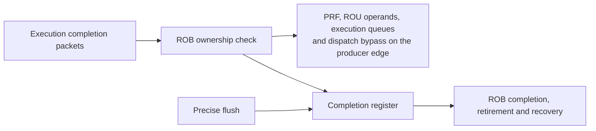
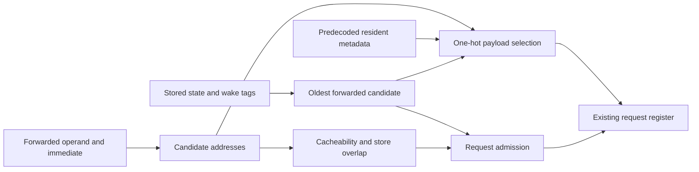

# LSPD standalone module synthesis and physical design

This directory provides fast, independent synthesis and static timing analysis for the major first-level modules instantiated by `hdl/rapt_core.sv`.

The flow uses Yosys with the slang SystemVerilog frontend and OpenSTA. It reuses the open PDK data and mapping configuration under `third_party/yosys-opensta` for ASAP7, NanGate45, and SKY130 HD.

RTL parameter contracts use generate-time error checks: invalid configurations fail elaboration and valid configurations contain no assertion hardware. The flow uses the frontend's default unroll limit, without ignoring initial blocks or removing assertion cells. `make -C lspd/syn elaborate MODULE=core` checks this boundary before technology mapping. ROB/UOQ/IQ entries use generated local state writers; small procedural port loops express priority within an entry.

The physical-design flow uses the mapped synthesis netlist as OpenROAD input. It currently enables NanGate45, which has a complete local LEF, Liberty, RC, and GDS platform setup in this repository. The interface is intentionally parallel to the synthesis flow so more physical-design platforms can be added without changing module-level usage.

## Subsystem evaluation

The three composition blocks are registered as `frontend`, `backend`, and
`memory`. They share the existing `syn`, `sta`, `ppa`, `fpga-syn`, and physical
design entry points with `core`:

| Module | Synthesis top | Boundary |
| --- | --- | --- |
| `frontend` | `rapt_frontend` | Fetch/prediction/decode; instruction cache remains in memory |
| `backend` | `rapt_backend_syn_top` | Rename, scheduling, execution, retirement, LSU/SQ, CSR |
| `memory` | `rapt_memory` | L1I/L1D, translation, bus, AXI bridge, optional L2 |

The backend adapter preserves independent native inputs and exports all fields
of its four internally produced broadcast interfaces. Internal interface instances
allow both producers and consumers to use their original modports. It adds no
registers, stimulus correlation, or output reduction. This baseline does not enable
`RAPT_RVFI`; the adapter does not export optional RVFI observation ports.

```sh
source env.sh
for module in frontend backend memory; do
  make -C lspd/syn structure-check MODULE=$module EXTRA_DEFINES=-DRAPT_RV64
done
make -C lspd ppa-all MODULES_TO_RUN="frontend backend memory" \
  RAPT_CONFIG=default PDK=nangate45 EXTRA_DEFINES=-DRAPT_RV64 \
  CLK_FREQ_MHZ=50 SRAM_MODE=macro PARALLEL_JOBS=3
for module in frontend backend memory; do
  make -C lspd fpga-syn MODULE=$module RAPT_CONFIG=default FPGA_XLEN=64 \
    CLK_FREQ_MHZ=50 FPGA_PART=xcku15p-ffva1156-2-e
done
```

For RV32, omit `EXTRA_DEFINES=-DRAPT_RV64` and set `FPGA_XLEN=32`.
ASIC output paths do not encode XLEN or SRAM mode: archive results or override
`BUILD_DIR` for individual runs before switching either setting. FPGA output paths
include XLEN. Default memory parameters select eight read credits, write-through
L1D and the preset's L2 setting (disabled in `default`).

ASIC macro-mode results use abstract SRAM Liberty models, not a fabricated
Nangate45 SRAM implementation. FPGA uses behavioral memories and Vivado OOC
synthesis. Both use a 20 ns clock and 4 ns input/output delays in the commands
above. Synthesis timing is not routed timing; independently optimized block areas
are not additive to the core, and cross-block timing still requires whole-core STA.

For placement/routing and layout images, first explicitly rebuild the netlist
through `lspd/pnr syn`, which forces flop-mapped memories. The physical flow
does not provide matching physical SRAM LEF views:

```sh
make -C lspd/pnr syn MODULE=frontend PDK=nangate45 EXTRA_DEFINES=-DRAPT_RV64 \
  RAPT_CONFIG=default CLK_FREQ_MHZ=50
make -C lspd pnr MODULE=frontend PDK=nangate45 EXTRA_DEFINES=-DRAPT_RV64 \
  RAPT_CONFIG=default CLK_FREQ_MHZ=50 SRAM_MODE=flops
make -C lspd viz MODULE=frontend PDK=nangate45 EXTRA_DEFINES=-DRAPT_RV64 \
  RAPT_CONFIG=default CLK_FREQ_MHZ=50 SRAM_MODE=flops
```

Replace `frontend` with `backend` or `memory` for the other blocks. These commands
rebuild the ASIC baseline with flop-mapped memories; preserve macro-mode reports
first. Physical implementation is a separate evaluation, not implied by an OOC
synthesis pass.

### Initial measurements (2026-09-21)

Default preset, RV64, 50 MHz, L2 disabled, write-through L1D. Native
`structure-check` passed for all three blocks in both RV32 and RV64.

| Block | Nangate45 cells | Area (Liberty units) | ASIC WNS (ns) | FPGA LUTs | FPGA FFs | FPGA setup slack (ns) |
| --- | ---: | ---: | ---: | ---: | ---: | ---: |
| frontend | 131445 | 208370.036 | +10.621 | 15527 | 5320 | +9.065 |
| backend | incomplete | incomplete | incomplete | incomplete | incomplete | incomplete |
| memory | 385722 | 1148329.520 | +7.541 | incomplete | incomplete | incomplete |

Completed ASIC reports passed the constraint audit with zero TNS. Register-only
setup budgets are 5.868 ns (frontend) and 4.731 ns (memory), not full-design Fmax.
Frontend FPGA uses 304 LUTRAMs (included in total LUTs), no BRAM, and no DSP.
FPGA figures are KU15P OOC synthesis estimates, not placement/routing results.
Backend ASIC spent over 20 minutes in Yosys resource-sharing analysis. Its
initial run was stopped before mapping completed; FPGA synthesis was stopped
during timing optimization. Neither is a tool-reported functional failure, but
neither supplies a completed area or timing result. Rerun the commands above
with a larger runtime budget to complete this baseline.
Memory FPGA was also started but stopped before a final report was available.
All incomplete entries above are stopped attempts, not jobs left running by this
evaluation. Whole-chip `make sta` was invoked, but the duplicate run was stopped
after discovering an earlier job using the same output directory; no full-chip
STA pass is claimed. The separate RV64 `make sta-check` slang gate passed.

Raw ASIC reports are under `syn/build/default/nangate45/<module>/50MHz/`;
FPGA reports are under
`fpga/build/default/xcku15p-ffva1156-2-e/rv64/<module>/50MHz/`.
Each completed run retains configuration, source hashes, tool logs, timing and
resource reports. No new physical layout or routed timing result is claimed here.

### Continuation measurements (2026-09-21)

Memory FPGA completed from the frozen source snapshot
`tmp/subsystem-eval-snapshot.8NhqOL`, using the same RV64/default/50 MHz KU15P
configuration. Reports are in `fpga/build/subsystem-snapshot-rv64/memory/`.
The source-manifest check passed. These newer sources are not the same revision
as the initial ASIC measurements above.

| Total LUTs | Logic LUTs | LUTRAMs | FFs | RAMB36 | DSPs | Setup slack (ns) | Hold slack (ns) |
| ---: | ---: | ---: | ---: | ---: | ---: | ---: | ---: |
| 71400 | 68700 | 2700 | 30128 | 32 | 0 | +5.768 | +0.040 |

TNS is zero; Vivado reports all specified timing constraints met. Synthesis took
1726.13 seconds with peak RSS 9548036 KiB. This is OOC synthesis, not routed timing.
The subsequent backend attempt exposed a missing `writeback_drain` output in its
adapter. The adapter now exports that output, and RV32/RV64 snapshot structure
checks passed before restarting backend FPGA synthesis. The memory manifest does
not include the unrelated backend adapter.

Frontend physical implementation completed in 7870.24 seconds with zero reported
routing DRC violations, WNS +9.508 ns and TNS 0. The report lists 318923 instances,
218546 um2 design area, 526713.0625 um2 die area and 42% utilization. The mapped
source-manifest check still passes. Reports and layout images are under
`pnr/build/subsystem-continuation-rv64/frontend/`. This is a standard-cell,
flop-mapped-memory evaluation, not the abstract-SRAM ASIC baseline above; zero
router DRC violations do not constitute foundry signoff.

The live-workspace backend ASIC and memory physical-netlist attempts completed
mapping but failed source-manifest validation after concurrent edits. Their
netlists were removed by the flow and are not accepted results.

Checked on 2026-09-22, backend FPGA completed successfully with a passing source
manifest: 277985 total LUTs (277869 logic, 112 LUTRAM, 4 SRL), 87924 FFs, 27 DSPs
and no BRAM/URAM. Setup slack is +3.806 ns, hold slack +0.046 ns and TNS zero.
Elapsed time was 14386.42 seconds. Reports are in
`fpga/build/subsystem-snapshot-rv64/backend/`. These are OOC synthesis estimates,
not routed timing; the log's earlier memory-thrashing warnings did not prevent
completion.

The isolated seven-context L2 outer refill collector passed RV64 `default-l2`
KU15P OOC synthesis at 50 MHz on 2026-09-25. Its setup/hold slack is
+11.163/+0.090 ns with zero TNS; it uses 542 LUTs (96 LUTRAMs) and 563 FFs.
The source manifest matched the workspace sources when measured; subsequent L2
integration edits make this report historical. Reports are under
`fpga/build/default-l2/xcku15p-ffva1156-2-e/rv64/l2_refill_mshrs/50MHz/`.
The collector now participates in the live L2's five normal clean read misses,
but the isolated result does not prove timing for the modified L2, memory
subsystem or LiteX SoC.

An earlier RV64 `default-l2` L2 revision, including five live clean-miss MSHRs
and same-line secondary read queues, passed KU15P 50 MHz OOC synthesis on
2026-09-25. Setup/hold slack is +9.167/+0.039 ns with zero TNS; utilization is
21,904 LUTs (672 LUTRAMs), 13,230 FFs, 8 RAMB36 and 16 URAM. The live L2 now
also queues different-tag same-set reads and reloads its MSHR after directory
lookup; its RTL differs from the recorded source manifest. Reports are under
`fpga/build/default-l2/xcku15p-ffva1156-2-e/rv64/l2/50MHz/`. This is
historical unrouted single-block evidence; the revised L2, `default-l2` memory,
and full LiteX SoC timing remain unmeasured for the live RTL.

The revised L2 with same-set different-tag MSHR replay passed a separate RV64
`default-l2` KU15P 50 MHz OOC synthesis on 2026-09-25. Setup/hold slack is
+8.622/+0.039 ns with zero TNS; it uses 22,734 LUTs (740 LUTRAMs), 13,283 FFs,
8 RAMB36 and 16 URAM. Its 174-file source manifest matched the workspace at
measurement time. The output is under
`fpga/build/default-l2-replay/xcku15p-ffva1156-2-e/rv64/l2/50MHz/`.
This remains a post-synthesis single-block result. The matching `memory`
subsystem and routed LiteX SoC have no completed 50 MHz result for this RTL.
The L2 data array subsequently changed from sixteen 4096x64 SRAM banks to
four logical 16384x64 banks with BOOM's row mapping. The result above is now
historical. The matching old `memory` OOC run was stopped during Vivado timing
optimization before it produced timing or utilization reports; the new bank
layout needs fresh L2, memory and routed SoC measurements.

The four-bank L2 revision passed a new RV64 `default-l2` KU15P 50 MHz OOC
synthesis on 2026-09-25. Setup/hold slack is +9.417/+0.042 ns with zero TNS;
it uses 22,651 LUTs (740 LUTRAMs), 13,801 FFs and 136 RAMB36 blocks. Vivado
mapped the 512 KiB data store to BRAM rather than URAM in this revision. The
source manifest matched all current RTL and flow inputs at measurement time.
Reports are under
`fpga/build/default-l2-four-bank/xcku15p-ffva1156-2-e/rv64/l2/50MHz/`.
The corresponding `memory` subsystem OOC and routed LiteX SoC measurements
remain pending for this revision.

The optional `SYNTH_SHARE=0` setting disables Yosys SAT resource sharing via
`synth -noshare`. The default remains `SYNTH_SHARE=1`, and the value is tracked in
the synthesis configuration stamp so changing it rebuilds the netlist. New STA
run configurations also record `synth_share`. This is
a runtime/PPA tradeoff experiment, not an established area or timing improvement:
the previous backend run spent 5692 seconds in resource sharing alone.

A separate frozen snapshot, `tmp/subsystem-noshare.YmY5c8`, retains the earlier
HDL snapshot and updated synthesis flow. It runs backend then memory with RV64,
50 MHz, flop-mapped memories and `SYNTH_SHARE=0`, followed by standard PNR and
layout rendering. Outputs are isolated under
`syn/build/subsystem-noshare-rv64/<module>-flops/` and
`pnr/build/subsystem-noshare-rv64/<module>/`. Backend synthesis and STA completed
with a passing source manifest: synthesis took 5763.75 seconds, mapped Liberty
area is 1489494.132 um2, WNS +7.7410 ns and TNS zero. ABC now accounts for 4106
seconds of synthesis CPU work. This does not establish a controlled speedup over
the earlier macro-mode attempt, which used different memory mapping.

Backend standard PNR remains active; memory synthesis follows it in the serial
chain. No final backend physical result or memory no-share result is claimed.
At the latest 2026-09-22 check, backend had run for about 9.5 hours and reached
global routing after writing `3_cts.odb`; OpenROAD remained CPU-active with about
24 GiB resident memory. The serial memory job had not started.
The good/missing-driver synthesis regression passed with resource sharing
disabled. Keep these flop-mapped results separate from the macro-mode baseline.

LSPD physical implementation now accepts `PNR_THREADS` (default `1`) and passes
it explicitly to OpenROAD. For a subsequent isolated experiment, append
`PNR_THREADS=4` to the existing `make -C lspd/pnr pnr` command. The installed
OpenROAD reports four active threads with this option, and Make argument
forwarding has been checked. This is not yet a measured routing speedup; some
stages may remain serial. Running jobs retain their original thread settings.
When using `pnr-all`, budget `PARALLEL_JOBS * PNR_THREADS` CPU threads and memory
for each design; the automatic job-count estimate does not account for this
thread multiplier or the large backend's measured memory footprint.

### L1I data-bank comparison (2026-10-01)

For RV64 `default-w4` on `xcku15p-ffva1156-2-e`, the 50 MHz `l1i` OOC flow
used a 20 ns clock and 4 ns input/output delays in both runs. The baseline is
commit `bd23f12d19707ae1316510c3fe387d28947afafa`; the revised worktree has
`rapt_l1i_data.sv` SHA-256 `b37087e456dcfadd7eafd5f92298f128ba8b27bdad5752759a68832b6d76fc83`.

| L1I array | Total LUTs | LUTRAMs | FFs | RAMB36 | Setup slack | Hold slack |
| --- | ---: | ---: | ---: | ---: | ---: | ---: |
| 16 independent 64x32 word banks per way | 34,637 | 2,488 | 9,691 | 0 | +6.329 ns | +0.071 ns |
| Four 64x128 quad banks per way | 32,572 | 440 | 7,510 | 32 | +6.919 ns | +0.071 ns |

The 2,048-LUTRAM reduction is the data array; the remaining 440 LUTRAMs are
the tag mirrors. The quad banks use the existing 64x128 1RW ASIC macro shape
with byte writes. The revised source manifest passed. Reports are in
`lspd/fpga/build/default-w4-final/xcku15p-ffva1156-2-e/rv64/l1i/50MHz/`;
the baseline was synthesized from a `HEAD` archive, with the generated decoder
files copied from the worktree, under
`/tmp/raptor-l1i-baseline/`. These are equivalent-scope module synthesis
estimates, not whole-core placement, routing, or board results.
The later `RAPT_FPGA_LUTRAM` header addition changes the literal source
manifest without changing the L1I branch measured here.

The RV32 `default-w4` L1I OOC run of the same banked RTL also passed at
50 MHz: 26,859 LUTs, 256 LUTRAMs, 6,259 FFs, 32 RAMB36, setup slack
+7.387 ns, and hold slack +0.071 ns. The RAM mapping gate passed, and the
source manifest matched at run completion. Reports are under
`/tmp/raptor-l1i-mapcheck-rv32/`; the later XLEN-aware check-table edit
changes the literal manifest without changing the synthesized RTL.

The matching RV64 `default-w4` `memory` subsystem OOC synthesis passed at
50 MHz with 68,904 LUTs, 532 LUTRAMs, 26,894 FFs, 64 RAMB36, setup slack
+6.454 ns and hold slack +0.040 ns. Its manifest matched the worktree at
measurement time; reports
are under `lspd/fpga/build/default-w4-l1i-quad/xcku15p-ffva1156-2-e/rv64/memory/50MHz/`.
The four-way fetch path passed RV32/RV64 directed word-fetch, wide-window,
pending-invalidation and RV64 IFU stream tests. The short RV64
`make coremark-rv64 RAPT_CONFIG=default-w4 ARGS="-b -n" ITERATIONS=2` run reached
`HIT GOOD TRAP` with 318,291 ROI cycles and 524,656 ROI instructions. Two
iterations are a functional/performance sample, not a valid timed CoreMark
score or a baseline comparison.

The RV64 `default-w4` L1I also passed the 50 MHz NanGate45 logic-mapping flow
with `SRAM_MODE=macro` and `SRAM_PLATFORM=sky130`: its netlist contains sixteen
`rapt_openram_1rw_64x128` instances. The result is in
`lspd/syn/build/default-w4/nangate45/l1i/50MHz/`. The bundled SRAM Liberty
view is abstract; its area, power and timing are not characterized signoff
numbers for NanGate45. This run verifies the 1RW macro mapping and standard-cell
elaboration, not physical macro implementation.

### Four-way backend payload banks (2026-10-01)

The FPGA build enables `RAPT_FPGA_LUTRAM=1`. The 32-entry operand spill keeps
completion-updated operands and tags in flops, while each allocation lane writes
its immutable uop into a distributed-RAM bank. Read copies supply four
independent issue reads. The 16-entry, four-port integer issue queue uses the
same layout for its immutable uop and keeps port eligibility in flops. Generic
and ASIC builds use the original flop layout (`RAPT_FPGA_LUTRAM=0`). Both
branches retain the same allocation, reuse, wakeup and flush behavior.

| RV64 `default-w4` KU15P OOC scope | Layout | Total LUTs | LUTRAMs | FFs | Setup slack |
| --- | --- | ---: | ---: | ---: | ---: |
| Operand value spill, 32 entries, 4 allocate/read lanes, 7 completion ports | Flops | 82,229 | 0 | 18,040 | +11.282 ns |
| Same scope | Banked uop | 38,261 | 3,840 | 4,661 | +11.120 ns |
| Integer execution unit | Flops | 81,160 | 0 | 11,269 | +1.367 ns |
| Same scope | Banked ALQ uop | 72,647 | 1,728 | 6,741 | +2.577 ns |

The first pair was synthesized in `/tmp/raptor-spill-baseline-exact-ooc/` and
`/tmp/raptor-spill-prod-ooc/`; the second pair in
`/tmp/raptor-ieu-baseline-ooc/` and `/tmp/raptor-ieu-prod-ooc/`. All four
completed with source manifests matching their isolated source trees. They
are equivalent-scope synthesis estimates; summing them does not predict a
whole-core result. The banked spill and IQ passed four-lane reuse/flush and
5,000-cycle randomized issue tests in RV32 and RV64. Short RV64 two-iteration
CoreMark functional runs with the banked branch reached `HIT GOOD TRAP` for
both `default-w4` and `default-l2`; their ROI cycles/instructions remained
318,291/524,656 and 458,604/524,656 respectively. These are not timed
CoreMark scores. A NanGate45 standard-cell check of the
ASIC spill branch measured 412,931 versus 411,663 abstract area units for
the baseline (+0.31%); neither number includes a characterized SRAM macro.
With the extra fetch-response and IOQ load-response stages used by the RV64
KU15P pack, the same two-iteration functional runs also passed: 402,870 ROI
cycles for `default-w4` and 536,815 for `default-l2`, each with 524,656 ROI
instructions. These cycle counts include different pipeline options from the
preceding sample. The final L1D tag read-port split repeated those exact
pipeline-flag runs successfully with the same ROI cycles and instructions.
RV64 signature tests with NEMU difftest also passed all five cases for each
`default-w4` and `default-l2`, using
`VFLAGS='-DRAPT_RV64 -DRAPT_FPGA_LUTRAM=1 -DRAPT_FETCH_RESPONSE_STAGE=1 -DRAPT_IOQ_LOAD_RESPONSE_STAGE=1'`,
`MEM_RANDOM_DELAY=3`, `MEM_RANDOM_SEED=42`, and `TIMEOUT=60`. Each run used
`make -C verify sigtest ISA=rv64 RAPT_CONFIG=<config> BUILD_PROFILE=<config>-fpga-sigtest`
with those options; logs are `/tmp/raptor-w4-fpga-sigtest.log` and
`/tmp/raptor-l2-fpga-sigtest.log`. Passing signatures and short CoreMark runs
are functional samples, not FPGA timing or board validation.
The same simulator profiles passed `make -C verify fuzz` for each config with
`ISA=rv64`, `SEED=42`, `FUZZ_NUM=20`, `FUZZ_LEN=200`, `MEM_RANDOM_DELAY=3`,
`MEM_RANDOM_SEED=42`, and `TIMEOUT=60`: 20/20 NEMU differential programs
passed for both W4 and L2. Logs are `/tmp/raptor-w4-fpga-fuzz.log` and
`/tmp/raptor-l2-fpga-fuzz.log`.
After adding the registered IFU auxiliary PC, both RV64 simulator profiles
were rebuilt from current RTL with the same FPGA defines. Their subsequent
NEMU differential signature tests passed 5/5 for each config, and seed-42
fuzz tests passed 20/20 for each config. Simulator build logs are
`/tmp/raptor-{w4,l2}-auxpc-sim-build.log`; the refreshed test logs are
`/tmp/raptor-{w4,l2}-auxpc-fpga-{sigtest,fuzz}.log`; rebuilding the simulator
matters because the verification targets otherwise reuse the previous binary.

The initial whole-chip RV64 `default-w4` KU15P build with only the L1I bank
change failed Vivado placement DRC `UTLZ-1`: post-optimization logic used
619,420 LUTs against 522,720 available. The subsequent banked-backend build
completed synthesis with 600,792 total CLB LUTs (591,217 logic,
9,575 memory), 109 RAMB36 and 13 RAMB18. Placement DRC still failed:
post-optimization logic used 568,010 LUTs, 45,290 beyond KU15P capacity.
An isolated `AreaOptimized_high` synthesis of that same pre-L1D-tag snapshot
used 532,310 CLB LUTs (523,119 logic and 9,191 LUTRAM), 148,315 registers,
109 RAMB36 and 14 RAMB18. This is 68,482 fewer LUTs than the ordinary
synthesis, but still 9,590 above the 522,720-LUT part before optimization and
placement. Its synthesis WNS was -14.820 ns versus -12.953 ns for the ordinary
run, so area and timing both require downstream checks. The final-source W4
`AreaOptimized_high` build in `/tmp/raptor-w4-final-area/` completed synthesis
with 522,737 CLB LUTs (512,926 logic and 9,811 LUTRAM), 138,951 registers,
109 RAMB36 and 14 RAMB18. Logic LUT use is 98.13% of KU15P capacity; total
CLB LUT use is 17 above the nominal 522,720 sites. Its synthesis WNS is
-14.821 ns. The worst synthesized path runs from an IOQ immediate register to
an IOQ load-request register through ROU completion/recovery and ALQ selection;
Vivado reports 160 logic levels and estimates 27.109 ns of unplaced routing
delay within its 34.640 ns data path. This points to a cross-block timing risk,
but is not a post-placement measurement. `opt_design` completed and placement's
precondition DRC passed.
The build was stopped during global placement because its unresolved `LUTLP-1`
warning requires a source change before board use, freeing memory for the L2
build and focused diagnostics. Placement capacity, routing and timing remain
unproven. The pre-tag area build in `/tmp/raptor-w4-area/` is a separate capacity
comparison.
Placement DRC also reports `LUTLP-1` on 77 LUT cells near TAGE `aux_taken`
under the area directive; the cause is under investigation. This warning can
make timing analysis unreliable and needs resolution before board validation.
An isolated direct-Vivado `AreaOptimized_high` TAGE synthesis and `opt_design`
found zero `LUTLP-1` violations (`/tmp/raptor-tage-area-drc.rpt`), so the
full-chip warning is not reproduced by TAGE alone without the board constraints.
Verilator lint on the final packed frontend source also passed without a
combinational-loop warning; it does not validate the area-optimized FPGA netlist.
A direct-Vivado `AreaOptimized_high` frontend OOC experiment using the packed
W4 source reproduced one `LUTLP-1` violation with 80 LUTs near `aux_taken`
(`/tmp/raptor-frontend-area-drc.rpt`). It used no board XDC, so the warning
depends on the larger frontend logic or its area optimization rather than the
board constraints alone.
An IFU variant replacing the response-stage ternary with explicit `generate`
branches produced the same 36,638 LUTs and one `LUTLP-1` violation in this
frontend OOC flow (`/tmp/raptor-frontend-stage-gen-drc.rpt`); it was not
adopted.
The final W4 synthesis checkpoint's DRC object identifies a mapped feedback
path from TAGE `aux_taken` through IFU `held_count[0]_i_4`,
`held_count[0]_i_3`, `u_dirp_i_811`, and `u_dirp_i_252` to `aux_pc[16]`, then
back into TAGE. This is a seven-cell path in the mapped netlist, not a
source-level proof that the registered IFU response is transparent. The
checkpoint query and pin dump are in `/tmp/raptor-loop-drc-objects.txt` and
`/tmp/raptor-loop-exact-pins.txt`.
A temp IFU variant that assigned the auxiliary PC directly when selecting a
conditional branch, removing the dynamic `candidate_pc[secondary_index]`
lookup, still produced one 80-LUT `LUTLP-1` violation and 36,637 total LUTs
in the same frontend OOC flow (`/tmp/raptor-frontend-auxpc-select-drc.rpt`).
It was not adopted. Registering the selected auxiliary PC when IFU captures
the L1I response removed the violation in the matched direct-Vivado frontend
OOC flow (`/tmp/raptor-frontend-registered-auxpc-drc.rpt`): zero `LUTLP-1`
checks and 36,668 CLB LUTs, 30 more than baseline. The W4 and L2 response
stage regressions, W4 RV32/RV64 and L2 RV64 IFU/L1I stream regressions, and
both static elaboration checks passed with this RTL. A new full W4 build with
the registered auxiliary PC is running in `/tmp/raptor-w4-registered-auxpc/`;
OOC DRC and module-level regressions do not prove whole-chip capacity or timing.
Its packed RTL predates the later FPR and BTB storage changes, so a new
whole-chip build will be needed for those changes.

This registered-auxiliary-PC W4 snapshot completed synthesis with 522,901
CLB LUTs (513,090 logic and 9,811 LUTRAM), 139,106 registers, 109 RAMB36,
14 RAMB18, and -14.821 ns unplaced synthesis WNS at the 20 ns core clock.
Total LUT use is 181 above the part's 522,720 sites before optimization;
the later capacity DRC and placement determine whether it fits.
The response-stage test now also compares each queried registered auxiliary PC
against the buffered response's conditional-branch PC. It passed for W4 RV32
and RV64 and L2 RV64 with the response stage enabled
(`/tmp/raptor-auxpc-assert-w4.log`, `/tmp/raptor-auxpc-assert-l2.log`).
The matching RV64 W4 `ifu` OOC flow with a 20 ns clock and 20% IO delays
passed Slang, synthesis and mapping checks: 5,373 LUTs, 1,736 FFs, and
+8.241 ns synthesis setup slack (`/tmp/raptor-if-registered-auxpc-ooc/`).
That pre-tag area run passed the pre-placement LUT-capacity DRC that rejected
the ordinary W4 run and entered global placement. It was then stopped to
free resources for the final-source builds; it has no post-placement or
routing result.
The area directive maps the old L1D tag block to only 14,385 LUTs in that
whole-chip snapshot, versus 17,790 LUTs under the ordinary W4 synthesis.
The then-current area build maps L1D tags to 5,388 LUTs and reduces whole-chip
CLB LUT use by 9,573 against the pre-tag area snapshot. This matched comparison
is the relevant area result; the isolated OOC saving is not additive.

### L1D tag read copies (2026-10-01)

The FPGA branch writes each way's tag to six distributed-RAM copies, one for
each independent combinational read address. Valid and dirty state remain
separate so clears and writeback decisions retain their existing priority.
Generic/ASIC builds retain the flop tags. Equivalent RV64 `default-w4` 50 MHz
`l1d` OOC synthesis from the same isolated source tree measured:

| Tag layout | Total LUTs | LUTRAMs | FFs | RAMB36 | Setup slack |
| --- | ---: | ---: | ---: | ---: | ---: |
| Flops | 41,602 | 0 | 18,940 | 32 | +5.885 ns |
| Six read copies per way | 24,719 | 780 | 9,811 | 32 | +6.267 ns |
| Final separate read signals | 26,021 | 780 | 9,792 | 32 | +6.026 ns |

The source manifests matched for `/tmp/raptor-l1d-tags-flops-ooc/` and
`/tmp/raptor-l1d-tags-lutram-ooc/`; the final main-tree result is
`/tmp/raptor-l1d-tags-split-ooc/` (`status ok`). Separate read signals avoid a
Verilator combinational-loop warning caused by the shared port array while
retaining 15,581 fewer LUTs than the flop baseline. Directed L1D tag, permission-stage,
16K-cache, writeback-stream and RV64 `default-l2` writeback-stream tests
passed, including RV32 coverage.

RV32 `default-w4` 50 MHz L1D OOC synthesis also passed with 33,688 LUTs,
464 LUTRAMs, 10,257 FFs, 32 RAMB36, setup slack +5.915 ns, and hold slack
+0.048 ns (`/tmp/raptor-l1d-mapcheck-rv32/`). Its source manifest and RAM
mapping gate passed at run completion. The later RV32 LUTRAM-minimum edit
changes the literal expectation-table hash, not the measured RTL.

These are OOC results; the earlier whole-chip W4 area and L2 placement
snapshots were packed before this tag change and do
not measure it. The L2 build in `/tmp/raptor-l2-final-netboot/` packed the
memory/tag revision before the later IFU auxiliary-PC register change. It was
stopped in physical optimization phase 17 to free memory for a current-source
build; it has no routed result. Its first
full-chip KU15P synthesis report
shows 333,775 CLB LUTs (326,644 logic, 7,131 LUTRAM), 129,819 registers,
246 RAMB36 and 14 RAMB18; global synthesis WNS is -1.646 ns. The preceding
banked L2 snapshot without the tag change used 353,570 CLB LUTs. Neither
snapshot has completed routing, so these figures do not establish a working
bitstream or timing closure. That L2 build completed `place_design`
with a -1.163 ns post-placement WNS at 50 MHz. Its physical
optimization improved the estimated WNS to -0.103 ns and TNS to -0.897 ns
after phase 16; this is not a routed timing result.
The replacement build from current RTL is running in
`/tmp/raptor-l2-registered-auxpc/`; its packed source includes `aux_pc_q`,
`RAPT_FETCH_RESPONSE_STAGE=1`, and `RAPT_FPGA_LUTRAM=1`. Its RV64 KU15P
whole-chip synthesis reports 333,928 CLB LUTs (326,797 logic and 7,131
LUTRAM), 129,889 registers, 246 RAMB36, 14 RAMB18, and 30 DSPs. Against the
same L2 tag revision before the auxiliary-PC register, this is +153 LUTs,
+70 registers, and unchanged BRAM use. Global synthesis WNS is -1.646 ns
and TNS is -2.335 ns; the worst group is an Ethernet clock crossing. The
20 ns core group has +1.541 ns synthesis setup slack. The report finds
zero combinational loops. The hierarchy assigns 32 RAMB36 each to L1I and
L1D data, 128 to the L2 data array, and eight to the L2 directory. `opt_design`
completed and the `place_design` precondition DRC passed with zero errors.
`place_design` completed with +0.006 ns estimated setup slack; subsequent
`phys_opt_design` reported +0.046 ns estimated setup slack. `route_design`
completed with estimated WNS -0.872 ns and a timing failure warning. The
post-route physical optimization reached approximately -0.661 ns in its
incremental path updates before this older-source build was stopped to free
memory; it produced no final routed timing report or bitstream. This
packed snapshot predates the later FPR synchronous-read change and is a
whole-chip placement reference for the earlier RTL, not final-source evidence.
Both registered-auxiliary-PC builds start from dirty worktree HEAD
`bd23f12d1970`. For exact RTL provenance, SHA-256 of their packed
`rapt_pack.sv` is `792d4980ad819ae2cb8b6a1cdb31bcc1fc59c6fc4fe4ffaa9e59416111972207`
for W4 and `1683a3bf4e850d6c81972b7bcf33f326bbb9c9b352ef91514a11507e44b8f8fd`
for L2. Both target RV64 KU15P with a 20 ns core clock; the W4 build uses
`AreaOptimized_high`, while L2 uses the netboot profile's `RuntimeOptimized`
synthesis directive. Both set `-resource_sharing off -no_lc -fanout_limit 24`.
The newer `default-l2` RV64 KU15P netboot synthesis, packed after the FPR,
BTB, and stream queue changes in `/tmp/raptor-l2-fpr-btb-stream-current/`,
reports 328,098 CLB LUTs (321,111 logic, 6,987 LUTRAM), 127,665 registers,
252 RAMB36, 14 RAMB18, and 30 DSPs. Global synthesis WNS is -1.646 ns in an
Ethernet clock crossing; the 20 ns core group has -0.183 ns setup slack. Its
worst core path runs from an L1D dirty bit to the L2 directory lookup hold
register. Against the preceding registered-auxiliary-PC L2 snapshot,
that is 5,830 fewer LUTs and 2,224 fewer registers, with six more RAMB36
(four in FPR, two in BTB). The new packed `rapt_pack.sv` SHA-256 is
`517c519b92f6b18d928cf5af6dc6795a7f529ea4686bf050ce10a259f2560afe`.
Placement and post-place physical optimization completed. The latter reports
+0.017 ns estimated setup slack at the 20 ns core period; the placement
utilization report lists 308,913 CLB LUTs (302,308 logic, 6,605 LUTRAM),
122,539 registers, 252 RAMB36, 14 RAMB18, and 30 DSPs. `route_design` completed
successfully with an estimated WNS of -1.032 ns; the route command's physical
optimization improved this to -0.937 ns. Separate post-route `phys_opt_design`
completed successfully. The first formal routed timing report
(`mlk_cu08_ku15p_timing.rpt`) has core setup WNS -0.581 ns, TNS -925.054 ns,
and 4,587 failing endpoints at the 20 ns period. Its worst path runs from
`u_ioq/ioq_imm_reg[2][43]` to `u_ioq/load_req_addr_q_reg[31]` through store
PMP checks, IOQ overlap and broadcast arbitration, and ROU recovery logic:
64 logic levels, 20.607 ns data delay (5.561 ns logic, 15.046 ns route).
The route status lists 367,663 fully routed nets and zero routing errors;
the routed DRC report contains warnings but no error-class violations.
The automatic full-route retry was stopped during global routing after the
evaluation scope narrowed to W4; no L2 bitstream was generated. The pre-route
+0.017 ns estimate did not predict routed closure.
Its synthesis hierarchy attributes 32 RAMB36 to L1I data, 32 to L1D data,
and 137 RAMB36 plus one RAMB18 to the L2 block; L1D tags use 940 LUTRAMs in
context.
For W4, `/tmp/raptor-w4-readalways-final/` packed the pre-resize default-w4
geometry (ALQ/IOQ 16 entries, operand spill 32). Its top synthesis did not
produce a utilization report and the run was stopped after the evaluation
scope moved to the current geometry; its outer log reported memory thrashing.
A separate 16:40-geometry KU15P RV64 build in
`/tmp/raptor-w4-current-capacity-full/` packed on 2026-10-01 16:40 CST with
ALQ/IOQ 8 entries and operand spill 16. Its `rapt_pack.sv` SHA-256 is
`c2cc4b6d8d16cf3ac513f973ce5766f215da7885f52a33437e3360732a9d74a7`.
Both use `AreaOptimized_high` and a 20 ns core clock. Their results must be
compared as different configurations. The 16:40-geometry build completed
top-level synthesis with zero errors and zero critical warnings. Its Vivado
synthesis utilization report lists 442,860 CLB LUTs (435,065 logic, 7,795
memory/shift), 125,326 registers, 179 RAMB36, 18 RAMB18, and 30 DSPs. The
CLB LUT count is 84.72% of the KU15P's 522,720 sites; this is synthesis
utilization, not proof of a successful placement. In the hierarchy, L1I and
L1D data each use 32 RAMB36, the RNQ uses 32 RAMB36, and the ALQ, IOQ, and
operand spill use 75,205, 28,114, and 38,873 LUTs respectively. The 20 ns
core clock group has -11.725 ns unplaced synthesis setup slack, with the worst
reported path from an IOQ immediate register to `load_req_alu_q`. `opt_design`
completed and the `place_design`
precondition DRC passed with zero errors. `place_design` also completed with
zero errors. Its post-placement timing estimate was -12.880 ns WNS, and Vivado
warned of high congestion; this is not a routed timing result. The subsequent
`phys_opt_design -directive AggressiveExplore` reached phase 7 with an
intermediate -12.248 ns WNS estimate. That older-geometry run was stopped at
21:06 CST to free resources for the current W4 preset; it produced no routed
result or bitstream.
The worktree's default-w4 preset changed again at 19:27 CST: ROB 64 to 32
and physical registers 128 to 64, while ALQ/IOQ remain 8 entries and operand
spill remains 16. The running KU15P build packed the earlier ROB 64 / PHY 128
configuration, so its implementation reports do not validate the new preset.
For the new preset, RV32 and RV64 `make sta-check` and full format check pass.
The RV64 simulator built with the FPGA DSP, LUTRAM, fetch response stage, and
IOQ load response stage defines passed 5/5 signature tests and 20/20 NEMU
differential fuzz cases (seed 42, length 200). A two-iteration CoreMark
functional run produced the expected CRCs and `HIT GOOD TRAP`, with 407,214
ROI cycles for 524,656 instructions, versus 406,476 cycles for the earlier
ROB 64 / PHY 128 preset with otherwise matched flags. Both runs are too short
for a valid CoreMark score. The new preset has not completed full KU15P
implementation or physical board testing.
An isolated full KU15P RV64 implementation for ROB 32 / PHY 64 started at
20:01 CST under `/tmp/raptor-w4-rob32-full/`, using `AreaOptimized_high`, a
20 ns core clock, and four Vivado workers. Its packed RTL SHA-256 is
`b4634b1a92643889015bff81f544883eb3d4e0f19e26d44398d7d162dae53288`;
the pack explicitly records ROB 32, PHY 64, ALQ/IOQ 8, and operand spill 16.
This baseline run was stopped during top-level timing optimization to free
resources for the later IOQ variants. It produced no top-level utilization,
placement, routing, or bitstream result.
An earlier LSPD OOC run predates the Makefile override for the LUTRAM define.
Rechecking its manifest against the current tree shows only that Makefile
changed; the measured RTL and header hashes still match.
The subsequent IOQ address-timing experiment keeps the same ROB 32 / PHY 64
geometry and FPGA defines. It prevents an unprepared resident load from
issuing through the combinational effective-address fallback and captures a
same-cycle enqueue snoop into the address register. A second revision also
registers zero-offset ordinary addresses, removing the immediate-zero mux
from the overlap/request path; atomics still use their base directly. Matched
RV64 KU15P LSU OOC syntheses at 20 ns, 20% IO delay, and two Vivado workers
produced:

| IOQ address variant | LSU LUTs | FFs | Setup slack |
| --- | ---: | ---: | ---: |
| Nonzero offsets registered, zero offsets direct | 50,119 | 11,423 | +6.430 ns |
| All ordinary addresses registered | 49,711 | 11,389 | +7.913 ns |
| All ordinary addresses registered; dispatch load request delayed to IOQ | 48,378 | 11,332 | +7.223 ns |

Both use 72 LUTRAMs and no BRAM in the LSU wrapper. The reports and source
manifests are in `/tmp/raptor-w4-staged-address-lsu-ooc/` and
`/tmp/raptor-w4-staged-all-lsu-ooc/`; the latter IOQ RTL SHA-256 is
`85cfafeb748a43b871c0ef3c90534423e82c08ccee9f2df241b9123238ab9a6d`.
The all-address revision passed W4 RV32/RV64 address-stage and static checks,
including ready and dependent zero-offset loads. Its matching FPGA-macro RV64
simulator passed 5/5 signature and 20/20 NEMU differential fuzz cases (seed
42, length 200), and a two-iteration CoreMark functional run returned the
expected CRCs and `HIT GOOD TRAP` in 407,214 ROI cycles for 524,656
instructions, equal to the pre-revision ROB 32 / PHY 64 run. The short run is
not a valid CoreMark score. LSU OOC timing does not cover the long
IOQ-to-ROU-to-IOQ path seen in full-chip reports; full implementation of the
revised RTL and board testing remain outstanding.
The all-address variant has an isolated full KU15P RV64 build under
`/tmp/raptor-w4-staged-all-full/`, using `AreaOptimized_high`, a 20 ns core
clock, and four Vivado workers. Its packed RTL SHA-256 is
`db54d4041596bcd34d1fb98ccd8cedbdb3b4321a51893423dc5a75d7a546a5fa`.
The packed W4 geometry is ROB 32, PHY 64, IOQ 8, operand spill 16. Its
run was stopped during top-level synthesis timing optimization to free
resources for the forward-disabled variant. It produced no top-level
utilization, placement, routing, or bitstream result.
The third variant disables `RAPT_IOQ_DIRECT_DISPATCH_REQUEST` in `default-w4`.
Its matched LSU OOC result is in
`/tmp/raptor-w4-dispatch-stage-lsu-ooc-valid/` with a successful source
manifest check. The first attempt was rejected by the manifest check because
the W4 config header was formatted during synthesis; only the rerun is used
above. With the third variant, W4 RV32/RV64 directed address-stage tests and
static elaboration pass. Its FPGA-macro RV64 simulation passed 5/5 signature
tests and 20/20 differential fuzz cases (seed 42, length 200, memory delay 3).
An additional 100/100 differential fuzz cases passed (seed 43, length 500,
memory delay 3) with the same simulator.
A two-iteration CoreMark functional run returned the expected CRCs and `HIT
GOOD TRAP` in 406,360 ROI cycles for 524,656 instructions. This run is too
short for a valid CoreMark score. A separate experiment that disabled the
IOQ forward and wake-next request paths took 424,413 ROI cycles under the
same short workload, so those paths remain enabled. A full KU15P RV64 build
of the third variant started under `/tmp/raptor-w4-dispatch-stage-full/`, with
`AreaOptimized_high`, a 20 ns core clock, and four Vivado workers. Its packed
RTL SHA-256 is
`9cf6a71570ec9986d02b5c3c766c14299bffce56caa8e5315c06bc759e1f833c`;
the packed header confirms ROB 32, PHY 64, IOQ 8, and direct dispatch request
disabled. Top synthesis completed with zero errors and zero critical warnings.
Its report lists 385,759 CLB LUTs (377,964 logic and 7,795 memory/shift),
112,793 registers, 179 RAMB36, 18 RAMB18, and 30 DSPs. These CLB LUTs are
73.80% of the KU15P's 522,720 sites before placement. The 20 ns core clock
group has -12.146 ns unplaced synthesis setup slack. Its worst path runs from
an IOQ atomic flag through load/store overlap and ROU completion acceptance
back to the IOQ load-request register. This shows that disabling the direct
dispatch request alone did not break the full feedback path. `place_design`
completed with zero errors, but its post-placement estimate is -13.223 ns WNS
and Vivado warns of high congestion. Physical optimization was stopped during
single-cell placement after a -13.196 ns timing estimate to free resources for
the forward-disabled variant. This is not a routed timing result; this
forward-enabled snapshot produced no bitstream or board result.
An exploratory W4 backend OOC run of this packed design reached 317,011 LUTs,
58,602 FFs, 68 RAMB36, 4 RAMB18, 27 DSPs, and -16.545 ns synthesis setup
slack. Its worst path runs from an IOQ atomic flag through older-memory
selection and same-cycle forwarded-request logic to the IOQ request address
register. During that run, the worktree W4 header was changed to disable
`RAPT_IOQ_FORWARD_REQUEST`, so the final source-manifest check rejected the
run. The generated report under `/tmp/raptor-w4-dispatch-stage-backend-ooc/`
is diagnostic evidence for the earlier forward-enabled snapshot, not a
validated result for the current worktree. The two full builds use their
separate packed snapshots and are unaffected by the header change.
The forward-disabled experiment returned 420,708 ROI cycles for the same
two-iteration CoreMark payload, compared with 406,360 cycles with forwarding
enabled; both returned the expected CRCs and `HIT GOOD TRAP` and are too short
for a valid CoreMark score. Its LSU OOC synthesis under
`/tmp/raptor-ioq-pipeline-lsu-no-forward/` passed, but used different extra
defines from the matched LSU table above, so its 47,578 LUTs and +5.582 ns
slack cannot be compared directly with those rows. Full-chip timing for this
forward-disabled variant has not been measured. A matched backend OOC run
under `/tmp/raptor-w4-no-forward-backend-ooc/` produced 314,066 LUTs,
58,587 FFs, and -12.329 ns unplaced setup slack. Its worst path moved from
the IOQ/ROU feedback loop to the double-precision FMA rounding stage. During
this run the worktree IOQ/header/config sources were changed for an address
precomputation experiment, so the final source-manifest check rejected the
OOC result. These numbers are diagnostic for the earlier packed source, not
validation of the current worktree. A full KU15P RV64
build started under `/tmp/raptor-w4-no-forward-full/` with the same 20 ns core
clock, `AreaOptimized_high`, and four workers. Its packed RTL SHA-256 is
`8c650dc8ff162e918d5fdb7827d2814da60f1c98f3a74803727f1f6bd1ece5f4`;
the packed header confirms ROB 32, PHY 64, IOQ 8, and both direct dispatch
request and same-cycle forwarding disabled. It predates the address
precomputation experiment. This build was stopped during top-level synthesis
timing optimization to release resources for the current staged-address and
FMA revision; it produced no top-level utilization, placement, route, or
bitstream result.

An earlier W4 revision added separate resident-CDB and dispatch-snoop address
preparation stages while keeping same-cycle forwarded load requests disabled.
The FMA rounding stage now reduces discarded bits through a masked vector
reduction instead of a serial sticky-bit loop. Its directed FMA cases and
200,000 random host-differential cases passed (zero mismatches); W4 RV32/RV64
static checks, directed IOQ address-stage cases, and full SystemVerilog format
check passed. Matched RV64 KU15P OOC synthesis at 20 ns and 20% IO delay gave
the FEU 43,409 LUTs, 6,753 FFs, 11 DSPs, and +8.509 ns setup slack under
`/tmp/raptor-w4-fma-sticky-feu-ooc/`. The staged LSU gave 45,556 LUTs,
11,360 FFs, 72 LUTRAMs, no BRAM, and +8.193 ns setup slack under
`/tmp/raptor-w4-cdb-stage-lsu-ooc/`. Both source manifests passed. The prior
address-precomputation LSU result used 52,684 LUTs, 11,325 FFs, and +8.438 ns
slack under equivalent constraints; the staged LSU saves 7,128 LUTs for
0.245 ns less local slack. Neither module result proves backend or whole-core
timing closure.
The staged FPGA-macro RV64 simulator passed 5/5 signature tests and 20/20
NEMU differential fuzz cases (seed 42, length 200, memory delay 3). The same
two-iteration CoreMark binary returned the expected CRCs and `HIT GOOD TRAP`
with 438,644 ROI cycles for 524,656 instructions. This is 17,936 cycles more
than the earlier forward-disabled, unstaged experiment; the run is too short
for an official score. The backend OOC run under
`/tmp/raptor-w4-cdb-stage-fma-backend-ooc/` and isolated full KU15P RV64
build under `/tmp/raptor-w4-cdb-stage-fma-full/` were stopped during synthesis
after the worktree switched to the onehot writeback variant. The full build used
`AreaOptimized_high`, a 20 ns core clock, and four Vivado workers. Its packed
RTL SHA-256 is
`4601192d7421b496691d61b9b47de67b3b94d3b2f3f49689be005e2101d35a36`;
the packed header records ROB 32, PHY 64, CDB/dispatch address stages enabled,
and direct-dispatch/same-cycle forwarded requests disabled. It produced no
backend or whole-chip utilization, placement, route, or bitstream result.

The next W4 revision replaced those two address stages with a first-match
onehot CDB value selector; port zero retains priority if writeback tags alias.
It keeps direct-dispatch and same-cycle forwarded requests disabled.
W4 RV32/RV64 static checks and directed IOQ address-stage tests pass, as does
the full SystemVerilog format check. Matched RV64 KU15P LSU OOC synthesis at
20 ns and 20% IO delay passed its source
manifest under `/tmp/raptor-w4-dispatch-only-lsu-ooc/`: 45,835 LUTs (72
LUTRAMs), 11,313 FFs, no BRAM, and +8.882 ns setup slack. The FPGA-macro
RV64 simulator passed 5/5 signature tests and 20/20 NEMU differential fuzz
cases (seed 42, length 200), plus 100/100 cases (seed 43, length 500); both
used memory random-delay limit 3 cycles. The same two-iteration CoreMark image
returned the expected CRCs and `HIT GOOD TRAP` in 420,708 ROI cycles for
524,656 instructions, 17,936 fewer cycles than the staged revision. This run
is too short for an official score. The backend OOC synthesis under
`/tmp/raptor-w4-onehot-backend-ooc/` was stopped during timing optimization
after the worktree changed; its source manifest would no longer have matched.
The isolated full KU15P RV64 build under `/tmp/raptor-w4-onehot-full/` was
stopped during top-level area optimization to free resources for the new W4
snapshot. It used `AreaOptimized_high`, a 20 ns core clock, and four Vivado
workers. Its packed RTL SHA-256 is
`b0a0390961c501f55b130d8b0f24b2cfbf05fec7d2ba74f416d6bccd683c5b01`;
the header records ROB 32, PHY 64, IOQ 8, operand spill 16, onehot writeback
enabled, and direct-dispatch/same-cycle forwarded requests disabled. It
produced no top-level utilization, placement, route, or bitstream result.

An earlier W4 snapshot disabled the A and B wake-next request shortcuts and
returns to the priority-loop CDB selector. Direct-dispatch and same-cycle
forwarded requests remain disabled. W4 RV32/RV64 static checks, IOQ
address-stage, B wake alias, and fast-load-next-head tests pass, as does the
full SystemVerilog format check. Its matched RV64 KU15P LSU OOC synthesis
passed the source-manifest check under
`/tmp/raptor-w4-no-wake-lsu-ooc/`: 43,186 LUTs (72 LUTRAMs), 11,346 FFs, no
BRAM, and +8.482 ns setup slack at 20 ns with 20% IO delay. Relative to the
previous onehot LSU snapshot, this saves 2,649 LUTs at a cost of 0.400 ns
local setup slack. The matching FPGA-macro RV64 simulator passed 5/5
signature tests and 20/20 NEMU differential fuzz cases (seed 42, length 200),
plus 100/100 cases (seed 43, length 500), both with memory random-delay limit
3 cycles. The same two-iteration CoreMark image returned the expected CRCs and
`HIT GOOD TRAP` in 423,221 ROI cycles for 524,656 instructions. This is 2,513
cycles more than the previous onehot snapshot; the run is too short for an
official score. Its matched backend OOC run under
`/tmp/raptor-w4-no-wake-backend-ooc/` was stopped during timing optimization
after the worktree changed; it produced no timing or resource report. The
isolated full KU15P RV64 build under `/tmp/raptor-w4-no-wake-full/` was
stopped during top-level area optimization. It used `AreaOptimized_high`, a
20 ns core clock, and four Vivado workers. Its packed RTL SHA-256 is
`3884eba7d31a16f0490fce0f737021274b2664c068cd06de064107f62a8ee332`;
the header records ROB 32, PHY 64, IOQ 8, and operand spill 16. It produced
no top-level utilization, placement, route, or bitstream result.

An earlier W4 revision added a registered IOQ older-memory disambiguation
stage to the same capacities and request settings. RV32/RV64 static checks,
directed IOQ overlap, address-stage, B wake alias, and fast-load-next-head
tests pass; full SystemVerilog formatting and `git diff --check` pass. Matched
RV64 KU15P LSU OOC synthesis passed its source-manifest check under
`/tmp/raptor-w4-overlap-stage-v2-lsu-ooc/`: 44,291 LUTs (72 LUTRAMs),
11,395 FFs, no BRAM, and +8.676 ns setup slack at 20 ns with 20% IO delay.
This uses 1,105 more LUTs than the prior unregistered disambiguation variant
and gains 0.194 ns local setup slack. The matching FPGA-macro RV64 simulator
passed 5/5 signature tests, 20/20 NEMU differential fuzz cases (seed 42,
length 200), and 100/100 cases (seed 43, length 500), with memory random-delay
limit 3 cycles. The matching RV32 FPGA-macro simulator also passed 5/5
signature tests, 20/20 fuzz cases (seed 42, length 200), and 100/100 cases
(seed 43, length 500) with the same memory-delay limit; logs are under
`/tmp/raptor-w4-overlap-stage-v2-rv32-{regression,fuzz100}.log`. The same
two-iteration CoreMark image returned the expected CRCs and `HIT GOOD TRAP`
in 450,785 ROI cycles for 524,656 instructions, 27,564 more cycles than the
prior unregistered variant. This run is too short
for an official score; the cycle cost is material and needs whole-core timing
context before extending this stage. Its backend OOC synthesis under
`/tmp/raptor-w4-overlap-stage-backend-ooc/` was stopped during timing
optimization after the W4 preset changed; it produced no final report. An
isolated full KU15P RV64 build under `/tmp/raptor-w4-overlap-stage-full/`
used `AreaOptimized_high`, a 20 ns core clock, and four Vivado workers; it was
stopped during top synthesis after the same change. Its
packed RTL SHA-256 is
`dd7ce3dbf7450ed74d6b758e5581fcecd513e3ab460d75ff77eae2afef8f88ce`;
the header records ROB 32, PHY 64, IOQ 8, and operand spill 16. It produced
no top-level utilization, placement, route, or bitstream result.

The next W4 revision disabled the overlap stage to recover load
throughput and instead registers the older ordered-effect prefix used by
early load completion. RV32/RV64 static checks and directed IOQ overlap,
early-load-broadcast, and fast-load-next-head tests pass. The full
SystemVerilog format check and `git diff --check` pass. Matched RV64 KU15P
LSU OOC synthesis passed its source-manifest check under
`/tmp/raptor-w4-live-overlap-order-lsu-ooc/`: 43,590 LUTs (72 LUTRAMs),
11,381 FFs, no BRAM, and +8.894 ns setup slack at 20 ns with 20% IO delay.
Relative to the prior registered-overlap candidate, this saves 701 LUTs and
gains 0.218 ns of local slack. The matching FPGA-macro RV64 simulator passed
5/5 signature tests, 20/20 NEMU differential fuzz cases (seed 42, length
200), and 100/100 cases (seed 43, length 500), with memory random-delay
limit 3 cycles. The same two-iteration CoreMark image returned the expected
CRCs and `HIT GOOD TRAP` in 423,221 ROI cycles for 524,656 instructions,
27,564 fewer cycles than the prior registered-overlap candidate. This run is
too short for an official score. Its backend OOC synthesis under
`/tmp/raptor-w4-live-overlap-order-backend-ooc/` was stopped during synthesis
after a further IOQ edit, without a final report. Its isolated full KU15P
RV64 build under `/tmp/raptor-w4-live-overlap-order-full/` used
`AreaOptimized_high`, a 20 ns core clock, and four Vivado workers. Its packed
RTL SHA-256 is
`7056643e790a8dcb390b857f2fd6d57832fcd88a434f13d28f6389a6cbbf0fd8`;
the packed source confirms the overlap stage is off and the early-order stage
is on. It was stopped during top synthesis after the IOQ edit, with no
top-level utilization, placement, route, or bitstream result.

The following W4 revision also checked late older fault and skip outcomes
combinationally while using the registered ordered prefix, and allows early
completion behind an atomic head only after the registered prefix has
sampled that order. RV32/RV64 static checks and directed early-load-broadcast,
atomic-fault, and acquire-order tests pass; the full SystemVerilog format
check passes. The late-fault early-broadcast test also passes for RV32/RV64
with `XSIM_RAPT_CONFIG=default-w4` and
`RAPT_IOQ_LOAD_RESPONSE_STAGE=1`; it checks that a newly arrived older fault
blocks a completed younger load despite a clear registered order bit.
Directed xsim tests select this preset with `XSIM_RAPT_CONFIG`, since
`RAPT_CONFIG` alone does not change their default fixture. The exact RV64
simulator pack confirms `OVERLAP_STAGE=0` and `EARLY_ORDER_STAGE=1`.
Matched RV64 KU15P LSU OOC synthesis passed its source-manifest check under
`/tmp/raptor-w4-live-order-fault-lsu-ooc/`: 42,611 LUTs (72
LUTRAMs), 11,315 FFs, no BRAM, and +7.983 ns setup slack at 20 ns with 20%
IO delay. Relative to the previous early-order snapshot it saves 979 LUTs
and has 0.911 ns less local slack; the worst local path is from an LSU
reservation input to the L1D read address. The matching FPGA-macro RV64
simulator passed 5/5 signature tests, 20/20 NEMU differential fuzz cases
(seed 42, length 200), and 100/100 cases (seed 43, length 500), with memory
random-delay limit 3 cycles. The matching RV32 FPGA-macro simulator also
passed 5/5 signature tests, 20/20 fuzz cases (seed 42, length 200), and
100/100 cases (seed 43, length 500) with the same memory-delay limit. The same
two-iteration CoreMark image returned the expected CRCs and `HIT GOOD TRAP`
in 423,221 ROI cycles for 524,656 instructions; this is too short for an
official score. Matched frontend and memory OOC syntheses passed their
source-manifest checks before the next IOQ edit. The frontend used 43,246
LUTs, 13,282 FFs, two RAMB36, and +6.744 ns setup slack; memory used 57,397
LUTs, 17,746 FFs, 64 RAMB36, and +5.941 ns setup slack at 20 ns with 20%
IO delay. Reports are under `/tmp/raptor-w4-live-order-fault-{frontend,memory}-ooc/`.
The backend OOC synthesis under
`/tmp/raptor-w4-live-order-fault-backend-ooc/` was stopped during timing
optimization after the next IOQ edit, with no final report. The isolated full
KU15P RV64 build under `/tmp/raptor-w4-live-order-fault-full/` used
`AreaOptimized_high`, a 20 ns core clock, and four Vivado workers. Its packed
RTL SHA-256 is
`6e47f4055a6f55a812b1200b383d10bb6a7ae188a244146074b4a99d6fcb8766`;
it was stopped during top synthesis with no top-level utilization, placement,
route, or bitstream result.

The current W4 revision keeps live overlap checking for load request issue
while sampling overlap only for early completion arbitration. RV32/RV64
`make sta-check RAPT_CONFIG=default-w4` runs and
`make format-check FORMAT_SCOPE=all` pass on this revision
(`/tmp/raptor-w4-early-overlap-sta-rv{32,64}.log` and
`/tmp/raptor-w4-early-overlap-format-check.log`). The W4 directed
early-broadcast test passes, including the
late older-fault case with a registered load response. The W4 B-channel
dependent-load alias test passes in RV32/RV64 with both live and registered
load responses; it checks that an unprepared younger address or a prepared
alias cannot issue ahead of the older store. The W4 AMO-fault and acquire-
publication directed tests also pass in RV32/RV64 with registered load
responses (`/tmp/raptor-w4-early-overlap-atomic-acquire.log`). The matching
atomic-release tests pass in both XLEN modes
(`/tmp/raptor-w4-early-overlap-release.log`). The isolated KU15P
RV64 full build under `/tmp/raptor-w4-early-overlap-full/` uses
`AreaOptimized_high`, a 20 ns core clock, and four Vivado workers. Its packed
RTL SHA-256 is
`c1b68e40df881327f2acba1b9c77302669a2e8356b5f148f533613230592d7e3`;
the base Git revision is `bd23f12d19707ae1316510c3fe387d28947afafa`,
with worktree changes captured by the packed hash and OOC source manifests.
The packed source confirms live request overlap, staged early completion
overlap, and staged early ordered-effect checks. The exact FPGA-macro RV64
simulator passed 5/5 signature tests, 20/20 NEMU differential fuzz cases
(seed 42, length 200), and 100/100 cases (seed 43, length 500) with memory
random-delay limit 3 cycles. The matching RV32 FPGA-macro simulator also
passed 5/5 signature tests, 20/20 fuzz cases (seed 42, length 200), and
100/100 cases (seed 43, length 500) with the same memory-delay limit. The same
two-iteration CoreMark image returned the expected CRCs and `HIT GOOD TRAP`
in 423,221 ROI cycles for 524,656 instructions; this is too short for an
official score. Matched KU15P RV64 LSU OOC synthesis passed its source-manifest
check under `/tmp/raptor-w4-early-overlap-lsu-ooc/`: 44,591 LUTs (72 LUTRAMs),
11,357 FFs, no BRAM, and +8.467 ns setup slack at 20 ns with 20% IO delay.
Relative to the previous live-overlap candidate it uses 1,980 more LUTs and
gains 0.484 ns of local slack. Matched frontend and memory OOC syntheses also
passed their source-manifest checks: the frontend used 43,246 LUTs, 13,282
FFs, two RAMB36, and +6.744 ns setup slack; memory used 57,397 LUTs, 17,746
FFs, 64 RAMB36, and +5.941 ns setup slack at the same constraints. Reports
are under `/tmp/raptor-w4-early-overlap-{frontend,memory}-ooc/`. The frontend
retains same-cycle queue capacity reclaim, so its FQU payload is not on the
clocked BRAM path; the two RAMB36 blocks are the BTB target banks. Matched
RNU OOC synthesis passed its source-manifest and BRAM mapping checks: 25,121
LUTs, 6,613 FFs, 64 RAMB36, four RAMB18, and +11.251 ns setup slack. Its
report is under
`/tmp/raptor-w4-early-overlap-rnu-ooc/`. The matched backend OOC synthesis
passed its source-manifest check under
`/tmp/raptor-w4-early-overlap-backend-ooc/`: 287,313 LUTs (3,404 LUTRAMs),
57,926 FFs, 68 RAMB36, four RAMB18, and 27 DSP blocks. At 20 ns with 20% IO
delay, its unplaced worst setup slack is -2.817 ns. The worst path starts at
`writeback_idle`, crosses flush/recovery and LSU IOQ address-selection logic,
and ends at `prepared_addr_reg[60]`; it has 78 logic levels and 13.899 ns of
estimated routing delay. This is an OOC diagnostic, not a placed-chip timing
result. The matching full KU15P RV64 build completed `synth_design` with zero
errors or critical warnings. Its synthesis report under
`/tmp/raptor-w4-early-overlap-full/default-w4/rv64/soc/gateware/` shows
373,309 CLB LUTs (365,514 logic and 7,795 LUTRAM), 112,914 registers, 179
RAMB36, 18 RAMB18, and 30 DSP blocks. LUT use is 71.42% of the KU15P's
522,720 CLB LUTs; 188 of 984 block RAM tiles are occupied. The hierarchical
report attributes 32 RAMB36 to L1I data, 32 to L1D data,
and 64 RAMB36 plus four RAMB18 to the rename queues; L1I tags remain 440
LUTRAMs and L1D tags 620 LUTRAMs. The operand-value spill uses 3,328 LUTRAMs.
Unplaced 20 ns core setup WNS is -7.789 ns, from an IOQ context register
through store checking and ROU recovery/dispatch logic to an IOQ
prepared-address register
(119 logic levels, 22.139 ns estimated routing delay).
An additional read-only query of the same synthesized checkpoint sampled the
1,200 worst 20 ns core paths: all launch from that IOQ context register. Their
endpoints include 512 address-register data pins, 448 address-register enable
pins, 232 IOQ operand-register data pins, and eight multiply/divide queue busy
bits (`/tmp/raptor-w4-timing-top100/paths.tsv`). This unplaced sample
implicates shared completion/recovery/dispatch fanout and address preparation;
placed timing is still needed to choose a cut. `opt_design` completed
successfully, its DRC passed with zero errors, and `place_design`
completed successfully. Its initial post-placement estimate was WNS -11.197
ns and TNS -383,151.608 ns; the estimate improved to WNS -9.488 ns and TNS
-256,692.787 ns when `phys_opt_design -directive AggressiveExplore` began.
Through multi-cell placement optimization, the estimate improved to WNS
-8.404 ns and TNS -222,418.661 ns. This old-source full run was stopped during
rewire optimization to concentrate on subsystem synthesis before another
whole-core run. These intermediate values are not a final placed timing
report; this run produced no routed timing result or bitstream.

An isolated full-overlap-stage variant, enabled only with
`-DRAPT_IOQ_OVERLAP_STAGE=1`, passed RV32/RV64 IOQ address and overlap directed
tests (`/tmp/raptor-w4-full-overlap-directed.log`). Its exact FPGA-macro RV64
simulator passed 5/5 signature tests and 20/20 differential fuzz cases with
seed 42 and memory random-delay limit 3
(`/tmp/raptor-w4-full-overlap-regression.log`). The same two-iteration
CoreMark image returned the expected CRCs and `HIT GOOD TRAP` in 450,785 ROI
cycles for 524,656 instructions, 6.51% more cycles than the current live
overlap build's 423,221 cycles. The short run is not a valid official
CoreMark score. Its matched LSU KU15P OOC synthesis passed under
`/tmp/raptor-w4-full-overlap-lsu-ooc/`: 43,751 LUTs (72 LUTRAMs), 11,369 FFs,
no BRAM, and +8.890 ns setup slack at 20 ns with 20% IO delay. Relative to
the current live-overlap LSU OOC at the same scope and constraints, this saves
840 LUTs and gains 0.423 ns of local setup slack. Its matched backend KU15P
OOC synthesis under `/tmp/raptor-w4-full-overlap-backend-ooc/` was stopped
before a timing report so the memory-completion pipeline experiment could use
the same resources. Cross-module timing remains unmeasured for this variant.

To cut the synthesized IOQ-to-ROU-to-IOQ feedback path, the W4 preset now
registers the accepted memory completion before global CDB fanout
(`RAPT_MEMORY_COMPLETION_STAGE=1`). It also selects the registered IOQ load
response path, which was already active in the FPGA build. The existing
completion-stage module preserves one packet per cycle and drops its packet on
flush. Other presets retain the prior live completion path. The W4 staged
configuration passed RV32/RV64 Slang elaboration (`make sta-check`) and the
completion-stage directed tests. Its exact FPGA-macro RV32 and RV64 simulators
each passed 5/5 signature tests and 20/20 plus 100/100 differential fuzz cases
with memory random-delay limit 3. The same two-iteration CoreMark image returned
the expected CRCs and `HIT GOOD TRAP` in 455,254 ROI cycles for 524,656
instructions, 7.57% more cycles than the previous live completion build's
423,221 cycles. This short run is not a valid official CoreMark score. The
RV64 load-overlap-widths, branch-sq-forward, split-page-fault, and
fp-page-nested-irq tests each passed six core runs (memory delays 0, 7, and
63 with seeds 1 and 42). Logs are in
`/tmp/raptor-w4-memcompletion-{memory,flush}-directed.log`. The
matched backend OOC synthesis under
`/tmp/raptor-w4-memcompletion-backend-ooc/` was stopped at the user's request
before a timing report; placed whole-chip timing remains unmeasured for this
change.
The stage-disabled `default` preset also passed RV32/RV64 `make sta-check`
after the backend change.
Matched ROU OOC synthesis passed its source-manifest check under
`/tmp/raptor-w4-memcompletion-rou-ooc/`: 91,160 LUTs (87,832 logic and 3,328
LUTRAM), 16,239 FFs, no BRAM/DSP, and +4.175 ns setup slack. Its worst path
runs from `rou_lsu.sq_empty` to a dispatch output, with 32 logic levels and
7.790 ns data delay. Corrected IEU OOC synthesis also passed its source-manifest
check under `/tmp/raptor-w4-memcompletion-ieu-native-ooc/`: 62,118 logic LUTs,
6,917 FFs, no BRAM/LUTRAM, 16 DSP blocks, and +1.416 ns setup slack. Its worst
path runs from `memory_wake` to an integer completion output, with 44 logic
levels and 10.549 ns data delay. These local runs use RV64
KU15P, 20 ns clock, 20% IO delay, and the same FPGA macros. Their native
input boundaries remain independent; the backend run checks their actual
bindings and cross-module paths. A local unplaced pass does not establish
whole-core timing closure.
The IEU synthesis adapter now exposes `branch_wake` and `memory_wake` instead
of silently using their zero defaults. The first IEU run was stopped before
reports because it omitted these paths. The corrected adapter passed the
RV32, RV64, and scaled native execution-wrapper elaboration matrix (six
IEU/FEU cases) and repository formatting checks.
An isolated second-boundary candidate uses `-DRAPT_BRQ_CDB_WAKE=0`, so a
branch reads the operand captured at the queue edge instead of executing from
the live integer completion in the same cycle. Its matched IEU OOC run is
under `/tmp/raptor-w4-brq-registered-ieu-ooc/` and passed its source-manifest
check: 58,690 logic LUTs, 6,917 FFs, 16 DSP blocks, no RAM, and +3.723 ns
setup slack. Relative to the corrected live-wake IEU at the same scope, it
saves 3,428 LUTs and gains 2.307 ns of unplaced slack. Its worst path still
runs from memory wake to integer completion, now with 34 logic levels and
8.242 ns data delay. Its exact FPGA-macro RV64 simulator profile is
`default-w4-fpga-memcompletion-brq` passed 5/5 signature tests and 20/20
differential fuzz cases (seed 42, length 200, memory-delay limit 3). The same
two-iteration CoreMark image returned expected CRCs and `HIT GOOD TRAP` in
456,406 ROI cycles for 524,656 instructions: 1,152 cycles (0.25%) more than
the memory-completion-stage-only build. This short run is not an official
CoreMark score. The matched backend OOC run under
`/tmp/raptor-w4-memcompletion-brq-backend-ooc/` was stopped at the user's
request before a timing report; this BRQ-only variant was not selected as the
W4 default.
The long IEU input-to-output path also motivates a third-boundary candidate
with both `RAPT_BRQ_CDB_WAKE=0` and `RAPT_ALQ_LOAD_WAKE=0`. Its IEU OOC run is
under `/tmp/raptor-w4-registered-wakes-ieu-ooc/` and passed its source-manifest
check: 60,688 logic LUTs, 6,917 FFs, 16 DSP blocks, no RAM, and +5.734 ns
setup slack. The worst path moves to `integer_system_issue_enable` through
issue selection to an integer completion output, with 25 logic levels and
6.231 ns data delay. Relative to the corrected live-wake IEU it saves 1,430
LUTs and gains 4.318 ns of unplaced slack; it uses 1,998 more LUTs than the
BRQ-only variant. Its simulator profile is `default-w4-fpga-registered-wakes`.
This RV64 profile passed 5/5 signature tests and 20/20 differential fuzz cases
(seed 42, length 200, memory-delay limit 3), plus 100/100 fuzz cases with
seed 43 and length 500 at the same delay limit. The matching RV32 FPGA-macro
profile also passed 5/5 signature tests, 20/20 seed-42 fuzz cases, and 100/100
seed-43 fuzz cases at the same lengths and memory-delay limit. Load-overlap-widths,
branch-sq-forward, split-page-fault, and fp-page-nested-irq each passed six
runs (delays 0/7/63, seeds 1/42). The same short CoreMark image
returned expected CRCs and `HIT GOOD TRAP` in 471,459 ROI cycles for 524,656
instructions, 3.30% more cycles than the BRQ-only variant and 11.40% more
than the pre-completion-stage build. This is a cycle comparison, not an
official CoreMark score. Its matched backend OOC run under
`/tmp/raptor-w4-registered-wakes-backend-ooc/` was stopped at the user's
request before a timing report. These were isolated overrides; neither
local result proves backend or whole-core timing closure. The combined
override was subsequently adopted as described below.

Work was paused at the user's request on 2026-10-02 at approximately 14:00
local time. All three remaining backend synthesis runs were terminated, and
the process check found no remaining synthesis or profiling jobs from this
work. Existing RTL changes, simulator profiles, logs, and completed reports
were retained. No candidate has a completed backend timing report or a new
whole-core routed timing result/bitstream; W4 FPGA timing closure remains
unverified. Further RTL changes and profiling were paused until the resumption
recorded below.

### W4 registered-wake candidate resumed on 2026-10-03

Work resumed with the same subsystem-first scope. The three stopped backend
runs were not restarted. A diagnostic synthesis reused the combined candidate's
exported RTL with Vivado `RuntimeOptimized`, retaining RV64, KU15P
`xcku15p-ffva1156-2-e`, the 20 ns clock, 4 ns input/output delays,
`-resource_sharing off -no_lc -fanout_limit 24`, and two workers. The source
manifest matched before W4 default adoption. Results are under
`/tmp/raptor-w4-resume-20261003-backend-runtime/`, including the exact Tcl,
constraints, source/artifact hashes, resource report, and timing report.
Synthesis completed in 1,813.63 seconds with 275,684 LUTs (272,280 logic,
3,400 LUTRAM, four SRLs), 58,586 FFs, 68 RAMB36, four RAMB18, and 27 DSPs.
Unplaced setup WNS is +2.129 ns and TNS is zero. There are no combinational
loops, unclocked registers, or unconstrained endpoints. The worst path runs
from `writeback_idle`, through retirement/recovery, dispatch selection, and
operand selection, to `prepared_addr_reg[60]`: 61 logic levels and 13.881 ns
data delay (4.681 ns logic and 9.200 ns estimated routing). This directive
differs from the earlier default-strategy OOC runs, so their area/slack deltas
are not a controlled RTL comparison. This result is not placed timing closure.

The W4 preset now selects `RAPT_BRQ_CDB_WAKE=0` and `RAPT_ALQ_LOAD_WAKE=0`
along with `RAPT_MEMORY_COMPLETION_STAGE=1`. These boundaries capture memory
completion before global fanout, load operands before integer execution, and
integer operands before branch execution/recovery. The combined configuration
has the RV32/RV64 regressions and 471,459-cycle short CoreMark result recorded
above (11.40% more cycles than the pre-completion-stage build).
After adoption, both XLENs passed `make sta-check RAPT_CONFIG=default-w4`,
and repository-wide formatting checks passed. Current backend, frontend,
and memory RTL was re-exported with the FPGA macros and without wake overrides.
All three exports match their respective previously measured exports byte
for byte after removing only source-location attributes; other synthesis
attributes, declarations, cells, and assignments remain in the comparison.
The commands, current source manifests, normalized files, and comparison hashes
are under `/tmp/raptor-w4-adopted-defaults-{backend,frontend,memory}/`.
The frontend and memory comparisons retain the earlier +6.744 ns and +5.941 ns
OOC evidence without resynthesizing unchanged logic.

The working revision is `bd23f12d19707ae1316510c3fe387d28947afafa` plus the
recorded worktree changes. A new full build was launched with:

```sh
make -C fpga/litex fpga-netboot-rv64-build RAPT_CONFIG=default-w4 \
  FPGA_AUTO_DETECT=0 NETBOOT_SYNTH_DIRECTIVE=RuntimeOptimized \
  NETBOOT_BUILD_ROOT=/tmp/raptor-w4-registered-wakes-full-20261003 VIVADO_JOBS=4
```

This uses the fixed 50 MHz CU08 netboot profile, FPGA DSP/LUTRAM mappings,
registered fetch/load responses, and the newly adopted W4 defaults. Its log is
`/tmp/raptor-w4-registered-wakes-full-20261003.log`. Routed setup/hold timing,
implementation DRC, and bitstream generation remain to be verified.

The full run completed main SoC synthesis with zero errors and zero critical
warnings. Its synthesis resource report shows 413,373 LUTs (405,418 logic and
7,955 memory/SRL), 118,567 registers, 179 RAMB36, 17 RAMB18, and 30 DSPs;
LUT occupancy is 79.08%. The 50 MHz system clock group's minimum setup slack
is +1.541 ns, but that path is the reset synchronizer's 2 ns max-delay check.
A read-only query of the same synthesized checkpoint specifically targeting
processor sequential cells found a worst 20 ns data path of +5.588 ns:
`rou/rob_head_reg[0]` through recovery/dispatch and operand selection to
`lsu/u_ioq/g_address[0].g_registered.prepared_addr_reg[60]`. It has 62 logic
levels and 14.231 ns data delay (4.159 ns logic, 10.072 ns estimated routing).
All 1,000 sampled worst processor paths start at that ROB head bit and end
in the LSU; their slacks range from +5.588 to +6.186 ns. The query, detailed
paths, and TSV are under `/tmp/raptor-w4-full-synth-paths-20261003/`.
These are unplaced estimates. Overall synthesis timing still has Ethernet
cross-clock setup violations (worst -1.646 ns), hold violations (worst
-0.488 ns), and a -0.019 ns pulse-width violation. The synthesis report also
lists 265 unclocked debug-hub pins and 277 unconstrained endpoints, as did
the preceding full build's synthesis report. Implementation and the final
coverage gate must resolve these before this build can pass. The full run
completed placement and is continuing through routing.

Placement completed with zero errors and zero critical warnings. The initial
placement estimate was WNS +0.003 ns/TNS zero. After post-placement physical
optimization, the saved placement checkpoint's resource report shows 384,073
LUTs (73.48%), 116,732 registers, 179 RAMB36, 17 RAMB18, and 30 DSPs.
A read-only analysis of that checkpoint under
`/tmp/raptor-w4-full-placed-analysis-20261003/` reports processor 20 ns setup
WNS +1.120 ns, from ROB entry 0's state register to IOQ entry 6's prepared
address register. This path has 62 logic levels and 18.530 ns data delay
(3.870 ns logic and 14.660 ns estimated routing). Overall placed setup WNS
is +0.043 ns on the Ethernet output-clock interface; TNS is zero. Unclocked
registers and unconstrained internal endpoints are both zero, resolving the
synthesis-stage debug-hub coverage findings. The placed hold WNS is still
-0.207 ns (3,555 failing endpoints), so this is not a complete timing pass.
The congestion report identifies level-6 long-wire regions around operand
spill storage, ALQ, and multiply logic.

The fixed-source run completed successfully at 03:39 local time on 2026-10-03.
Final routed setup WNS is **+0.024 ns**, hold WHS is **+0.006 ns**, and pulse
width slack is **0.000 ns**, with zero failing endpoints and zero TNS/THS.
The 50 MHz system clock group has +0.098 ns setup slack. All 452,746 routable
nets are fully routed, with zero routing errors. DRC reports zero errors and
87 warnings. Unclocked registers and unconstrained internal endpoints remain
zero; the 8 inputs and 12 outputs without IO delays are unchanged board ports.
Bitstream generation and the netboot timing/source-identity gates passed.
The build receipt is
`/tmp/raptor-w4-registered-wakes-full-20261003/default-w4/rv64/netboot/build.json`,
with source identity
`3bf54b8145c74e1438b1f9c6cc26ea44df27670330eb9bb1909e5b052313f4be`
and bitstream SHA-256
`7e17096d78fb60574a4ea5c67e368b09a508649f8d06045a2557f9e7d0eb505c`.
The bitstream is in the same build's `soc/gateware/mlk_cu08_ku15p.bit`.
This closes the FPGA build gate for the registered-wake candidate; its
performance result below still fails the combined acceptance target.
Read-only analysis of the routed checkpoint in
`/tmp/raptor-w4-full-routed-analysis-20261003` confirms all four bus-skew
constraints pass (minimum slack +14.497 ns). Routed resources remain 384,073
LUTs, 116,732 registers, 179 RAMB36, 17 RAMB18, and 30 DSPs. The worst core
path runs from `rou/recovery_request/owner_reg[1]` to IOQ entry 6's
`prepared_addr_reg[60]`: +0.098 ns slack, 58 logic levels, and 19.900 ns data
delay (5.529 ns logic plus 14.371 ns routing). This remains the composition
path to monitor when changing completion, dispatch, or wakeup behavior.

The acceptance target was extended on 2026-10-03 to require greater than 6
CM/MHz from `make coremark-rv64 RAPT_CONFIG=default-w4`, in addition to the
FPGA build and timing gates. That exact command on the registered-wake
candidate exited successfully, reached `HIT GOOD TRAP`, and produced the
expected CRCs. Its two-iteration evaluation is **4.8540 CM/MHz**, from
412,030 ROI cycles and 524,656 ROI instructions, so the performance target
is not met. The default two-iteration workload is too short for an official
CoreMark score. This generic simulator uses `RAPT_RV64` without the netboot
DSP/LUTRAM/fetch-stage defines; its cycle count must not be directly compared
with the FPGA-macro runs above. The log is
`/tmp/raptor-w4-cm6-current.log`; the payload SHA-256 is
`8d6d735be92ea890078bb5e9869fee9d0607d23944c3aeba15c663bb0214195c`.
The W4 config header SHA-256 is
`b141b8e610f4ed7ee9a798aa6466b4cf401af8852cfed6cdb5241158b8aee1b8`.
Performance experiments use separate RTL copies and simulator profiles.
Neither gate is waived.

### W4 completion control and CoreMark candidate on 2026-10-03

The W4 candidate adopted at 03:53 local time registers every accepted completion packet before ROB
state, recovery, and retirement consume it. Accepted operand data reaches PRF,
execution queues, and ROU operand storage on the original producer edge.
ROU dispatch bypass uses that same data event so an operand cannot be lost when
an execution queue allocates its consumer on the wake edge. The existing
ownership guard remains ahead of both paths, and precise flush clears the
completion register. `RAPT_ROB_COMPLETION_STAGE` selects this behavior and
defaults to zero outside W4.



W4 now uses one ROB completion-control stage with the IOQ response stage
disabled. ALQ load wake, IOQ address forwarding, next-load request capture, and
direct request capture are enabled. BRQ operands remain registered. Issue
queues advertise stored free entries (`RAPT_IQ_RECLAIM_ON_ISSUE=0`), removing
the reverse path from current-cycle issue selection into dispatch capacity.
Early IOQ ordering and overlap checks remain registered. TAGE tagged tables
grow from 512 to 1,024 entries; ROB, PRF, ALQ, IOQ, and checkpoint capacities
remain 32, 64, 8, 8, and 16. The netboot W4 profile now respects the preset's
IOQ response setting while retaining its fetch-response register.

The exact command `make coremark-rv64 RAPT_CONFIG=default-w4` passed with
**6.0574 CM/MHz**, 330,172 ROI cycles, 524,656 ROI instructions, expected CRCs,
and `HIT GOOD TRAP`. Log: `/tmp/raptor-w4-cm6-adopted-coremark.log`.
The benchmark payload, compiler options, two iterations, and scoring are
unchanged. This is the repository's short simulation evaluation, not an
official ten-second CoreMark result. The isolated control-stage candidate
before TAGE expansion measured 333,712 cycles (5.9932 CM/MHz). Increasing
ALQ or checkpoint capacity did not improve the measured region. ROB 64 with
PRF 64 reached 6.0200 CM/MHz; it was not selected.

Small-module and composition checks for that candidate use RV64, KU15P
`xcku15p-ffva1156-2-e`, 20 ns clock, 4 ns input/output delays, DSP/LUTRAM
mapping, fetch-response staging, Linux PMEM 1 GiB, and behavioral memories
(`SRAM_MODE=flops`). All rows except backend have zero setup/hold violations.
Every row has zero unclocked registers, unconstrained internal endpoints,
and combinational loops. These are OOC synthesis results; the backend
failure below prevents this candidate from proceeding to a routed FPGA run.
The source revision is dirty `bd23f12d19707ae1316510c3fe387d28947afafa`;
each run's `source_manifest.sha256` records its exact input file hashes.

| Scope | Synthesis directive | Setup slack (ns) | LUTs | Registers | RAMB36 / RAMB18 | DSPs |
| --- | --- | ---: | ---: | ---: | --- | ---: |
| IEU | default | +2.220 | 60,631 | 6,917 | 0 / 0 | 16 |
| LSU | RuntimeOptimized | +5.080 | 46,003 | 11,363 | 0 / 0 | 0 |
| ROU, separate operand input | RuntimeOptimized | +3.027 | 86,178 | 16,239 | 0 / 0 | 0 |
| BPU | RuntimeOptimized | +9.509 | 29,092 | 11,143 | 2 / 0 | 0 |
| frontend | RuntimeOptimized | +6.054 | 50,414 | 16,340 | 2 / 0 | 0 |
| backend | RuntimeOptimized | **−14.278** | 282,668 | 59,030 | 68 / 4 | 27 |

Backend synthesis completed in 3,638.13 seconds with source hashes matching.
Setup TNS is −32,330.775 ns across 13,109 failing endpoints; hold slack is
+0.046 ns with no hold violations. The worst path starts at the
`exu_l1d.reservation[1]` input and ends at `lsu.u_ioq.load_req_addr_q_reg[0]/R`.
It crosses LSU completion selection, live ALQ wake/issue, the integer ALU,
and the forwarded IOQ request selector: 133 logic levels, 30.189 ns data
delay (6.313 ns logic, 23.876 ns estimated routing), plus the 4 ns input delay.
The carry-less product includes a serial conditional-XOR chain; request
selection also places store-overlap checks after a forwarded-address mux.
This result is a failed composition timing check even though the synthesis
command completed successfully. The next iteration targets these two cones
before rerunning IEU, LSU, and backend. The CoreMark result above remains a
performance result for this failing candidate, not combined goal completion.

IEU, LSU, and ROU results were measured from the isolated prototype.
Exports from the formatted production sources before the tree refactor below are
byte-identical after removing only source-location attributes. The comparison
records, commands, and current source hashes are in
`/tmp/raptor-w4-cm6-adopted-leaf-{ieu,lsu,rou}/comparison.json`.
The memory composition export also matches the earlier +5.941 ns / 57,397 LUT
result exactly; its record is in
`/tmp/raptor-w4-cm6-adopted-leaf-memory/comparison.json`.
Unchanged memory logic was not resynthesized. Do not attribute differences
between synthesis directives solely to RTL changes.

BPU and frontend reports captured production sources at this stage under
`/tmp/raptor-w4-cm6-adopted-{bpu,frontend}-runtime`. The backend run uses
`/tmp/raptor-w4-cm6-adopted-backend-runtime`. Reproduce the composition runs with:

```sh
make -C lspd/syn fpga-syn MODULE=backend RAPT_CONFIG=default-w4 \
  FPGA_XLEN=64 SRAM_MODE=flops CLK_FREQ_MHZ=50 FPGA_THREADS=4 \
  FPGA_SYNTH_DIRECTIVE=RuntimeOptimized \
  EXTRA_DEFINES='-DRAPT_FETCH_RESPONSE_STAGE=1 -DRAPT_LINUX -DRAPT_PMEM_BYTES=1073741824' \
  FPGA_BUILD_DIR=/tmp/raptor-w4-cm6-adopted-backend-runtime
```

Use `MODULE=frontend` with its own output directory for the frontend check.
RV32/RV64 `make sta-check` passed with both `MEMORY=sram` and `MEMORY=dff`;
the latter includes the FPGA macro set. Full-scope formatting and format
checks passed. Generic RV64 validation passed five signature tests, 20 random
programs (seed 42, length 200), 100 longer programs (seed 43, length 500),
and 24 directed load-overlap, branch/SQ forwarding, split-page fault, and
FP nested-interrupt runs. Random tests use maximum memory delay 3; directed
runs cover delays 0/7/63 and seeds 1/42. Generic RV32 and the FPGA-macro RV64
model also passed five signature tests and both 20/100-program random batches.
RV32 passed 24 directed load-overlap, branch/SQ forwarding, split-page fault,
and FP context-switch cases. The FPGA-macro RV64 model passed the same
24-case directed matrix as generic RV64, including FP nested interrupts.
That model includes DSP/LUTRAM, fetch-response staging, Linux PMEM 1 GiB,
and both core/mtime clock macros set to 50 MHz. Logs use the prefix
`/tmp/raptor-w4-cm6-adopted-` with `rv32-regression`, `rv32-stress`,
`rv32-directed`, `fpga-regression`, and `fpga-stress` suffixes.
Running the unchanged CoreMark payload on that FPGA-macro model passed CRCs
and differential checking with 392,846 ROI cycles and 524,656 instructions:
**5.0911 CM/MHz**. Its log is
`/tmp/raptor-w4-cm6-adopted-fpga-coremark.log`. This separate configuration
includes the FPGA fetch-response register; the requested default-command
threshold is met by the 6.0574 CM/MHz result above. No FPGA board CoreMark
measurement is claimed.
The earlier closed bitstream belongs to the previous registered-wake
candidate and does not validate this implementation.

### W4 balanced ALU and forwarded request selection on 2026-10-03

The failed backend path above motivated three combinational changes:

- CLMUL/H/R share a full polynomial product built from independent masked
  partial products and a balanced XOR tree.
- CLZ/CTZ use a shared balanced validity tree and first/last set-bit encoders,
  retaining the all-zero and RV64 word semantics.
- IOQ forwarding computes static per-entry addresses and older-store blockers
  in parallel. A one-hot age selection and balanced payload tree replace
  selection followed by wide overlap checks. Selection still chooses the
  oldest eligible candidate before applying its blocker, preserving ordering.

These changes add no pipeline stages or instruction latency. The exact command
`make coremark-rv64 RAPT_CONFIG=default-w4` again passed with **6.0574 CM/MHz**,
330,172 ROI cycles and 524,656 instructions, identical to the previous candidate.
The final log is `/tmp/raptor-w4-cm6-count-tree-coremark.log`. The unchanged
payload on the rebuilt FPGA-macro model again measured 392,846 ROI cycles,
or **5.0911 CM/MHz**, with correct CRCs and differential checking; see
`/tmp/raptor-w4-cm6-count-tree-fpga-coremark.log`. The simulation and board
measurement limitations described above still apply.

Current OOC checks retain RV64 W4, KU15P, 20 ns clock, 4 ns I/O delays,
behavioral memories, and the DSP/LUTRAM, fetch-response, Linux PMEM 1 GiB
macro set. The leaves use two workers and `RuntimeOptimized`:

| Scope | Setup slack (ns) | Hold slack (ns) | LUTs | FFs | RAMB36 / RAMB18 | DSPs |
| --- | ---: | ---: | ---: | ---: | --- | ---: |
| IEU, CLMUL tree only | +2.269 | +0.081 | 55,529 | 6,917 | 0 / 0 | 16 |
| IEU, also balanced CLZ/CTZ | +4.082 | +0.081 | 55,339 | 6,917 | 0 / 0 | 16 |
| LSU, parallel forwarded-request checks | +4.478 | +0.052 | 46,653 | 11,346 | 0 / 0 | 0 |
| backend, all three changes | **−4.482** | +0.046 | 281,197 | 59,021 | 68 / 4 | 27 |

All rows have zero hold violations, unclocked registers, unconstrained internal
endpoints, and combinational loops. The leaves have zero setup violations. The final IEU run
took 177.80 seconds; its worst path is `load_fast.confirmed_dest[1]` to
`wb_integer_raw[2326]`, with 34 levels and 7.883 ns data delay. The integrated
W4 backend disables this speculative fast-load interface. Reports are under
`/tmp/raptor-w4-cm6-tree-{ieu,lsu}-runtime` and
`/tmp/raptor-w4-cm6-count-tree-ieu-runtime`. The new four-worker backend check
is under `/tmp/raptor-w4-cm6-count-tree-backend-runtime`. It completed in
3,469.46 seconds with matching source hashes, but setup timing still fails:
TNS −975.808 ns across 773 endpoints. Worst slack improved from −14.278 ns to
−4.482 ns under the same backend constraints, while LUT use fell by 1,471.
The worst path remains `exu_l1d.reservation[1]` to
`lsu.u_ioq.load_req_addr_q_reg[0]/CE`: 90 logic levels, 20.407 ns data delay
(4.841 ns logic, 15.566 ns estimated routing), plus 4 ns input delay.
The worst register-to-register path is −1.844 ns with 94 logic levels.
Detailed reports and 1,000 endpoint paths are under
`/tmp/raptor-w4-cm6-count-tree-backend-analysis-20261003`.
Remaining paths include serial ALQ port selection and a forwarded index feeding
resident-request validation. These are the next focused targets; whole-core
placement and routing remain pending a passing backend composition check.

Current LSU, frontend, memory, and ROU exports match their measured references
after removing only source-location attributes. Their source manifests and
comparison records are in
`/tmp/raptor-w4-cm6-count-tree-unchanged-{lsu,frontend,memory,rou}`. Unchanged
composition logic was not resynthesized.

CLZ/CTZ SAT proofs cover every input and both word settings for RV32/RV64
under `/tmp/raptor-w4-cm6-count-equivalence-rv{32,64}`. IOQ proofs first verify
selection for all eight head positions with arbitrary overlap results, then
prove the overlap primitive against the original circular-distance equation
for arbitrary addresses and two-bit spans. Both XLENs passed; scripts and
logs are under `/tmp/raptor-w4-cm6-forward-composed-rv{32,64}`. The initial
monolithic proofs timed out and are not counted as passes.

`make -C verify verilator-alu-clmul-rv32 verilator-alu-clmul-rv64` passed
9,420 and 37,656 independent polynomial-convolution checks, including every
basis pair, all-one operands, random operands, and RV64 word result handling.
The existing decoded bit-operation tests passed 2,784 RV32 and 3,840 RV64
vectors in each of M/S/U modes after the count-tree change. RV32 and RV64
system regressions after the CLMUL/IOQ changes passed five signature tests,
100 random programs (seed 43, length 500, memory delay 3), and 18 directed
load-overlap, branch/SQ forwarding, and split-page-fault cases each. The later
count change is covered by the full-input equivalence proofs. The rebuilt
final FPGA-macro RV64 model passed the same signature/random sets and all
24 directed cases including FP nested interrupts. Final RV32/RV64 Slang
checks passed for both `MEMORY=dff` and `MEMORY=sram`; full-scope formatting
checks passed. Logs use `/tmp/raptor-w4-cm6-tree-` and
`/tmp/raptor-w4-cm6-count-tree-` prefixes.

### W4 parallel issue selection and resident requests on 2026-10-03

The remaining −4.482 ns path above motivates two further combinational changes:

- ALQ enables `UniformSimplePorts` in the issue selector. Non-system ALU
  ports have identical capabilities, so balanced counts of older ready entries
  assign them in parallel. The deferred system port then selects the oldest
  remaining compatible entry. Port availability, physical port priority, and
  selected identities match the original greedy algorithm. IQ asserts the
  capability-mask contract. Arbitrary capability masks, in-order selection,
  and rebalancing continue to use the general selector.
- IOQ resident-request validation uses an index derived only from the atomic
  head and resident issue candidate. The forwarded index no longer feeds a
  second resident-address mux and cacheability check. Request validity and
  every valid request's index/address are unchanged; idle payloads are unused.

These changes add no pipeline stage or instruction latency. The exact command
`make coremark-rv64 RAPT_CONFIG=default-w4` again measures **6.0574 CM/MHz**,
330,172 ROI cycles and 524,656 instructions, with expected CRCs and a good trap.
See `/tmp/raptor-w4-cm6-parallel-select-coremark.log`. The short-evaluation
limitations described above remain applicable.
The rebuilt FPGA-macro model also retains 392,846 ROI cycles (5.0911 CM/MHz)
with the same payload, expected CRCs, and differential checking; see
`/tmp/raptor-w4-cm6-parallel-select-fpga-coremark.log`. No board measurement is claimed.

OOC checks retain RV64 W4, KU15P, 20 ns clock, 4 ns I/O delays, behavioral
memories, and DSP/LUTRAM, fetch-response, Linux PMEM 1 GiB defines. The leaves
use two workers and `RuntimeOptimized`; backend uses four workers.

| Scope | Setup slack (ns) | Hold slack (ns) | LUTs | FFs | RAMB36 / RAMB18 | DSPs |
| --- | ---: | ---: | ---: | ---: | --- | ---: |
| IEU, parallel ALQ selection | +5.305 | +0.081 | 55,685 | 6,901 | 0 / 0 | 16 |
| LSU, separate resident validation | +5.204 | +0.071 | 47,575 | 11,335 | 0 / 0 | 0 |
| backend, both changes | **−1.459** | +0.046 | 281,129 | 59,010 | 68 / 4 | 27 |

Both leaf checks have zero setup/hold violations, unclocked registers,
unconstrained internal endpoints, and combinational loops, with matching
source manifests. IEU improves by 1.223 ns for 346 additional LUTs; LSU improves
by 0.726 ns for 922 additional LUTs under the same respective constraints.
Elapsed times are 175.72 and 210.29 seconds. Reports are in
`/tmp/raptor-w4-cm6-parallel-select-{ieu,lsu}-runtime`. The backend composition
run is `/tmp/raptor-w4-cm6-parallel-select-backend-runtime`. It completed in
3,427.27 seconds with matching source hashes, but still fails setup timing:
TNS −306.176 ns across 277 endpoints. Hold and pulse-width checks pass.
All 277 failing endpoints are IOQ request registers; the worst path is
`exu_l1d.reservation[1]` to `load_req_alu_q_reg[0]/D`, with 78 logic levels
and 17.469 ns data delay plus 4 ns input delay. The worst register-to-register
path is +0.526 ns. The first non-request endpoint in the 1,000-path report,
an IOQ prepared-address register, has +0.726 ns slack. Detailed reports are in
`/tmp/raptor-w4-cm6-parallel-select-backend-analysis-20261003`. This remains a
failed composition check; whole-core FPGA validation is pending.

Current frontend, memory, and ROU exports match the previously measured logic
after removing only source-location attributes. Comparison records and current
source hashes are in `/tmp/raptor-w4-cm6-parallel-select-unchanged-{frontend,memory,rou}`.
The source revision remains dirty `bd23f12d19707ae1316510c3fe387d28947afafa`.

`make -C verify issue-select-uniform-prove` passes eight equivalence proofs
against the independent port-first reference, covering arbitrary validity,
readiness, capability and enable inputs with legal age orderings. This includes
every deferred port position for eight entries and four ports. The existing five general
selector proofs and two runner-audit tests pass. `verilator-port-priority`
passes 40,000 randomized configurations across general/uniform modes and one
through four ports, with assertions and compiler warnings treated as errors.
Separate RV32/RV64 SAT proofs of the actual IOQ selection expressions pass
under `/tmp/raptor-w4-cm6-resident-select-equivalence-rv{32,64}`.

RV32/RV64 Slang checks pass with both `MEMORY=dff` and `MEMORY=sram`; DFF checks
include the FPGA macro set. Formatting and full-scope format checks pass.
The generic RV64 model passes five signature tests, 100 random programs
(seed 43, length 500, maximum memory delay 3), and 24 directed load-overlap,
branch/SQ forwarding, split-page fault, and FP nested-interrupt runs (delays
0/7/63, seeds 1/42). The rebuilt generic RV32 and FPGA-macro RV64 models each
pass the same 5/100/24 counts. RV32 substitutes FP context switching for the
RV64 FP nested-interrupt matrix, covering its split FSD and lazy FPR restore.
Logs use the `/tmp/raptor-w4-cm6-parallel-select-` prefix.

### W4 forwarded-request experiment on 2026-10-03 (reverted)

This candidate was reverted after the backend result below. Its leaf area
improvement did not carry through to the composition block, and the maximum
delay moved to the request enable's store-overlap check. The earlier IOQ
implementation from the parallel-selection candidate remains in use.

The remaining request path above includes a forwarded address/cacheability
check feeding age arbitration, followed by binary index encoding, another
metadata array mux, and operation decoding. IOQ now chooses the oldest
forwarded candidate from stored state and wake tags while checking each
address's cacheability and store overlap in parallel. Only a selected,
cacheable, unblocked request is captured. If the oldest candidate is not
cacheable, the shortcut defers until its address is resident; it does not
issue an unordered device access. A younger cacheable follower can then
progress through normal resident selection.

Request metadata is decoded per resident entry and selected with the same
one-hot reduction as the forwarded address. Resident requests retain their
normal index selection. These changes add no state or pipeline stage.



The exact command `make coremark-rv64 RAPT_CONFIG=default-w4` remains
**6.0574 CM/MHz**, with 330,172 ROI cycles, 524,656 instructions, expected
CRCs, and a good trap. The payload and scoring are unchanged; this remains
the short repository evaluation. See
`/tmp/raptor-w4-cm6-request-select-coremark.log`.
The rebuilt FPGA-macro model passes the same payload and CRC checks with
392,846 ROI cycles (5.0911 CM/MHz), including NEMU differential checking;
see `/tmp/raptor-w4-cm6-request-select-fpga-coremark.log`. This remains a
separate configuration and is not an FPGA board measurement.

The LSU OOC run uses the same RV64 W4 KU15P, 20 ns clock, 4 ns I/O delay,
FPGA defines, behavioral memory configuration, two workers, and
`RuntimeOptimized` directive as the previous leaf run. It passes with
+5.066 ns setup slack and +0.052 ns hold slack, zero setup/hold violations,
unclocked registers, unconstrained internal endpoints, and combinational
loops. Resources are 46,235 LUTs (46,123 logic and 112 LUTRAM), 11,326 FFs,
and no BRAM/DSP. This saves 1,340 LUTs and nine registers; the leaf's worst
slack decreases by 0.138 ns. The optimization targets the composed request
path. Elapsed time is 196.70 seconds; reports are in
`/tmp/raptor-w4-cm6-request-select-lsu-runtime`.

The new backend composition run is
`/tmp/raptor-w4-cm6-request-select-backend-runtime`. It completed with matching
source hashes in 3,383.54 seconds but fails setup: WNS −1.476 ns, TNS
−322.130 ns across 275 endpoints. Hold is +0.046 ns with no violations.
It uses 282,271 LUTs and 59,008 FFs, 68 RAMB36, four RAMB18, and 27 DSPs:
1,142 more LUTs than the previous backend, without a timing improvement.
The worst path remains rooted at SC reservation and runs through ALQ selection,
CSR address/read decoding, forwarded address generation, and store-overlap
validation to `load_req_addr_q_reg[0]/CE`: 80 logic levels and 17.401 ns data
delay plus 4 ns input delay. Every failing endpoint is a request register.
The worst register-to-register path is +0.638 ns; the first non-request path
is +0.971 ns. Reports and the rejected IOQ source are archived under
`/tmp/raptor-w4-cm6-request-select-backend-analysis-20261003`.
Current frontend, memory, ROU, and IEU exports match their measured references
after removing only source-location attributes. Comparison records and source
hashes are under `/tmp/raptor-w4-cm6-request-select-unchanged-{frontend,memory,rou,ieu}`.
The source revision remains dirty `bd23f12d19707ae1316510c3fe387d28947afafa`.

SAT checks of the extracted request selection expressions prove that every
newly admitted forwarded request was admitted by the prior implementation
with the same identity. When all candidates are cacheable, admission is
unchanged; an otherwise admitted request is deferred only behind a selected
non-cacheable candidate. Separate RV32/RV64 proofs cover all metadata inputs,
valid one-hot selections, resident/forwarded muxing, and captured address
identity. Proof artifacts are in
`/tmp/raptor-w4-cm6-request-refinement-proof-rv64` and
`/tmp/raptor-w4-cm6-request-metadata-proof-rv{32,64}-v2`. Initial metadata proof
extraction selected the wrong source branch and failed parsing; only the
corrected `v2` proofs passed and are counted.

`verilator-ioq-forward-nonalias-rv32` and `-rv64` pass with assertions and
compiler warnings treated as errors. The durable fixture covers store
disambiguation and a simultaneous wake straddling the PMEM boundary, checking
deferral, follower progress, metadata, backpressure, and flush. Address-stage
and bare MMIO-retry tests also pass in both XLENs. Translated MMIO replay
passes in both XLENs with assertions; its existing fixture has unused output
ports, so that run uses `-Wno-PINMISSING` with other warnings fatal.
All four RV32/RV64
`MEMORY=dff`/`sram` Slang checks and the full formatting check pass. Generic
RV64 passes five signature tests, 100 random programs (seed 43, length 500,
maximum memory delay 3), and 24 directed load-overlap, branch/SQ forwarding,
split-page fault, and FP nested-interrupt cases. Generic RV32 and the FPGA-macro
RV64 model each pass the same 5/100/24 counts. RV32 uses the FP context-switch
matrix, covering split FSD and lazy FPR restore. Directed matrices use delays
0/7/63 and seeds 1/42. Logs use the `/tmp/raptor-w4-cm6-request-select-` prefix.
After reverting the candidate, the PMEM-boundary test permits a cacheable
follower to forward immediately or use its resident address. It still forbids
the non-cacheable candidate from using the shortcut and checks eventual
progress, payload identity, backpressure, and flush.

### W4 CSR address capture on 2026-10-03

The two failed request-path reports above both include ALQ issue selection
feeding the CSR read-address mux and then CSR result decoding. IEU now captures
the 12-bit CSR read address when its system instruction is admitted to ALQ.
ROU already serializes these instructions: a serial instruction must enter an
empty ROB alone, and further admission waits for it to drain. The CSR value
and read-modify-write data are still read live at execution, including counters.
There is no added instruction latency. Assertions check that at most one
system instruction is admitted on an edge and that every issued system
instruction's address matches the captured address. Standalone ALU/CSR pipe
instances retain the original issue-address behavior unless
`UseDispatchCsrAddress` is enabled.

The exact command `make coremark-rv64 RAPT_CONFIG=default-w4` again passes
with **6.0574 CM/MHz**, 330,172 ROI cycles, 524,656 instructions, expected CRCs,
and a good trap; see `/tmp/raptor-w4-cm6-csr-address-coremark.log`. The benchmark
payload, two iterations, compiler, and scoring remain unchanged.
The model using the fixed FPGA macros also retains its previous result:
392,846 ROI cycles for the same 524,656 instructions and two iterations, or
5.0911 CM/MHz. CRCs, differential checking, and the good trap pass; see
`/tmp/raptor-w4-cm6-csr-address-fpga-coremark.log`. These are the repository's
short simulation evaluations; they do not meet CoreMark's ten-second rule
for a validated score and are not board measurements.

IEU OOC checks use the same RV64 W4 KU15P, 20 ns clock, 4 ns I/O delay, FPGA
defines, behavioral memories, two workers, and `RuntimeOptimized` synthesis
as the prior leaf. Setup is +4.789 ns and hold +0.081 ns, with zero setup/hold
violations, unclocked registers, unconstrained internal endpoints, or loops.
Resources are 56,102 LUTs, 6,913 FFs, no BRAM, and 16 DSPs; this adds 417 LUTs
and the 12 address registers. The leaf's worst slack decreases by 0.516 ns;
the targeted CSR address/read composition is checked in backend. Elapsed time
is 176.91 seconds. Reports are under
`/tmp/raptor-w4-cm6-csr-address-ieu-runtime`.

The backend rerun, `/tmp/raptor-w4-cm6-csr-address-backend-runtime`, completed
with matching source hashes but still fails setup: WNS -1.379 ns, TNS
-284.386 ns, and 277 failing endpoints. Hold is +0.046 ns with no violations;
unclocked registers, unconstrained internal endpoints, and loops are zero.
Resources are 281,030 LUTs (277,626 logic, 3,400 LUTRAM, four SRL), 59,022 FFs,
68 RAMB36, four RAMB18, and 27 DSPs. Relative to the retained parallel-selector
baseline this saves 99 LUTs, adds 12 FFs, and improves WNS by only 0.080 ns.
Elapsed time is 3,418.80 seconds with peak RSS 17,469,292 KiB.

All 277 failing paths still start at `exu_l1d.reservation[1]` and end at IOQ
request registers. The worst path now traverses integer CTZ logic instead of
CSR address decoding: 78 levels, 17.389 ns data delay plus 4 ns input delay.
Register-only setup is +0.526 ns; the first non-request path has +0.728 ns.
Reports and archived input RTL are in
`/tmp/raptor-w4-cm6-csr-address-backend-analysis-20261003`. A new whole-core
build has not been started for this candidate.

RV32/RV64 Slang checks pass for both memory models, formatting passes,
and the updated IOQ boundary tests pass in both XLENs. The standalone CSR
architectural tests also pass for RV32 and RV64, exercising the default
issue-address interface. Their first strict compile stopped on the existing
`paged` integer-condition `WIDTHTRUNC` warning at
`verify/xsim/tb_csr_all_contract.sv:132`; the rerun disables only that warning,
with assertions and other warnings fatal. Both logs are preserved under
`/tmp/raptor-w4-cm6-csr-address-standalone*`.

System regression covers the CSR architecture and HPM permission matrices
in addition to the load, store, page-fault, and floating-point checks. Each
of generic RV32, generic RV64, and the FPGA-macro RV64 model has passed five
signatures, 100 differential fuzz programs, and all 36 directed cases. Fuzz
uses seed 43, length 500, maximum memory delay 3, and memory seed 43; directed
tests use delays 0/7/63 and seeds 1/42. The HPM cases at delay 63 exceeded the
initial 180-second wall-clock limit (or the wrapper's 210-second limit) while
instructions continued to progress. All six cases passed when rerun with a
900-second limit, unchanged simulator/reference/ROM/image hashes, and
separate logs. Initial timeout reports are preserved. Logs use the
`/tmp/raptor-w4-cm6-csr-address-` prefix, with the combined result and source
report references in
`/tmp/raptor-w4-cm6-csr-address-functional-summary.json`.

### W4 registered SC decision on 2026-10-03

The next candidate enables `RAPT_IOQ_SC_DECISION_STAGE` for W4. It samples the
SC byte-range decision after the head's operands, translation, and store
permission checks are ready. The decision carries its IOQ head index and is
discarded on head removal, flush/reset, or an external write notification.
An external notification blocks completion and SQ handoff immediately; the
decision is sampled again after notifications drain. The existing rule that
atomics only execute at the head prevents a younger LR from replacing the
reservation during this interval.

This adds one SC preparation cycle while preserving ordinary load/store
latency. The live reservation comparison remains an assertion oracle for
every completing SC. The default outside W4 retains the original live
decision. Extent, late-notification, flush, and completion-ownership tests,
including SQ backpressure after notification drain, pass with the stage both
enabled and disabled for RV32/RV64. Extent coverage has 12 RV32 and 48 RV64
cases; external-notification/ownership coverage has 14 cases per XLEN. All
four Slang XLEN/memory-model checks and final formatting checks pass.

The exact command `make coremark-rv64 RAPT_CONFIG=default-w4` again gives
**6.0574 CM/MHz**, 330,172 ROI cycles and 524,656 instructions with the expected
CRCs and good trap. The fixed FPGA-macro model remains at 392,846 ROI cycles,
or 5.0911 CM/MHz, for the same image and two iterations. These remain short
simulation evaluations, not validated ten-second CoreMark or board scores.
Logs are `/tmp/raptor-w4-cm6-sc-decision-{coremark,fpga-coremark}.log`.

The matched LSU OOC run at 50 MHz has setup +5.274 ns, hold +0.053 ns,
zero setup/hold violations, and no unconstrained/unclocked endpoints or loops.
It uses 47,790 LUTs (47,678 logic and 112 LUTRAM), 11,343 FFs, and no BRAM/DSP;
relative to the retained LSU baseline this adds 215 LUTs and eight FFs and
improves setup by 0.070 ns. Elapsed time is 231.00 seconds and peak RSS
3,995,104 KiB. The fixed-source reports are in
`/tmp/raptor-w4-cm6-sc-decision-lsu-runtime`.

Fresh exports of frontend, memory, ROU, and IEU match their previous accepted
exports after removing only source-location attributes and blank lines.
Current source hashes and comparisons are under
`/tmp/raptor-w4-cm6-sc-decision-unchanged-{frontend,memory,rou,ieu}`. The new
backend run is `/tmp/raptor-w4-cm6-sc-decision-backend-runtime`; its result is
**setup failure**, with WNS −0.933 ns and TNS −166.535 ns across 274 endpoints.
Hold is +0.046 ns and pulse width +9.458 ns, with no hold/pulse violations,
unclocked registers, unconstrained internal endpoints, or combinational loops.
Resources are 281,033 LUTs (277,629 logic, 3,400 LUTRAM, four SRLs), 59,025 FFs,
68 RAMB36, four RAMB18, and 27 DSPs. Against the CSR-address candidate this
improves setup by 0.446 ns for three additional LUTs and three FFs. Elapsed
time is 3,271.24 seconds, peak RSS 17,455,408 KiB, and the source manifest
matches. A new whole-core build has not started.

All 274 failures in the 1,000-path report now start at `writeback_idle` and
end at IOQ request registers. The worst path passes through retirement/flush,
the SQ allocation forwarding check, memory completion selection, ALQ issue,
the ALU CTZ tree, and forwarded request generation: 70 levels and 16.943 ns
data delay plus 4 ns input delay. The first non-request endpoint has +1.131 ns
slack; register-to-register slack is +0.535 ns. Reports and the frozen source
snapshot are in `/tmp/raptor-w4-cm6-sc-decision-backend-analysis-20261003`.
Excluding `writeback_idle` from the startpoints exposes the same chain from
`dm_haltreq_i`, with −0.767 ns slack. Both enter through cancellation before
SQ conflict detection and completion payload selection.

Generic RV32, generic RV64, and FPGA-macro RV64 have each passed five
signatures, 100 differential fuzz programs
(seed 43, length 500, memory delay 3, memory seed 43), and 60 directed cases
(delays 0/7/63, seeds 1/42). The latter cover load/store overlap, split page
faults, nested FP interrupts (FP context on RV32), LR/SC
reservation/extent/misalignment, atomic PMA checks, and AMO access/page faults.
All three batches exit successfully without timeout reruns. Logs use
`/tmp/raptor-w4-cm6-sc-decision-`; the combined checks and report references
are recorded in `/tmp/raptor-w4-cm6-sc-decision-functional-summary.json`.

### W4 cancellation at transfer boundaries on 2026-10-03

The next candidate separates the IOQ's impending-store conflict hint from
its actual SQ handoff. `sq_forward_pending` drives the read-only SQ collision
check without reset/flush qualification; `sq_handoff_valid`, completion
validity, FPR writes, and reservation clearing retain their existing kill
gates. SQ allocation still requires an accepted store completion. During a
kill, the unqualified hint can only conservatively block an already-cancelled
load; it cannot allocate or change committed write data. Outside cancellation
the hint has the same value as the previous handoff input.

Early load completion likewise uses an unqualified selection for its payload
mux, while the early transfer and all state updates retain cancellation.
This removes recovery control from two data-selection paths and adds no
state or pipeline stage. The SC decision and CSR address capture remain.

The source remains dirty `bd23f12d19707ae1316510c3fe387d28947afafa`, with exact
per-file hashes in each run's manifest. OOC settings are RV64 `default-w4`,
`xcku15p-ffva1156-2-e`, `SRAM_MODE=flops`, 20 ns clock and 4 ns I/O delays,
DSP/LUTRAM and fetch-response stages enabled, and Linux PMEM 1 GiB.
`RuntimeOptimized` uses two workers for LSU and four for backend.

RV32/RV64 directed cancellation tests pass with assertions and compiler
warnings treated as errors. They cover a checked store cancelled before
handoff, a younger B response cancelled while the older A request waits,
and both SQ read ports blocked by an unaccepted hint across branch flush.
The latter also verifies that the committed older store retains its data,
forwards after cancellation, and drains exactly once; reset with a pending
hint leaves no store. Initial results are in
`/tmp/raptor-w4-cm6-cancel-data-directed-initial.log`. Twelve further directed
runs pass across both XLENs: early completion, B wake aliasing, forwarded
request nonaliasing, late SC notifications, SQ acquire lifetime, and branch
recovery with retained stores. All four Slang XLEN/memory-model checks and
full-scope formatting pass.

The exact command `make coremark-rv64 RAPT_CONFIG=default-w4` still gives
**6.0574 CM/MHz**, 330,172 ROI cycles, 524,656 instructions, the expected CRCs,
and a good trap. The short-run CoreMark qualification limit still applies.
The matching LSU OOC check has setup +5.501 ns, hold +0.053 ns, pulse width
+9.468 ns, and zero setup/hold/pulse violations, unclocked registers,
unconstrained internal endpoints, or loops. It uses 46,914 LUTs (46,802 logic
and 112 LUTRAM), 11,347 FFs, and no BRAM/DSP: 876 fewer LUTs, four more mapped
FFs, and +0.227 ns setup slack relative to the SC-decision candidate. Elapsed
time is 211.38 seconds, peak RSS 3,977,260 KiB, and source hashes match.

Current frontend, memory, ROU, and IEU exports match their measured references
after removing only source-location attributes and blank lines. Comparison
records are under `/tmp/raptor-w4-cm6-cancel-data-unchanged-`; the new backend
run is `/tmp/raptor-w4-cm6-cancel-data-backend-runtime`. It completes with
matching source hashes but still fails setup: −0.315 ns WNS, −29.949 ns TNS,
and 179 failing endpoints. Hold is +0.046 ns and pulse width +9.458 ns, with
zero hold/pulse violations, unclocked registers, unconstrained internal
endpoints, or loops. Resources are 282,284 LUTs (278,880 logic, 3,400 LUTRAM,
four SRL), 59,027 FFs, 68 RAMB36, four RAMB18, and 27 DSPs. Elapsed time is
3,200.60 seconds and peak RSS 17,448,112 KiB. Compared with the SC-decision
backend this improves setup by 0.618 ns, with 1,251 more LUTs and two more FFs.

All 179 failing paths start at `exu_l1d.reservation_blocked`, entering the SQ
conflict hint before load completion, operand wake, and request selection.
The worst has 68 levels and 16.325 ns data delay plus 4 ns input delay.
Other input paths have at least +0.587 ns slack; register-to-register slack
is +1.191 ns. Reports and exact source snapshots are under
`/tmp/raptor-w4-cm6-cancel-data-backend-analysis-20261003`.
The FPGA-macro model passes the same image with NEMU checking and expected
CRCs, retaining 392,846 ROI cycles and 5.0911 CM/MHz. This is distinct from
the exact generic command above and is not a board measurement.

Generic RV32, generic RV64, and FPGA-macro RV64 each pass five signatures,
100 differential fuzz programs (seed 43, length 500, memory delay 3, memory
seed 43), and 60 directed cases across the same ten matrices listed for the
SC candidate. Each matrix covers delays 0/7/63 and seeds 1/42. All batches
exit successfully without timeout reruns, and their simulator, reference,
boot ROM, and payload hashes match. Four cancellation tests also pass with
the `default` preset in RV32/RV64. The aggregated results are in
`/tmp/raptor-w4-cm6-cancel-data-functional-summary.json`; logs use the same
`/tmp/raptor-w4-cm6-cancel-data-` prefix.

### W4 reservation notifications at handoff on 2026-10-03

The follow-up removes the live reservation-notification gate from the
read-only SQ conflict hint. A prepared successful SC may conservatively
block an aliasing load on the notification cycle; it cannot allocate or
forward the SC's data. Actual SC completion, handoff, and reservation clear
remain blocked immediately, and the notification invalidates the sampled
decision on the next edge. The head must resample after notifications drain.
This changes only IOQ qualification and adds no state or pipeline stage.

The SC external-notification test now checks both immediate suppression of
all SC side effects and retention/clearing of the independent conflict hint.
Twelve W4 directed runs pass across RV32/RV64: SC external notifications,
completion cancellation, SQ forwarding cancellation, early load completion,
B wake aliasing, and forwarded-request nonaliasing. The SC/cancellation
tests also pass in both XLENs with the `default` preset. All four Slang
XLEN/memory-model checks and full-scope formatting pass. The exact CoreMark
command retains 6.0574 CM/MHz, 330,172 ROI cycles, 524,656 instructions,
expected CRCs, and a good trap; the benchmark image SHA-256 is unchanged.

With the same OOC settings as above, LSU setup is +5.875 ns, hold +0.053 ns,
and pulse width +9.468 ns. Setup/hold/pulse violations, unclocked registers,
unconstrained endpoints, and loops are all zero. Resources are 47,333 LUTs
(47,221 logic, 112 LUTRAM), 11,337 FFs, and no BRAM/DSP. Relative to the
cancellation candidate's LSU, this is +0.374 ns setup slack, 419 more LUTs,
and ten fewer mapped FFs. Elapsed time is 224.51 seconds and peak RSS
3,986,212 KiB; source hashes match. Current frontend, memory, ROU, and IEU
exports still match their measured references after removing only source
locations and blank lines.

Reports use `/tmp/raptor-w4-cm6-notify-hint-`. The matching backend run is
`/tmp/raptor-w4-cm6-notify-hint-backend-runtime` and remains pending.

At 2026-10-02 03:27 local time, the command
`make -C fpga/litex fpga-detect FPGA_DETECT_REFRESH=1` reported zero connected
FPGA targets, so the board load and UART test cannot yet be run in this
workspace. Fresh scans at 04:10, 05:18, 06:31, 07:27, 08:29, and 09:29 local time
found zero targets (`/tmp/raptor-w4-board-detect-0410.log`,
`/tmp/raptor-w4-board-detect-0518.log`,
`/tmp/raptor-w4-board-detect-0631.log`,
`/tmp/raptor-w4-board-detect-0727.log`,
`/tmp/raptor-w4-board-detect-0829.log`, and
`/tmp/raptor-w4-board-detect-0929.log`). Another scan at 10:48 found zero
targets (`/tmp/raptor-w4-board-detect-1048.log`).

The final generic branch passed NanGate45 50 MHz abstract-macro synthesis with
16 `rapt_openram_1rw_64x128` instances and area 574,886.684, compared with
584,305.212 for unmodified RTL under the same preset and macro model. These
are pre-layout placeholder macro figures, not physical signoff.

The `default-l2` RV64 `tb_l1d_16k` word-refill capacity test fails its first
hot-line check identically with `RAPT_FPGA_LUTRAM=1`, `=0`, and unmodified
baseline RTL. That test instantiates `LineRefill=0` while `default-l2` enables
writeback; the full-line writeback-stream capacity test passes. This existing
failure is not evidence for or against the tag layout change.

### W4 load-cone cut and registered boundaries on 2026-10-06/07

The acceptance target for this round is a stamped RV64 `default-w4` KU15P
netboot build at 50 MHz and more than 5.8 CM/MHz from
`make coremark-rv64 RAPT_CONFIG=default-w4`. Every whole-chip result below
uses the fixed CU08 netboot profile with `RuntimeOptimized` synthesis and
eight Vivado workers; CoreMark is the repository's two-iteration run.

Whole-chip synthesis and placement showed one dominant structure: a single
cycle from the IOQ load-request register through the L1D/SQ response and
trap qualification, memory completion, a same-cycle ALQ wake, integer select
and ALU, and the global result capture (operand spill, every queue, the IOQ
request stage). All 26k core endpoints within 6 ns of failing started at the
load request. Synthesis-to-placement loss was 6.5–7.8 ns at 84% LUT use
(`/tmp/raptor-w4-g4-full`, synthesis +2.55 ns, post-place phys_opt
−4.00 ns, high congestion), so local trimming could not close it.

Cycle-exact restructures (CoreMark unchanged at 330,179 cycles at that point):

- `rapt_rob_dispatch_window` (`RAPT_ROB_DISPATCH_WINDOW`): the full-ROB age
  ranking moves to the end of the cycle. The oldest unaccepted ROB_DP owners
  and their domain/spill payload are registered; allocation lanes are carried
  one cycle; live allocations are offered only when the window is complete,
  so a younger uop never passes an invisible older owner.
- IOQ early completion: a registered-only age scan plus parallel live A/B
  candidates; ages compare from registers and payloads are read with
  registered indices, so the response only steers a final small mux.
- `RAPT_LSU_PMP_STAGE`: SQ forwarding and split loads take their PMP decision
  from a register (M-mode with all entries off cannot fault; a held request
  uses last cycle's check). B-channel requests that cannot be decided
  statically retry through A. L1D keeps its own registered check.
- `RAPT_MEMORY_COMPLETION_TRUSTED`: the memory port skips the combinational
  ROB-owner lookup; `MEMORY_COMPLETION_OWNER_LIVE` asserts it would accept.
- The SQ impending-store hint uses a page-offset compare (it only blocks);
  resident SQ entries store precomputed neighbour block numbers; the IOQ
  forwarded request picks among tag-eligible entries and qualifies only its
  valid bit with page-offset overlap and a base-in-PMEM check; request
  payload registers load whenever the stage is free; the ALQ resolves each
  entry's operand before the one-hot issue reduction.

Architectural cuts and the area trade (W4 preset):

| Change | ROI cycles | Reason |
| --- | ---: | --- |
| `RAPT_ALQ_LOAD_WAKE=0` | +17.9k alone | Removes load response → integer select → ALU → capture from one cycle |
| `RAPT_INTEGER_ISSUE_PORTS=3` | +0.2k | One fewer ALU and result broadcast at every operand holder |
| `RAPT_IOQ_FORWARD_NO_MEMORY=1` | +2.7k | Load results no longer close the request register through the L1D response |

ROB 64 / PHY 128 / IOQ 16 recovered the load-wake cycle but synthesized to
540,744 CLB LUTs (103% of KU15P) and was rejected. Concurrent work in the
same tree added posted write-through stores and a faster divider, which more
than paid for the cuts. With them, the current W4 preset measures
333,011 ROI cycles for 524,656 instructions: **6.006 CM/MHz** (assertion
build identical). The exact command `make coremark-rv64 RAPT_CONFIG=default-w4`
before the forward-source cut measured 330,305 cycles (6.055 CM/MHz).
Rejected or deferred options with their measured cost: no B channel +13%,
response stage +11%, TAGE 512 +1%, IOQ store-free forwarding +4.2%.
`RAPT_FQU_RECLAIM_SAME_CYCLE=0` (registered fetch-queue capacity) costs
505 cycles and remains available for additional frontend margin.

The `/tmp/raptor-w4-g10-full` build of this RTL synthesizes to 413,944 CLB
LUTs (79.2%); processor-path synthesis slack is +6.742 ns. Placement
estimated +0.003 ns, post-place phys_opt +0.043 ns, and routing met timing:
the routed report states that all user timing constraints are met, with the
50 MHz core clock at setup WNS +0.054 ns and hold WHS +0.010 ns, TNS zero.
The bitstream was written with zero DRC errors, but the netboot gate refused
to stamp it because RTL inputs changed while Vivado ran. The clean rebuild
with the tree frozen, `/tmp/raptor-w4-g11-full`, packed RTL that differs from
g10 only by an explicit default parameter value; its placement and routing
checksums matched g10. It passed every netboot gate: routed core setup WNS
**+0.054 ns**, hold WHS **+0.010 ns**, TNS/THS zero, all user timing
constraints met, zero DRC errors, 388,072 placed CLB LUTs (74.2%), 122,758
registers and 185.5 block RAM tiles. The receipt
`/tmp/raptor-w4-g11-full/default-w4/rv64/netboot/build.json` records source
identity `6ef7917ecdd22f6da4122b3cb74abd037669b63fe644df5bd41da13236872d2b`
and bitstream SHA-256
`8e7eac437744bea91c9c30b342fa8473f6f61335747913202cd697f4709258bc`.
On the same tree, the exact command `make coremark-rv64 RAPT_CONFIG=default-w4`
reports 333,011 ROI cycles, the expected CRCs, `HIT GOOD TRAP`, and
**6.0058 CM/MHz**. No board load or on-board CoreMark is claimed.

Functional checks on the current RTL (assertions enabled, RV64): 5/5
signature tests, 100/100 NEMU differential fuzz programs per candidate
(seeds 43–50, length 500, memory delay 3), and 24/25 directed RVA22S64 runs
covering PMP, split-page, SQ forwarding, LR/SC, AMO and Svpbmt cases. The
remaining `pmp-address-span` failure reproduces on a simulator built before
these changes. `make sta-check` passes for RV32 and RV64.

## Quick start

The root `make sta` entry uses `sim`'s packed whole-chip flow; the module commands below use LSPD. Normal STA checks the installed tools without fetching or updating repositories. For explicit whole-chip tool provisioning, run `make -C sim sta-setup STA_PLATFORM=nangate45` (network access and installation permissions required). `make -C sim sta-deps` only checks readiness. The packed-RTL checks first run `synth-frontend-check`. After upgrading Yosys, rerun `sta-setup`: the Slang plugin must match the new Yosys ABI and be installed in that version's plugin directory. Copying an old `slang.so` is insufficient.

Before mapping, `make -C sim pack-sram-synth-check` checks the whole-chip RTL against SRAM macro port contracts; `pack-synth-check` checks behavioral SRAM. Both use native Slang declaration rules and default expansion limits. Add `VFLAGS=-DRAPT_RV64` for RV64 and `BUILD_PROFILE=sta-check-rv64` to isolate outputs; neither check changes the shared simulator configuration.

```sh
make -C lspd list
make -C lspd doctor PDK=nangate45
make -C lspd ppa MODULE=ifu PDK=nangate45 RAPT_CONFIG=default CLK_FREQ_MHZ=100
make -C lspd ppa MODULE=l1i PDK=nangate45 RAPT_CONFIG=small SRAM_MODE=macro
make -C lspd ppa-all-pdks MODULE=l1d RAPT_CONFIG=small CLK_FREQ_MHZ=80
make -C lspd ppa-all MODULES_TO_RUN="ifu fqu idu rnu" PDK=asap7
make -C lspd ppa-matrix RAPT_CONFIG=small PARALLEL_JOBS=3
make -C lspd ppa-summary PDK=nangate45 RAPT_CONFIG=small
make -C lspd ppa-summary-all-pdks RAPT_CONFIG=small
make -C lspd parallel-info
make -C lspd pd-doctor PDK=nangate45
make -C lspd pnr MODULE=fqu PDK=nangate45 RAPT_CONFIG=small CLK_FREQ_MHZ=100
make -C lspd viz MODULE=fqu PDK=nangate45 RAPT_CONFIG=small CLK_FREQ_MHZ=100
make -C lspd pd-summary PDK=nangate45 RAPT_CONFIG=small MODULES_TO_RUN="fqu cmu"
make -C lspd pnr-all PDK=nangate45 RAPT_CONFIG=small MODULES_TO_RUN="fqu cmu"
```

`ppa-all` evaluates different modules concurrently. `ppa-all-pdks` evaluates the three PDK mappings concurrently for one module. GNU Make's jobserver limits the active processes, and `--output-sync=target` keeps each module's console output together. `ppa-matrix` evaluates every selected module on every PDK; `MODULES_TO_RUN` defaults to all supported modules.

The default parallelism is the smaller of the logical CPU count and available memory divided by 6 GiB per synthesis job. Override either assumption when needed:

```sh
make -C lspd ppa-all PDK=nangate45 PARALLEL_JOBS=24
make -C lspd ppa-all PDK=sky130 JOB_MEMORY_MB=8192
```

Large cache/core configurations can consume substantially more memory than small frontend blocks. Reduce `PARALLEL_JOBS` or increase `JOB_MEMORY_MB` when running `core`, `l1i`, `l1d`, and enabled `l2` together.

Supported module names are `core`, `bpu`, `ifu`, `fqu`, `stream_queue`, `l1i`, `idu`, `rnu`, `rename_checkpoint`, `rou`, `prf`, `fpr`, `dpu`, `dispatch_select`, `dispatch_steer`, `issue_select`, `muldiv_fu`, `ieu`, `feu`, `cmu`, `csr`, `lsu`, `l1d`, `bus`, `axi`, `l2`, and `l2_refill_mshrs`. `dpu` isolates K-to-W domain/token compaction; `dispatch_select` isolates ROB rotation/rank and acceptance accounting; `dispatch_steer` combines both with indexed domain lookup and selected physical identities, but not the wide operand payload read. `issue_select` exposes the combinational issue-selection cone with a clock port used only as an IO timing reference; it inserts no pipeline registers. `muldiv_fu` exposes the complete `rapt_ieu_mul` arithmetic unit, including both multiply and divide paths, with native independent operands, operation, word mode, tag, and handshake ports. It excludes the MDQ and completion arbiter. For the RV64 four-entry MDQ tag shape, use `EXTRA_DEFINES='-DRAPT_RV64 -GTAG_W=2'`; select `SRAM_MODE=flops` because this leaf contains no SRAM. A full-unit worst path can be in the multiplier and need not describe divider-specific timing. Use `make -C lspd list` to show the corresponding RTL top modules.

Module-only synthesis adapters live in `lspd/hdl_wrapper/`. Only the selected top's adapter is parsed, so an unrelated stale wrapper cannot invalidate a module's report after an interface refactor. They do not enter the product `hdl/` tree, simulator pack, or tapeout RTL file list. DPU retains its `stimulus` / `response` adapter. IEU, FEU and LSU expose independent typed dispatch and completion arrays plus native interface ports; their queue grants and capacity outputs are flattened per slot with queue-specific index widths. They add no output reduction or correlated stimulus fan-in to the measured logic. Select XLEN/ROB/payload types through the preset and `-DRAPT_RV64`, not independent wrapper width overrides. FPR A/B/C names denote three operands, not dispatch lanes.

The focused native elaboration gate covers IEU/FEU in RV32, RV64, and scaled configurations (three dispatch slots, seven completions, seven-entry queue; IEU also has four integer ports with system port 2):

```sh
python3 verify/scripts/rtl_synthesis_check.py --only execution \
  --output /tmp/execution-wrapper-native-final
```

This gate uses default frontend limits and fingerprints HDL, wrappers and flow Makefiles. It is elaboration evidence, not mapped area or timing closure; old stimulus-wrapper PPA is not directly comparable to this new boundary.

LSU has a separate focused group covering RV32, RV64 and an expanded RV64 configuration (three dispatch slots, seven completions, IOQ 16, SQ 32). Its wrapper preserves the committed-store interface and completion acceptance; it does not add selective cancellation to the LSU or alter store draining. Use `--check-structure` to additionally run ordinary `opt` followed by `check -assert`, failing on remaining structural problems:

```sh
python3 verify/scripts/rtl_synthesis_check.py --only lsu --check-structure \
  --output /tmp/lsu-wrapper-structure-final
# The same stronger check is available for any individual synthesis top:
make -C lspd/syn structure-check MODULE=lsu BUILD_DIR=/tmp/lsu-structure
```

Reports distinguish elaboration-only from optimized structural checks. Neither performs technology mapping or proves protocol/ISA correctness.

The mapped synthesis flow also fails closed on structural problems: ordinary `opt; check -assert` runs before synthesis and undriven-value normalization, and a second `check -assert` guards the final mapped netlist. A missing live driver must not silently become a constant through `setundef -zero`. Exercise the actual Tcl flow with valid and deliberately undriven fixtures:

```sh
make -C verify synthesis-driver-check
```

This check uses the installed Yosys/slang and Nangate45 library. It is a tool-flow regression test, not evidence that every production configuration synthesizes.

STA runs a fatal `check_setup -verbose` constraint audit before timing reports. Each run first writes `status incomplete` to invalidate an earlier successful summary; only a completed run writes `status ok`. The summary collector rejects explicitly incomplete reports even if old netlists/logs remain. Legacy summaries without a status field remain readable, but are not retroactively certified by the new audit. Exercise real constrained/unconstrained-clock fixtures with:

```sh
make -C verify sta-constraint-check
```

Constraint coverage is not timing closure: negative slack remains a reported timing result, not an unconstrained-path error.

Timing schema 2 reports global WNS/TNS and, when a register-to-register path exists, `reg_setup_budget_ns` (target period minus register-only setup slack). It no longer estimates `period_min_ns`/`fmax_mhz` from global slack: IO delays can dominate that slack. The summary table shows register setup budget rather than Fmax; legacy reports without a register-only metric show N/A. The metric still depends on the clocks, exceptions, library and interconnect model and is not a full-design frequency guarantee.

Results are isolated by configuration, PDK, module, and target frequency:

```text
lspd/syn/build/<config>/<pdk>/<module>/<frequency>MHz/
  <top>.netlist.v
  <top>.stat.rpt             # mapped cell counts and Liberty area
  <top>.sta_summary.rpt
  synth.log
  sta.log
  synth.profile             # synthesis wall/CPU time and peak RSS
  sta.profile               # STA wall/CPU time and peak RSS
  run_config.txt            # exact module/config/constraint/define tuple
  source_manifest.sha256    # source hashes used by synthesis
  netlist.sha256            # mapped-netlist hash
  sram_model.txt            # SRAM implementation mode and model provenance
```

Cache data arrays use `SRAM_MODE=macro` by default. This mode preserves supported L1I, L1D, and L2 arrays as explicit SRAM instances and automatically generates the abstract Verilog and Liberty models required by synthesis and STA. Unsupported array shapes fail synthesis instead of silently expanding to registers. Use `SRAM_MODE=flops` to reproduce the logic-mapped baseline:

```sh
make -C lspd ppa MODULE=l1d RAPT_CONFIG=small PDK=nangate45 SRAM_MODE=flops
```

The generated `sram_model.txt` identifies which mode and model platform were used for an individual result. `SRAM_PLATFORM=sky130` currently selects the abstract model shape set; it does not imply that the selected standard-cell PDK contains characterized Sky130 SRAM macros.

For a large composition top, `SYNTH_GENERIC_ABC=0` skips the generic ABC pass inside Yosys `synth`. `SYNTH_ABC_SCRIPT=fast` selects `scripts/abc_fast.script` for the later Liberty mapping; it still runs OpenSTA. Both options are recorded in `run_config.txt`. The fast script trades mapping quality for a shorter Backend run, so compare area, timing, and power only against runs with the same options:

```sh
make -C lspd/syn ppa MODULE=backend RAPT_CONFIG=default PDK=nangate45 \
  CLK_FREQ_MHZ=50 SYNTH_SHARE=0 SYNTH_GENERIC_ABC=0 SYNTH_ABC_SCRIPT=fast \
  EXTRA_DEFINES=-DRAPT_RV64
```

Report generation is separate from synthesis and STA so existing build results can be summarized without rerunning evaluation. Generate one PDK report with:

```sh
make -C lspd ppa-summary \
  PDK=nangate45 RAPT_CONFIG=small CLK_FREQ_MHZ=100 \
  MODULES_TO_RUN="ifu fqu idu rnu"
```

Generate reports for all three PDKs from their existing results with:

```sh
make -C lspd ppa-summary-all-pdks \
  RAPT_CONFIG=small CLK_FREQ_MHZ=100 \
  MODULES_TO_RUN="ifu fqu idu rnu"
```

Each generated report is written to:

```text
lspd/syn/build/<config>/<pdk>/ppa_summary.md
lspd/syn/build/<config>/<pdk>/profile_summary.md
```

The table contains mapped cell count and area, WNS/TNS, register-only setup budget (target period minus register-only setup slack, not full-design Fmax), and total vectorless power for every requested module. Missing build results are shown as `missing` with `N/A` metrics.

`profile_summary.md` records synthesis, STA, and total wall time, CPU time, peak RSS, and build output size for each module. It also reports the number of RTL files and nonblank RTL lines retained in the synthesized hierarchy as reproducible proxies for development complexity. Run `make -C lspd profile-summary` to regenerate it from existing profile files without rerunning synthesis.

## Interpretation

## FPGA Module Synthesis

`make -C lspd fpga-syn` reuses the module registry, source selection and selected
native interface adapter. It runs Slang elaboration and structural checks, exports
unmapped Verilog, and runs Vivado out-of-context synthesis. The export lowers
Yosys internal bitwise mux cells with `bwmuxmap` and preserves RTL attributes,
including FPGA memory hints. Attribute preservation does not guarantee BRAM
inference. The flow checks RAMB36 and LUTRAM minima for the listed module scopes
in `lspd/syn/fpga_ram_expectations.tsv` after Vivado synthesis; falling below a
minimum leaves `status.txt` incomplete. Update the table when a deliberate
memory change alters the expected resource count. Other modules still
require manual inspection of `utilization.rpt`. The flow does not use ASIC
Liberty mapping or abstract SRAM macros. Behavioral memories remain available for
Vivado inference. This export path is distinct
from direct Vivado SystemVerilog synthesis: compare variants using the same path.

Matched RV64 `default-w4` module OOC runs at 50 MHz on KU15P (Vivado 2025.2,
20 ns clock, 20% IO delays) show the effect of the clocked FPR and BTB payload
reads. Each pair used isolated snapshots with the same flow and preset;
the BPU pair differs in BTB RTL, while the FPR pair differs in FPR RTL and
its required interface and SRAM helper. Both runs in each pair ended with
`status ok` and matching source manifests:

| Module | Storage | LUTs | FFs | RAMB36 | Setup slack |
| --- | --- | ---: | ---: | ---: | ---: |
| FPR | flop array, four asynchronous reads | 5,354 | 2,150 | 0 | +11.232 ns |
| FPR | two clocked dual-port replicas | 445 | 300 | 4 | +11.595 ns |
| BPU | asynchronous BTB target banks | 21,052 | 7,949 | 0 | +9.508 ns |
| BPU | clocked BTB target banks with forwarding | 19,872 | 8,070 | 2 | +9.563 ns |

The reports are in `/tmp/raptor-fpr-flop-baseline-ooc/`,
`/tmp/raptor-fpr-bram-matched-ooc/`, `/tmp/raptor-btb-baseline-bpu-ooc/`,
and `/tmp/raptor-btb-variant-snapshot-ooc/`. FPR payload/reset,
FPQ/FEU/FPR integration, BTB storage, IOQ FP-store readiness, and staged IFU
response regressions passed in the exercised RV32/RV64 configurations. These
module results do not establish whole-chip fit or routed timing. The FPR 2RW
and BTB target memories have no matching ASIC macro in the current 1RW macro
library, so ASIC macro mapping still needs a compiler and characterized view
for those port contracts.

After adding a simulator-only FPR state monitor, the current-tree FPR OOC
run (`/tmp/raptor-fpr-monitor-synth-check/`) still reports 445 LUTs, 300 FFs,
four RAMB36, and +11.595 ns slack, confirming that the monitor is absent from
the synthesized hardware.

The matching NanGate45 50 MHz abstract flow uses no SRAM macro for either
FPR version: the earlier flop array reports 36,708.266 cell area and +11.326 ns
setup slack, while the new two-port RTL lowers to standard cells with
35,443.170 area and +11.650 ns slack. These pre-layout figures are a mapping
check, not ASIC signoff PPA; a characterized 2RW macro is still absent.

The same clocked BTB target RTL in `default-l2` RV64 maps to two RAMB36,
9,250 BPU LUTs, 4,053 FFs, and +10.850 ns setup slack at 50 MHz
(`/tmp/raptor-btb-l2-variant-ooc/`). The mapping expectations now require
those two BTB RAMB36 blocks for W4/L2 RV64 and four FPR RAMB36 blocks for
both presets in either XLEN; the checker passed against the recorded reports.

The wide RNU stream queues have a matched `default-w4` RV64 KU15P OOC
comparison at 50 MHz. With `RAPT_FPGA_STREAM_BRAM=0`, the RNU uses 37,137 LUTs,
11,220 FFs, no BRAM, and has +11.315 ns setup slack. With the clocked banked
payload enabled and an unconditional clocked RAM read, it uses 25,882 LUTs,
6,772 FFs, 64 RAMB36 and four RAMB18, with +11.251 ns setup slack. Both runs
completed with matching current-source manifests
(`/tmp/raptor-rnu-flop-readalways-1201/` and
`/tmp/raptor-rnu-readalways-1201/`). This saves 11,255 LUTs and 4,448 FFs
for 64 RAMB36 and four RAMB18. The stream queue randomized test and
the RV32/RV64 rename recovery and frontend recovery directed tests passed with
the BRAM path. The RAM mapping table now requires at least 64 RAMB36 for the
W4 RV64 RNU when
that path is enabled; `RAPT_FPGA_STREAM_BRAM=0` or the inherited
`RAPT_FPGA_LUTRAM=0` disables the expectation for a deliberate flop baseline.
Module OOC results do not establish
whole-chip timing or board behavior.

After making the stream RAM read unconditional, matched `default-w4` RV64
frontend OOC runs at 50 MHz show the FQU queue effect. With
`RAPT_FPGA_STREAM_BRAM=0`, the frontend uses 43,246 LUTs, 13,282 FFs, two
RAMB36, and has +6.744 ns setup slack. With the BRAM queue enabled it uses
41,584 LUTs, 12,164 FFs, 18 RAMB36 and four RAMB18, with +7.834 ns setup
slack. Both source manifests match the current RTL
(`/tmp/raptor-frontend-stream-flop-1201/` and
`/tmp/raptor-frontend-stream-current-1201/`). This saves 1,662 LUTs and
1,118 FFs in the frontend at a cost of 16 RAMB36 and four RAMB18. Although
Vivado warns that this small RAM may be denser in LUTRAM, the matched frontend
reports favor BRAM at this clock target.

After the FPR, BTB, and unconditional stream RAM read changes, both `default-w4` and
`default-l2` RV64 simulators were rebuilt with the netboot RTL defines:
`RAPT_RV64`, `RAPT_FPGA_DSP=1`, `RAPT_FPGA_LUTRAM=1`,
`RAPT_FETCH_RESPONSE_STAGE=1`, `RAPT_IOQ_LOAD_RESPONSE_STAGE=1`,
`RAPT_LINUX`, and `RAPT_PMEM_BYTES=1073741824`. Each preset passed five
signature tests and 20 NEMU differential fuzz programs with seed 42, memory
random-delay limit 3 cycles, and memory seed 42. The build and regression
logs are `/tmp/raptor-{w4,l2}-fpga-board-readalways-sim-build.log` and
`/tmp/raptor-{w4,l2}-fpga-board-readalways-regression.log`.
After the W4 capacity change to ALQ/IOQ 8 and operand spill 16, the RV64
simulator was rebuilt with the same netboot defines under profile
`default-w4-fpga-current-capacity`. It passed the five signature tests and
20 NEMU differential fuzz programs with seed 42 and the same memory delays.
The build and regression logs are
`/tmp/raptor-w4-current-capacity-sim-build.log` and
`/tmp/raptor-w4-current-capacity-regression.log`.
With the same two-iteration CoreMark image and netboot RTL defines, the
pre-resize W4 simulator used 402,870 ROI cycles and the current-capacity W4
simulator used 406,476 (+0.9%); both retired 524,656 ROI instructions,
reported identical CRCs, and reached `HIT GOOD TRAP`. CoreMark rejects the
two-iteration runs as shorter than ten seconds, so these numbers compare
simulator cycles only, not valid CoreMark scores. Logs:
`/tmp/raptor-w4-original-capacity-coremark-direct.log` and
`/tmp/raptor-w4-current-capacity-coremark.log`.

```sh
make -C lspd fpga-syn MODULE=recovery_pending FPGA_XLEN=32 \
  EXTRA_DEFINES='-GEntries=32 -GXlen=32' CLK_FREQ_MHZ=50
make -C lspd fpga-syn MODULE=recovery_pending FPGA_XLEN=64 \
  EXTRA_DEFINES='-GEntries=32 -GXlen=64' CLK_FREQ_MHZ=50
make -C lspd fpga-syn MODULE=rename_checkpoint FPGA_XLEN=64 CLK_FREQ_MHZ=50
```

`FPGA_XLEN` selects the RV64 macro and output directory; independent leaf parameters
must still be provided with `EXTRA_DEFINES`, as shown for recovery's `Xlen`.
Do not pass a conflicting XLEN macro in `EXTRA_DEFINES`.
Defaults are `FPGA_PART=xcku15p-ffva1156-2-e`, `FPGA_THREADS=4`,
`FPGA_XLEN=64`, `FPGA_SYNTH_DIRECTIVE=default`, `RAPT_CONFIG=default`, and
`CLK_FREQ_MHZ=100`. Set `FPGA_SYNTH_DIRECTIVE=RuntimeOptimized` to match a
whole-core build using that synthesis directive. The selected directive is
recorded in `run_config.txt`; compare RTL alternatives with the same directive.
The flow defines `RAPT_FPGA_DSP=1` and defaults `RAPT_FPGA_LUTRAM=1`
(overridable with `EXTRA_DEFINES`) and uses behavioral memories (`SRAM_MODE=flops`
in the shared LSPD source selector, not forced FPGA flip-flop mapping).
Use `FPGA_BUILD_DIR` to isolate parameter variants; every invocation reruns synthesis
and an exclusive lock prevents concurrent writers to the same output directory.

Results default to `lspd/fpga/build/<config>/<part>/rv<xlen>/<module>/<frequency>MHz/`:
`run_config.txt`, `tools.txt`, source and artifact SHA256 manifests, `export.log`,
`export.profile`, `synth.profile`, `vivado.log`, `module.xdc`, `utilization.rpt`,
`timing.rpt`, `constraints.rpt`, and `synth.dcp`. Source changes during the run fail
the check. Only `status.txt` containing `status ok` marks a completed run; stale
reports from an incomplete run must not be used.

The XDC is loaded before synthesis. Inputs and outputs have delays equal to
`IO_DELAY_FRAC` (default 0.20) times the target period. Review constraint coverage
and slack separately: completion is not a timing-closure certificate. These are
post-synthesis estimates, not routed Fmax or evidence of whole-chip routability.
Module synthesis does not prove functional correctness; retain focused formal or
simulation regressions and the repository's whole-chip `make sta` RTL gate.

For bottleneck work, compare one change at a time in `recovery_pending`,
`rename_checkpoint`, `dispatch_steer`, and the execution/cache modules. Record
both export and Vivado time, LUT/FF/BRAM/DSP counts, and timing under identical
parameters. Module-local improvements still require integration validation.

## ASIC Interpretation

This is a pre-layout comparison flow. STA uses ideal clocks, a default input and output delay of 20% of the requested period, a 5 fF output load, and uniform vectorless switching activity. Override these with `IO_DELAY_FRAC` and `OUTPUT_LOAD_FF` when needed.

L1I, L1D, and enabled L2 data arrays are represented by abstract SRAM macros in the default mode so register and mux expansion does not dominate area and timing. The bundled placeholder area and timing values are not characterized for ASAP7, NanGate45, or SKY130 HD and must not be treated as SRAM signoff PPA. They are intended for architecture-level comparisons until foundry- and compiler-characterized macro views are supplied. L2 is a passthrough unless the selected RTL configuration enables `RAPT_L2_EN`.

The three PDKs use different architectures and corners. Compare variants within one PDK directly; use cross-PDK numbers as directional estimates only.

## Physical design

`make -C lspd pnr` automatically builds the matching `lspd/syn` netlist with `SRAM_MODE=flops`, then runs floorplanning and PDN generation, placement, CTS, global and detailed routing, parasitic extraction, and post-route reporting. Physical SRAM macro placement is not enabled yet, so cache-heavy blocks remain a logic baseline in this flow.

Results use the same configuration/PDK/module/frequency isolation as synthesis:

```text
lspd/pnr/build/<config>/<pdk>/<module>/<frequency>MHz/
  <top>_final.def            # final exchange layout
  <top>_final.odb            # OpenROAD database
  <top>_final.v              # post-route netlist
  <top>_final.spef           # extracted parasitics when RC rules are available
  area_final.rpt
  timing_{max,min}_final.rpt
  power_final.rpt
  <top>_route_drc.rpt
  pnr_metrics.txt
  pnr.profile
  images/
    <top>_layout.png
    <top>_floorplan.png
    <top>_placed.png
    <top>_cts.png
    <top>_grouted.png
```

`pd-summary` writes `lspd/pnr/build/<config>/<pdk>/pnr_summary.md` with post-route instance count, cell and die area, utilization, WNS/TNS, estimated Fmax, vectorless power, detailed-route violations, runtime, peak memory, and visualization status. Use `CORE_UTILIZATION`, `CORE_ASPECT_RATIO`, and `PLACE_DENSITY` to evaluate floorplan tradeoffs. `PNR_MODE=fast` selects the repository's reduced-runtime OpenROAD flow for iteration; the default is `standard`. The `viz` target uses the repository's KLayout batch renderer and Nangate45 layer properties.
